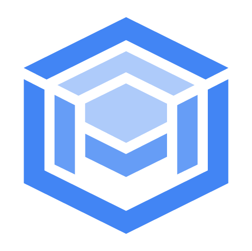
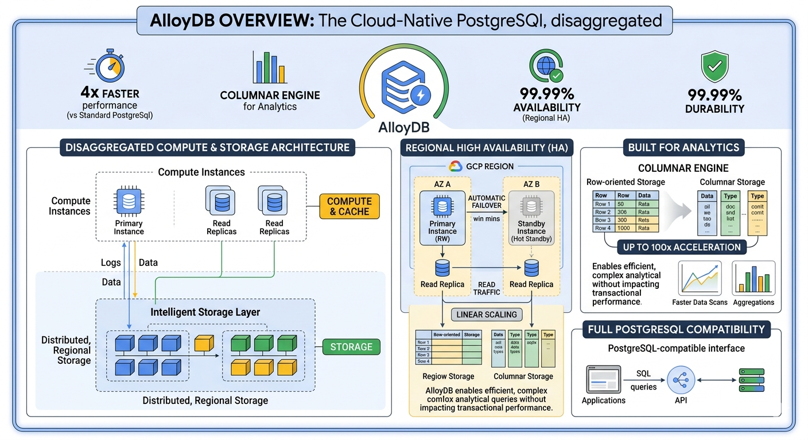

# AlloyDB: ACE Exam Study Guide (2026)

<figure>
  
  <figcaption><center>AlloyDB<br><i>Image source: Google Cloud Documentation</i></center></figcaption>
</figure>

## 1. Core Overview

AlloyDB is a fully managed, PostgreSQL-compatible database service on Google Cloud, optimized for high-performance transactional (OLTP) and analytical (OLAP) workloads (HTAP).

> **OLTP** (_Online Transactional Processing_) - Operational efficiency and data integrity
>
> OLTP systems handle large volumes of fast, short online transactions (e.g., ATM withdrawals, e-commerce orders). They are optimized for row-level inserts, updates, and deletes, prioritizing high concurrency and "acid" compliance.

> **OLAP** (_Online Analytical Processing_) - Complex analysis and business intelligence
>
> OLAP systems process massive datasets to discover trends and insights. Instead of individual transactions, they run complex "read-only" queries over historical data, often using columnar storage to accelerate aggregations like "total sales per region per year."

> **HTAP** (_Hybrid Transactional/Analytical Processing_) - Real-time analytics on live data.
>
> HTAP is an emerging architecture that allows a single database to perform both OLTP and OLAP without moving data to a separate warehouse. This eliminates "ETL lag," enabling businesses to run analytical models on live, "fresh" transactional data immediately.

> **ETL** (_Extract, Transform, Load_) - it is the three-step process used to move data from various source systems into a single, centralized data warehouse or "source of truth."

- **PostgreSQL Compatibility:** 100% PostgreSQL-compatible. Existing PostgreSQL applications run without code changes.
- **Editions (2026 Standards):**
  - **AlloyDB for PostgreSQL:** Managed cloud service with separated compute and storage architecture, high availability, and HTAP capabilities.
  - **AlloyDB Omni:** Deployable on-premises, at the edge, or in hybrid environments; same PostgreSQL compatibility and feature set as the managed service.
- **Architecture:** Separated compute and storage. Compute nodes (primary, standby, read replicas) access a shared, elastic storage layer, enabling fast failover, minimal downtime scaling, and HTAP via optional columnar storage.
- **Use Cases:** Demanding PostgreSQL workloads, HTAP (hybrid transactional/analytical processing), replacing self-managed PostgreSQL, applications requiring low latency, high throughput, and both OLTP and OLAP capabilities.

<figure>
  
  <figcaption><center>AlloyDB<br><i>Image source: Own work (Gemini Prompting)</i></center></figcaption>
</figure>

## 2. High Availability (HA) and Replication

Understanding HA and read scaling is critical for the ACE exam, as AlloyDB's behavior differs slightly from Cloud SQL.

### 2.1. High Availability (HA)

- **Purpose:** Protection against zone failures. Provides reliability, not read performance scaling.
- **Architecture:** Regional configuration. Provisions a Primary compute instance in one zone and a Standby instance in another zone within the same region. Both access the shared storage layer.
- **Failover:** Automatic. If the primary zone fails, the standby takes over in under 60 seconds with no data loss.

### 2.2. Read Replicas

- **Purpose:** Read performance scaling (offload read queries from the primary instance).
- **Architecture:** Can be deployed in the same region or cross-region. Replicas access the same shared storage layer as the primary, so there is no replication lag for data consistency.
- **Failover:** Manual. You must manually promote a read replica to a standalone primary instance for disaster recovery.

## 3. Backups and Recovery

- **Automated Backups:** Taken daily within a configurable window. Retained for up to 365 days.
- **On-Demand Backups:** Taken manually at any time.
- **Point-in-Time Recovery (PITR):** Restore an instance to any second within the backup retention period.
- **Cloning:** Create an exact, independent clone of an AlloyDB instance for testing or development.
- **Cross-Region Backups:** Copy backups to a different region for disaster recovery.

## 4. Scaling

- **Vertical Scaling:** Increase vCPUs and RAM of compute instances (primary, standby, read replicas). Minimal downtime (seconds) due to separated storage and compute.
- **Horizontal Scaling:** Add read replicas to scale read capacity. AlloyDB does not support horizontal write scaling (single primary for writes; use Cloud Spanner for massively distributed writes).
- **Storage Scaling:** Elastic, automatically scales up to 64 TB per instance with no downtime. Storage **cannot scale down** (same as Cloud SQL).
- **Columnar Storage:** Optional columnar storage layer accelerates analytical queries without duplicating data, enabling HTAP workloads.

## 5. Security and Networking

- **Private IP:** Instances use a private, internal IP via Private Services Access (VPC Peering) by default. No public IP is assigned unless explicitly enabled.
- **AlloyDB Auth Proxy:** The recommended secure connection method. Uses IAM for authentication, automatically handles TLS/SSL, and eliminates the need for IP whitelisting. Compatible with all PostgreSQL clients.
- **IAM Database Authentication:** Users and service accounts log in using their Google Cloud identity instead of static database passwords.
- **Encryption:** Data encrypted at rest (Google-managed keys or customer-managed keys via Cloud KMS) and in transit (TLS 1.3).
- **VPC Service Controls:** Define security perimeters to restrict AlloyDB access to authorized VPCs.

## 6. Maintenance

- **Maintenance Windows:** Configure a specific day and time for Google to apply updates.
- **Downtime:** Near-zero downtime maintenance. Compute node updates are applied with minimal impact due to the separated storage and compute architecture.
- **Self-Service Maintenance:** Manually trigger maintenance updates outside the configured window if needed.

## 7. Decision Tree for the ACE Exam

- PostgreSQL-compatible, high performance? -> **AlloyDB**.
- Standard PostgreSQL workloads? -> **Cloud SQL for PostgreSQL**.
- HTAP (OLTP + OLAP)? -> **AlloyDB**.
- Global scale, massive write throughput? -> **Cloud Spanner**.
- Data warehousing (OLAP only)? -> **BigQuery**.
- On-premises/edge PostgreSQL? -> **AlloyDB Omni**.
- Unstructured NoSQL? -> **Cloud Firestore** or **Cloud Bigtable**.

## 8. Migration and Administrative Tasks

- **Database Migration Service (DMS):** The primary tool for migrating to AlloyDB from on-premises PostgreSQL, other clouds, or Cloud SQL for PostgreSQL. Supports continuous replication with minimal downtime.
- **Import/Export:** Store SQL/CSV files in a **Cloud Storage (GCS)** bucket first before importing into AlloyDB. The AlloyDB service account requires `roles/storage.objectViewer` on the GCS bucket.
- **pg_dump/pg_restore:** Suitable for small datasets, but DMS is preferred for large-scale or production migrations.

## 9. Using AlloyDB in a Spring Boot App (Example)

Connect to AlloyDB via Private IP or the AlloyDB Auth Proxy using the standard PostgreSQL JDBC driver, just like a regular PostgreSQL instance.

```yaml
spring:
  datasource:
    url: jdbc:postgresql://10.0.0.10/DB_NAME?currentSchema=SCHEMA_NAME
    username: USER
    password: PASSWORD
    driver-class-name: org.postgresql.Driver

  jpa:
    hibernate:
      ddl-auto: update
    show-sql: true
```

### 9.1. When to Use Each AlloyDB Connection Method

- **Private IP**

  Use when your service runs inside a VPC (GKE, GCE, Cloud Run with VPC connector). Best security, lowest latency, no public exposure.

- **AlloyDB Auth Proxy**

  Use for local development or secure production connections. Handles IAM auth and TLS automatically, no certificate management needed.

  ```bash
  ./alloydb-auth-proxy INSTANCE_CONNECTION_NAME \
      --port=5432 \
      --credentials-file=key.json
  ```

  For more details see [Connect using the AlloyDB Auth Proxy](https://docs.cloud.google.com/alloydb/docs/auth-proxy/overview) (Google Cloud Documentation).

- **Direct PostgreSQL Connection**

  Use only for testing, never in production. Requires whitelisting public IPs and managing TLS certificates manually.

### 9.2. AlloyDB Auth Proxy vs Cloud SQL Auth Proxy

Key Similarities:

- _IAM-Based Authentication_ - Both use your Google Cloud IAM (Identity and Access Management) credentials to authorize the connection. If your IAM user or service account has the correct permissions, you can connect.
- _Mutual TLS (mTLS)_ - They both automatically encrypt traffic using mTLS. You don't have to manually manage, rotate, or download database server certificates.
- _Local Entry Point_ - Both run as a local process (or a sidecar container in Kubernetes) that listens on `127.0.0.1`. Your application thinks it is talking to a local database, while the proxy tunnels that traffic to GCP.
- _No Public IPs Required_ - They allow you to connect to instances that have only private IP addresses, provided your environment has a network path to the Google Cloud API.

> _mTLS_ (Mutual Transport Layer Security) is an extension of standard TLS where both the client and the server verify each other’s identity before a connection is established.
>
> For more details see [mTLS](./mtls.md).

Main Differences:

| Feature           | Cloud SQL Auth Proxy                                  | AlloyDB Auth Proxy                                                           |
| ----------------- | ----------------------------------------------------- | ---------------------------------------------------------------------------- |
| Connection String | Uses a "Connection Name" (`project:region:instance`). | Uses a "URI" or "Instance Path" (`projects/.../clusters/.../instances/...`). |
| Instance Type     | Connects to a single, specific database instance.     | Can connect to a specific instance (Primary or Read Pool) within a cluster.  |
| Auto-IAM Auth     | Optional flag (`--enable-iam-auth`).                  | Highly integrated; AlloyDB is designed with IAM-first principles.            |

## 10. Exam Tip

- **AlloyDB vs Cloud SQL for PostgreSQL:** Choose AlloyDB for high-performance, HTAP, or demanding PostgreSQL workloads. Choose Cloud SQL for standard, lower-complexity PostgreSQL use cases.
- **Separated Compute/Storage:** This is a key architectural differentiator from Cloud SQL, enabling faster failover and minimal downtime scaling.
- **DMS:** Always use DMS for migrations to AlloyDB, not manual pg_dump for large workloads.
