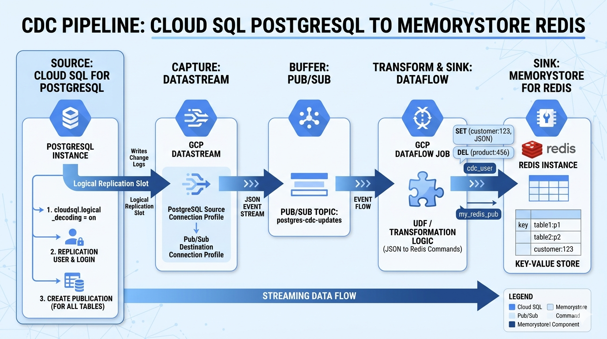

# Configure CDC sync from Cloud SQL (PostgreSQL) into Memorystore (Redis)

Setting up a Change Data Capture (CDC) pipeline from Cloud SQL for PostgreSQL to Google Cloud Memorystore (Redis) involves three main components:

- enabling logical replication on the source,
- choosing a capture mechanism,
- and using a transformation layer to write the data into Redis.

Google Cloud's native _Datastream_ service does not currently support Redis as a direct destination. Therefore, the most robust architectural pattern is to use _Datastream to Pub/Sub_ (or GCS) and then a Dataflow job to sink the data into Redis.

## 1. Configure Cloud SQL for PostgreSQL

You must first enable logical decoding so Postgres can record changes in a format that external tools can read.

1. Set Flags - In the Google Cloud Console, edit your Cloud SQL instance and add/enable the following flag:
   - `cloudsql.logical_decoding = on`

   > Note: This requires a database restart.

2. _Grant Permissions_ - Create a dedicated user for replication.

   ```sql
   CREATE USER cdc_user WITH REPLICATION LOGIN PASSWORD 'your_password';
   GRANT SELECT ON ALL TABLES IN SCHEMA public TO cdc_user;
   GRANT USAGE ON SCHEMA public TO cdc_user;
   ```

3. _Create Publication_ - Tell Postgres which tables to "publish" for streaming.
   ```sql
   CREATE PUBLICATION my_redis_pub FOR TABLE table1, table2;
   -- Or for all tables:
   CREATE PUBLICATION my_redis_pub FOR ALL TABLES;
   ```

## 2. The Streaming Pipeline Architecture

Since there is no direct _"Postgres-to-Redis"_ button in GCP, use this standard event-driven architecture.

1. _Datastream_ - Create a stream in GCP Datastream.
   - _Source_ - Cloud SQL for PostgreSQL (using the `cdc_user` user and `my_redis_pub` publication).
   - _Destination_ - Cloud Pub/Sub.

2. _Dataflow_ - Deploy a Google-provided Dataflow template (or a custom Python/Java job).
   - The job subscribes to the Pub/Sub topic.
   - It parses the JSON change event (Insert/Update/Delete).
   - It executes the corresponding command in Memorystore (Redis) (e.g., `SET`, `HSET`, or `DEL`).

## 3. Data Transformation Logic

When streaming to Redis, you must decide how to map your SQL rows to Redis keys. A common pattern is:

- _Key Format_ - `table_name:{primary_key}`
- _Value Format_ - A JSON string of the row or a Redis Hash (`HSET`).

Example Logic in Dataflow:

- _On `INSERT`/`UPDATE_`-`SET customer:123 '{"name": "Jane", "email": "jane@example.com"}'`
- _On `DELETE_`-`DEL customer:123`

## 4. Summary Checklist

| Step      | Action                                                             |
| --------- | ------------------------------------------------------------------ |
| Source    | Enable `cloudsql.logical_decoding` and create a `PUBLICATION`.     |
| Transport | Use _Datastream_ to capture changes and push them to _Pub/Sub_.    |
| Processor | Use _Dataflow_ to read from _Pub/Sub_ and transform the data.      |
| Sink      | The _Dataflow_ job writes to the _Memorystore (Redis)_ private IP. |

<figure>
  
  <figcaption><center>CDC from Cloud SQL (PostgreSQL) to Memorystore (Redis)<br><i>Image source: Own work (Gemini Prompting)</i></center></figcaption>
</figure>

## 5. Opentofu Code

Put all following code snippets in a `mail.tf` file.

### 5.1. Pub/Sub Topic to receive CDC events

```terraform
resource "google_pubsub_topic" "cdc_events" {
  name = "postgres-cdc-updates"
}
```

### 5.2. Datastream Connection Profile for PostgreSQL

```terraform
resource "google_datastream_connection_profile" "source_postgre" {
  display_name          = "Postgres Source"
  connection_profile_id = "postgres-source"
  location              = "us-central1"

  postgresql_profile {
    hostname = "10.x.x.x" # Cloud SQL Private IP
    username = "cdc_user"
    password = "your-password"
    port     = 5432
    database = "your_db_name"
  }
}
```

### 5.3. Datastream Connection Profile for Pub/Sub (Destination)

```terraform
resource "google_datastream_connection_profile" "dest_pubsub" {
  display_name          = "PubSub Destination"
  connection_profile_id = "pubsub-dest"
  location              = "us-central1"

  pubsub_profile {
    topic = google_pubsub_topic.cdc_events.id
  }
}
```

### 5.4. The Datastream Stream

```terraform
resource "google_datastream_stream" "postgres_to_pubsub" {
  stream_id    = "pg-to-redis-stream"
  location     = "us-central1"
  display_name = "Postgres to Redis Pipeline"

  source_config {
    source_connection_profile = google_datastream_connection_profile.source_postgre.id
    postgresql_source_config {
      publication      = "my_redis_pub"
      replication_slot = "datastream_slot"
      include_objects {
        postgresql_schemas {
          schema = "public"
        }
      }
    }
  }

  destination_config {
    destination_connection_profile = google_datastream_connection_profile.dest_pubsub.id
    pubsub_destination_config {
      data_format = "JSON"
    }
  }

  backfill_all {}
}
```

### 5.5. Dataflow Job (Pub/Sub to Redis)

```terraform
resource "google_dataflow_job" "pubsub_to_redis" {
  name              = "cdc-to-redis-processor"
  template_gcs_path = "gs://dataflow-templates/latest/PubSub_to_Redis"
  temp_gcs_location = "gs://your-temp-bucket/tmp"
  region            = "us-central1"

  parameters = {
    inputTopic      = google_pubsub_topic.cdc_events.id
    redisHost       = "10.y.y.y" # Memorystore Private IP
    redisPort       = "6379"
    # Note: Custom logic may be required via a UDF (JavaScript)
    # to map JSON fields to specific Redis Keys.
  }

  on_delete = "cancel"
}
```

Run `tofu init` and then `tofu apply`.
