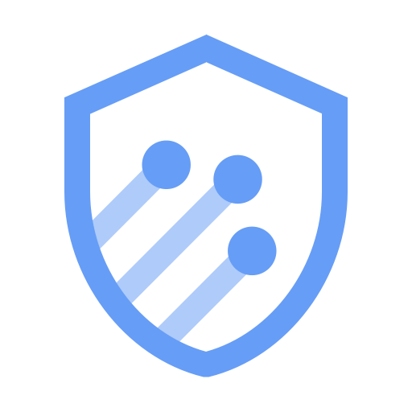

# Cloud Armor: ACE Exam Study Guide (2026)



_Image source: Google Cloud Documentation_

## 1. Cloud Armor Overview

Cloud Armor is Google Cloud's network security service that provides Web Application Firewall (WAF) and Distributed Denial of Service (DDoS) protection at scale.

- **Primary Purpose:** Protect web applications and services from common internet-based threats, including DDoS attacks and application-layer (Layer 7) attacks.
- **Integration:** Cloud Armor security policies are applied to **Backend Services** of a **Global External HTTP(S) Load Balancer** (Classic or Envoy-based).
- **Enforcement:** Traffic is inspected and filtered at the Google Cloud edge, before it reaches your backend instances.
- **Gemini in Cloud Armor:** Can help analyze attack patterns, suggest security policy improvements, and assist in interpreting security logs.

## 2. Security Policies and Rules

A security policy is a container for rules that define how to filter traffic.

- **Policy Types:**
  - **Backend Security Policy:** Applied to traffic reaching backend services.
  - **Edge Security Policy:** Applied to traffic at the Google Cloud edge (e.g., for filtering traffic to Cloud Storage buckets behind a Load Balancer).
- **Rule Components:**
  - **Priority:** Rules are evaluated from lowest to highest numerical value (0 is the highest priority).
  - **Match Condition:** Can be an IP address/range, or a complex expression (using Common Expression Language - CEL).
  - **Action:** `allow`, `deny` (403, 404, 502), `redirect`, or `throttle`.
  - **Preview Mode:** Allows you to test the rule without actually blocking traffic (logs are generated, but the rule action is not enforced).

## 3. Web Application Firewall (WAF) Capabilities

Cloud Armor includes preconfigured WAF rules to protect against common web attacks:

- **SQL Injection (SQLi)**
- **Cross-Site Scripting (XSS)**
- **Remote File Inclusion (RFI)**
- **Local File Inclusion (LFI)**
- **Remote Code Execution (RCE)**
- **Protocol Attack / Scanner Detection**
- **Exam Tip:** You should know that Cloud Armor can mitigate the "OWASP Top 10" risks using these preconfigured rule sets.

### 3.1. OWASP Top 10

#### 3.1.1. Broken Access Control

Failures in enforcing permissions allow users to access data or actions they shouldn’t.

**Spring Boot example**  
A controller exposes user details without checking ownership:

```java
@GetMapping("/users/{id}")
public User getUser(@PathVariable Long id) {
    // No check: user can fetch ANY user
    return userService.findById(id);
}
```

**Fix**  
Use Spring Security method-level authorization:

```java
@PreAuthorize("#id == authentication.principal.id")
```

> Check the `id` against the `sub` claim from JWT.

#### 3.1.2. Cryptographic Failures

Sensitive data is exposed due to missing or weak encryption.

**Spring Boot example**
Storing passwords in plain text or using MD5:

```java
String hash = DigestUtils.md5DigestAsHex(password.getBytes());
```

**Fix**  
Use BCrypt:

```java
PasswordEncoder encoder = new BCryptPasswordEncoder();
```

#### 3.1.3. Injection

Untrusted input is interpreted as code or commands.

**Spring Boot example**  
Using string concatenation in JPA queries:

```java
@Query("SELECT u FROM User u WHERE u.name = '" + name + "'")
```

**Fix**  
Use parameter binding:

```java
@Query("SELECT u FROM User u WHERE u.name = :name")
```

> **XSS (Cross-Site Scripting)** is also an injection attack. It happens when an untrusted input is rendered into a webpage without proper escaping, allowing attackers to execute malicious JavaScript in the victim’s browser. This can lead to session theft, account takeover, redirects, or UI manipulation.

#### 3.1.4. Insecure Design

Security issues caused by missing or flawed architecture and design decisions.

**Spring Boot example**  
No rate limiting → brute force login possible.

**Fix**

- Spring Cloud Gateway rate limiting
- Cloud Armor rate limiting
- Captcha for login endpoints

#### 3.1.5. Security Misconfiguration

Incorrect or missing security settings across applications, servers, or cloud resources.

**Spring Boot example**  
Actuator endpoints exposed publicly

```yaml
management:
  endpoints:
    web:
      exposure:
        include: "*"
```

**Fix**  
Restrict exposure.

```yaml
include: health,info
```

And secure with Spring Security.

#### 3.1.6. Vulnerable and Outdated Components

Using libraries or frameworks with known vulnerabilities.

**Spring Boot example**
Using vulnerable Log4j version.

**Fix**  
Upgrade to patched versions and use dependency scanning (OWASP DC, Snyk, Trivy).

#### 3.1.7. Identification and Authentication Failures

Weak authentication or session handling allows attackers to impersonate users.

**Spring Boot example**
Session ID not regenerated after login → session fixation.

**Fix**
Spring Security handles this automatically, but only if enabled:

```java
http.sessionManagement().sessionFixation().migrateSession();
```

> Not checking JWT cryptographic signature falls into this categoty.

#### 3.1.8. Software and Data Integrity Failures

Trusting unvalidated or untrusted code, data, or CI/CD pipelines.

**Spring Boot example**
CI pipeline pulling dependencies without checksum verification.

**Fix**

- Maven checksum validation
- Signed artifacts
- Secure CI/CD runners

#### 3.1.9. Security Logging and Monitoring Failures

Insufficient logging or alerting prevents detection of attacks.

**Spring Boot example**
Login failures not logged.

**Fix**  
Implement logging:

```java
logger.warn("Failed login for user {}", username);
```

Send logs to SIEM (Cloud Logging, ELK, etc.).

> A SIEM (_Security Information and Event Management_) is a centralized system that collects, aggregates, correlates, and analyzes logs from across your infrastructure to detect security threats in real time.

#### 3.1.10. Server-Side Request Forgery (SSRF)

Server makes unintended internal or external requests controlled by the attacker.

**Spring Boot example**
Fetching user-supplied URLs:

```java
RestTemplate rest = new RestTemplate();
String result = rest.getForObject(userInputUrl, String.class);
```

**Fix**

- Validate URLs
- Allowlist domains
- Block metadata endpoints (`169.254.169.254`)
- Use Cloud Armor SSRF rules

## 4. Managed Protection Tiers

- **Cloud Armor Standard:**
  - Pay-as-you-go pricing.
  - Always-on DDoS protection for Layer 3 and Layer 4 attacks.
  - Access to WAF rules and IP filtering.
- **Cloud Armor Enterprise (Managed Protection Plus):**
  - Subscription-based pricing.
  - Advanced DDoS protection (including Layer 7 protection).
  - **Adaptive Protection:** Uses machine learning to detect and mitigate anomalous traffic patterns.
  - DDoS cost protection (billing credits for traffic spikes caused by DDoS).
  - Bot Management integration (reCAPTCHA Enterprise).

## 5. Monitoring and Logging

- **Cloud Logging:** Every decision made by Cloud Armor (allow/deny) is logged.
- **Security Policy Logs:** Contain information about the rule that matched, the source IP, and the action taken.
- **Cloud Monitoring:** Dashboards showing request rates, blocked requests, and attack trends.

## 6. Key Exam Scenarios

- **DDoS Mitigation:** If a question asks how to protect a web app from a massive volume of traffic, Cloud Armor is the answer.
- **IP Whitelisting/Blacklisting:** Use Cloud Armor security policies to allow only specific corporate IP ranges to access a backend service.
- **Geo-fencing:** Creating a rule to deny traffic from specific countries using the `origin.region_code` attribute.
- **Troubleshooting:** If a legitimate user is getting a 403 error, check the Cloud Armor logs to see if a WAF rule is incorrectly blocking the traffic (false positive).

## 7. Essential gcloud Commands

- **Create a Security Policy:** `gcloud compute security-policies create [NAME] --description="[DESC]"`
- **Add an IP Rule:** `gcloud compute security-policies rules create [PRIORITY] --security-policy=[POLICY] --src-ip-ranges="[IP_RANGE]" --action="deny-403"`
- **Add a Preconfigured WAF Rule:** `gcloud compute security-policies rules create [PRIORITY] --security-policy=[POLICY] --expression="evaluatePreconfiguredExpr('sqli-stable')" --action="deny-403"`
- **Update a Rule:** `gcloud compute security-policies rules update [PRIORITY] --security-policy=[POLICY] --action="allow"`
- **Attach to Backend Service:** `gcloud compute backend-services update [BACKEND_SERVICE] --security-policy=[POLICY] --global`
