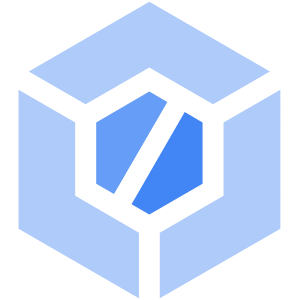

# Cloud Build: ACE Exam Study Guide (2026)



_Image source: [Vecta.io](https://vecta.io/symbols/4/google-cloud-platform/15/google-cloud-build)_

## 1. Cloud Build Overview

Cloud Build is a serverless, managed CI/CD (Continuous Integration / Continuous Deployment) platform that executes builds on Google Cloud's infrastructure.

- **Key Characteristics:**
  - **Serverless:** No build servers to manage or scale.
  - **Container-Native:** Every step in a build is executed in a separate Docker container.
  - **Flexible:** Can build code from a variety of sources and deploy to a variety of targets.
  - **Logging:** All build logs are available in Cloud Logging for troubleshooting.

## 2. Core Concepts

- **Build Step:** A single operation in a build process (e.g., `npm install`, `docker build`). Each step is executed as a container.
- **Build Config File:** Usually named `cloudbuild.yaml` (or `cloudbuild.json`). It defines the steps, environment variables, and arguments for the build.
- **Build Trigger:** A mechanism that automatically starts a build when code is pushed to a repository (e.g., GitHub, Bitbucket, Cloud Source Repositories).
- **Build Artifacts:** The result of a successful build, such as a container image (stored in _Artifact Registry_) or a binary (stored in _Cloud Storage_).
- **Available Builders:** Google provides pre-built images in `gcr.io/cloud-builders/` (e.g., `docker`, `gcloud`, `npm`, `java`). Community-built builders are in `gcr.io/cloud-builders-local/builder` for local testing.

## 3. Build Configuration (cloudbuild.yaml)

A typical build configuration file includes:

- **steps:** A list of build steps to be executed in order.
- **name:** The name of the Docker image to use for that step (e.g., `gcr.io/cloud-builders/docker`).
- **args:** The arguments to pass to the container's entrypoint.
- **env:** Environment variables for the step.
- **timeout:** The maximum duration for a step or the entire build (default: 10m, max: 60m).
- **images:** Specifies which built images should be pushed to Artifact Registry after a successful build.
- **options:** Additional build options:
  - **logging:** `CLOUD_LOGGING_ONLY`, `LOCAL_AND_CLOUD_LOGGING`, or `NONE`.
  - **machineType:** `E2_HIGHER` or `N1_HIGHER_8` (default: `E2_HIGHER`).

## 3.1. Example: cloudbuild.yaml

```yaml
steps:
  - name: 'gcr.io/cloud-builders/docker'
    args: ['build', '-t', 'gcr.io/$PROJECT_ID/myimage:$COMMIT_SHA', '.']
  - name: 'gcr.io/cloud-builders/docker'
    args: ['push', 'gcr.io/$PROJECT_ID/myimage:$COMMIT_SHA']
images:
  - 'gcr.io/$PROJECT_ID/myimage:$COMMIT_SHA'
options:
  logging: 'CLOUD_LOGGING_ONLY'
  machineType: 'E2_HIGHER'
timeout: '20m'
```

## 4. Build Triggers

- **Source Repositories:** GitHub, Bitbucket, and Cloud Source Repositories (CSR).
- **Events:** Pushes to a branch, tags, or pull requests.
- **Substitution Variables:** Allows you to pass dynamic values (like the commit ID or branch name) into your build config (e.g., `_SERVICE_NAME`).

## 5. Build Environments

- **Default Pool:** A shared, multi-tenant pool of worker machines.
- **Private Pools:** Dedicated, customizable worker pools that can access resources in your VPC (e.g., a private GKE cluster or an internal database) via VPC Peering.

## 6. Security and IAM

- **Cloud Build Service Account:** The identity that Cloud Build uses to execute builds.
  - Default: `[PROJECT_NUMBER]@cloudbuild.gserviceaccount.com`
  - **Exam Tip:** You must grant this service account the necessary IAM roles to deploy to other services (e.g., `roles/run.admin` to deploy to Cloud Run).
- **Artifact Integrity:** You can use [_Binary Authorization_](./gke.md#6-gke-security) in conjunction with Cloud Build to ensure that only images built and signed by Cloud Build are deployed to GKE.
- **Secret Manager:** For sensitive data (API keys, tokens), store in Secret Manager and access via `secretEnv` field in `cloudbuild.yaml`.

## 7. Essential `gcloud` Commands

- **Submit a Build Manually:** `gcloud builds submit --config cloudbuild.yaml .`
- **Build a Docker Image directly:** `gcloud builds submit --tag gcr.io/[PROJECT_ID]/[IMAGE_NAME] .`
- **List Builds:** `gcloud builds list`
- **Describe a Build:** `gcloud builds describe [BUILD_ID]`

## 8. Exam Tips

- **Steps as Containers:** Remember that every single step in a `cloudbuild.yaml` is a Docker container.
- **The Service Account Gotcha:** If a build fails with a _Permission Denied_ error during deployment, the first thing to check is if the _Cloud Build Service Account_ has the correct IAM role for the target service (e.g., GKE or Cloud Run).
- **Artifact Registry:** By default, Cloud Build is closely integrated with _Artifact Registry_ for storing container images. **GCR is deprecated** - use Artifact Registry instead.
- **Caching:** You can speed up builds by using Docker's `--cache-from` feature or by using a persistent disk for caching in a Private Pool.
- **Parallelism:** You can run build steps in parallel by using the `waitFor` field in your `cloudbuild.yaml`.
- **Timeout Issues:** If builds time out, increase the `timeout` field (max: 60m) or optimize your build steps.
- **Troubleshooting:** Check Cloud Logging for detailed error messages when builds fail.
