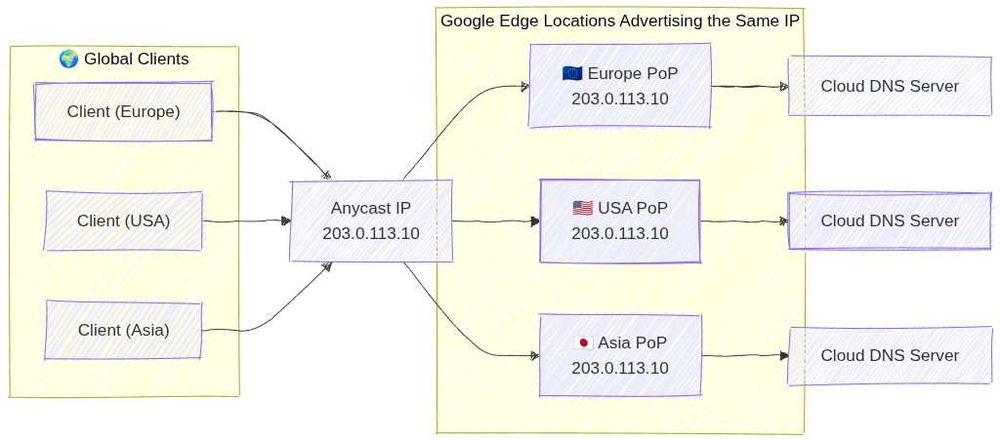
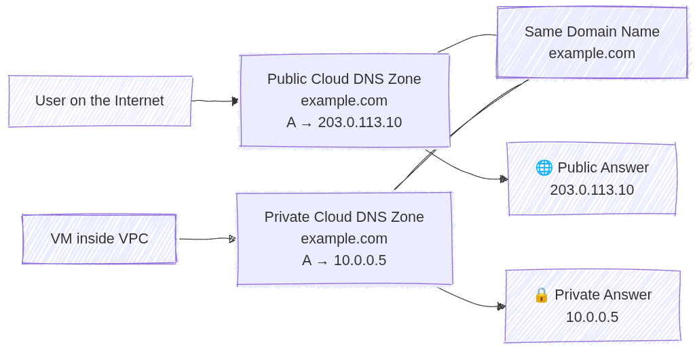

# Cloud DNS: ACE Exam Study Guide (2026)


_Image source: Google Cloud Documentation_

## 1. Cloud DNS Overview

Cloud DNS is a high-performance, resilient, and managed Domain Name System (DNS) service that runs on the same infrastructure as Google.

### Key Characteristics

- **Fully Managed:** No DNS servers to manage or scale.
- **Global Scope:** DNS is a global service; managed zones are accessible from anywhere.
- **Low Latency:** Uses Google's global network of Anycast name servers.
- **100% Availability SLA:** Google guarantees 100% availability for its authoritative name servers.

### Authoritative Name Server

An authoritative name server stores and serves the official DNS records for a domain (A, AAAA, CNAME, MX, TXT, SPF, DKIM, etc.). It provides final, non-recursive answers to DNS queries. In Cloud DNS, the authoritative name servers are the globally distributed Google name servers assigned to your DNS zone, each using Anycast IPs for low-latency resolution.

### Anycast IP

_Anycast IP_ means a single IP address is advertised from multiple global locations. Traffic is routed to the nearest or lowest‑latency Google edge. Cloud DNS uses Anycast for its public authoritative name servers, giving global low‑latency DNS resolution, built‑in failover, and high availability without extra configuration.



_Image source: Own work (Mermaid diagram)._

## 2. Managed Zones

A managed zone is a container for DNS records of the same DNS name suffix (e.g., `example.com`).

- **Public Zones:** Visible to the entire internet. You must register the domain with a registrar and point the registrar's name servers to Google's.
- **Private Zones:** Visible only to one or more VPC networks within your project or organization.
  - _Exam Tip:_ Use private zones for internal service discovery (e.g., `db.internal.vpc`).
- **Forwarding Zones:** Used to forward DNS queries for a specific domain to an external DNS server (e.g., on-premises DNS).
- **Peering Zones:** Allows one VPC to use the DNS records defined in another VPC's private zone.

## 3. Record Types

Cloud DNS supports common DNS record types:

- **A:** Maps a hostname to an IPv4 address.
- **AAAA:** Maps a hostname to an IPv6 address.
- **CNAME:** Maps an alias hostname to a canonical hostname.
- **MX:** Specifies mail servers for a domain.
- **TXT:** Arbitrary text data (often used for domain verification like SPF (_Sender Policy Framework_) or DKIM (_DomainKeys Identified Mail_)).
- **SOA (Start of Authority):** Contains administrative info about the zone.

## 4. DNS Forwarding and Peering

- **Inbound Query Forwarding:** Allows on-premises clients to resolve GCP private DNS records. Requires an _Inbound Forwarding Policy_ on the VPC.
- **Outbound Query Forwarding:** Allows GCP instances to resolve on-premises DNS records. Accomplished via _Forwarding Zones_.
- **DNS Peering:** Connects the DNS namespace of two VPCs. Unlike VPC Peering, this only affects DNS resolution, not network connectivity.

## 5. DNS Policies

DNS policies allow you to control how the VPC handles DNS queries.

- **Server Policies:** Can enable inbound DNS forwarding or specify alternative DNS servers for the VPC.
- **Client Policies:** Can be used to apply specific DNS settings to VM instances.
- **DNS over HTTPS (DoH):** Support for encrypted DNS queries between clients and Cloud DNS to enhance privacy and security.

## 6. Security

- **DNSSEC (DNS Security Extensions):** Protects your domains from spoofing and cache poisoning by digitally signing DNS records.
  - _Exam Tip:_ DNSSEC is available for _Public Zones_ only.
- **IAM Roles:**
  - `roles/dns.admin`: Full control over Cloud DNS resources.
  - `roles/dns.reader`: View access only.

## 7. Essential gcloud Commands

- **Create a Public Managed Zone:**
  `gcloud dns managed-zones create [ZONE_NAME] --dns-name="example.com." --description="My public zone"`
- **Create a Private Managed Zone:**
  `gcloud dns managed-zones create [ZONE_NAME] --dns-name="internal.com." --description="My private zone" --visibility=private --networks=[VPC_NAME]`
- **Add an A Record:**
  ```bash
  gcloud dns record-sets transaction start --zone=[ZONE_NAME]
  gcloud dns record-sets transaction add [IP_ADDRESS] \
      --name="www.example.com." --ttl=300 --type=A --zone=[ZONE_NAME]
  gcloud dns record-sets transaction execute --zone=[ZONE_NAME]
  ```
- **List Records:**
  `gcloud dns record-sets list --zone=[ZONE_NAME]`

## 8. Exam Tips

- **Visibility:** Always distinguish between Public (Internet) and Private (VPC only) zones.
- **Forwarding vs. Peering:**
  - Use Forwarding for GCP <-> On-Premises.
  - Use Peering for GCP VPC <-> GCP VPC.
- **Split-Horizon DNS:** Cloud DNS supports split-horizon, where you have a public zone and a private zone with the same name but different records.
- **Registration:** Cloud DNS is not a domain registrar. You buy the domain elsewhere (or through Google Domains/Squarespace) and use Cloud DNS for management.

### Split-Horizon DNS (Cloud DNS)

Split-horizon DNS lets you create a public zone and a private zone with the same domain name (e.g. `example.com`) but different DNS records. Public clients receive the public IPs (e.g. `203.0.113.10`) from the public zone, while internal VPC clients receive private IPs (e.g. `10.0.0.5`) from the private zone. Cloud DNS automatically selects the correct zone based on the source of the query.



_Image source: Own work (Mermaid diagram)._

## 9. External Links

- [Cloud DNS - The Cloud Girl](https://www.thecloudgirl.dev/networking/cloud-dns)
