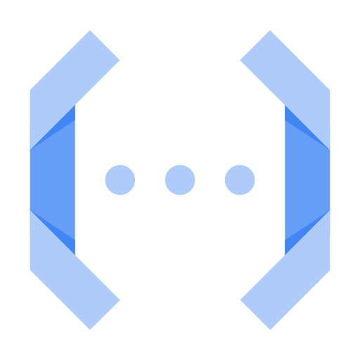

# Cloud Functions: ACE Exam Study Guide (2026)



_Image source: Google Cloud Documentation_

## 1. Cloud Functions Overview

Cloud Functions is a serverless, event-driven compute platform for executing snippets of code in response to events.

- Key Characteristics
  - **Serverless**: No infrastructure management; automatic scaling.
  - **Single-purpose**: Best for small, independent units of logic.
  - **Ephemeral**: Instances are created, perform work, and are destroyed.
- Generations (2nd Gen is now the Default)
  - **2nd Generation (Built on Cloud Run)**
    - Uses **Eventarc** as the unified eventing engine.
    - Higher concurrency (up to 1000 requests per instance).
    - Longer processing times (up to 60 minutes for HTTP).
    - Larger instance sizes (up to 16GB RAM / 4 vCPUs) and support for C4 machine types.
    - Traffic splitting between revisions.
  - **1st Generation:** Legacy model, limited concurrency (1 request per instance).

## 2. Triggers and Events (via Eventarc)

In 2nd Generation, Cloud Functions use **Eventarc** to deliver events from over 90+ Google Cloud sources.

- **HTTP Triggers:** Triggered via a direct URL (standard for webhooks or simple APIs).
- **Event-Driven Triggers:**
  - **Cloud Storage:** Triggered by file creation, deletion, or metadata updates.
  - **Pub/Sub:** Triggered when a message is published to a specific topic.
  - **Firestore:** Triggered by document creation, updates, or deletions.
  - **Cloud Logging:** Triggered by specific log entries (via Eventarc).

## 3. Runtimes and Deployment

- **Supported Languages:** Node.js, Python, Go, Java, Ruby, PHP, .NET Core.
- **Deployment Source:**
  - Local machine via `gcloud`.
  - Source repositories (GitHub, Bitbucket).
  - Cloud Storage (ZIP file).
- **Cloud Build:** When you deploy, _Cloud Build_ automatically packages the function and stores it as a container image in _Artifact Registry_.

## 4. Scaling and Performance

- **Max Instances**: Limits scaling to prevent excessive costs.
- **Min Instances**: Keeps instances _warm_ to eliminate cold start latency.
- **Startup CPU Boost (2026):** Temporarily allocates extra CPU during function startup to reduce cold start time — a cost-effective alternative to min-instances.
- **Concurrency (2nd Gen Only)**: Allows a single instance to handle multiple simultaneous requests, reducing the total number of instances needed.
- **Timeout**: The maximum time a function can run before being terminated.

## 5. Networking

- **Ingress Settings:** Control whether the function is public or internal-only.
- **VPC Access:**
  - **Direct VPC Egress (Recommended for 2nd Gen):** Faster, lower latency, and no connector overhead.
  - **Serverless VPC Access Connector:** Required for 1st Gen or specific VPC requirements.
- **Static Outbound IP:** Requires a _VPC Connector_ and _Cloud NAT_.

## 6. Security and IAM

- **Permissions:**
  - `roles/cloudfunctions.invoker`: Allows calling/triggering the function.
  - `roles/cloudfunctions.admin`: Full control over functions.
- **Service Accounts:**
  - **Runtime Service Account:** The identity the function uses when it runs (default is the App Engine default service account).
    > Best practice: Use a _Custom Service Account_ with minimal permissions.
- **Secrets:** Integrate with _Secret Manager_ to securely provide API keys or credentials.

## 7. Monitoring and Logging

- **Cloud Logging:** All `stdout` and `stderr` output is automatically sent to Cloud Logging.
- **Error Reporting:** Automatically captures unhandled exceptions.
- **Cloud Monitoring:** Tracks execution counts, execution times, and memory usage.

## 8. Essential `gcloud` Commands

- **Deploy (HTTP):** `gcloud functions deploy [NAME] --gen2 --runtime [RUNTIME] --trigger-http --allow-unauthenticated`
- **Deploy (Pub/Sub):** `gcloud functions deploy [NAME] --gen2 --runtime [RUNTIME] --trigger-topic [TOPIC_NAME]`
- **List Functions:** `gcloud functions list`
- **Check Logs:** `gcloud functions logs read [NAME]`
- **Describe Function:** `gcloud functions describe [NAME]`

## 9. Java Cloud Functions – Required Interfaces

To write a Cloud Function in Java, you must implement one of Google’s functional interfaces. These are part of the [**Cloud Functions Framework**](https://docs.cloud.google.com/java/docs/reference/google-cloud-functions/latest/overview), which allows you to run and test these functions locally or in any Knative-compatible environment.

```gradle
dependencies {
    implementation platform("com.google.cloud:libraries-bom:26.79.0")
    implementation "com.google.cloud:google-cloud-functions"
}
```

_Cloud Functions_ doesn’t run on Knative directly, but uses the Knative‑compatible Functions Framework, allowing the same function code to run on _Cloud Run_ or any Knative environment.

#### For HTTP-triggered functions

`com.google.cloud.functions.HttpFunction`

```java
public class HelloHttp implements HttpFunction {

    @Override
    public void service(HttpRequest request, HttpResponse response) throws Exception {
        BufferedWriter writer = response.getWriter();
        writer.write("Hello from HTTP Function!");
    }
}
```

#### For background (event-driven) functions

`com.google.cloud.functions.BackgroundFunction<T>`

```java
public class HelloBackground implements BackgroundFunction<PubSubMessage> {

    @Override
    public void accept(PubSubMessage message, Context context) {
        var data = message.data();
        System.out.println("Received Pub/Sub message: " + data);
    }
}

// Simple POJO for Pub/Sub payload
record PubSubMessage(String data) {
}
```

#### For raw event payloads

`com.google.cloud.functions.RawBackgroundFunction`

```java
public class HelloRawBackground implements RawBackgroundFunction {

    @Override
    public void accept(String json, Context context) {
        System.out.println("Raw event payload: " + json);
    }
}
```

These interfaces define the entry point that Google Cloud invokes when your function runs.

## 10. Exam Tips & Comparison

- **Cloud Functions vs. Cloud Run**
  - Use _Cloud Functions_ for event-driven snippets or simple _glue logic_.
    > **Glue logic** is small, simple code that connects components so they can work together. It adapts interfaces, transforms data, or coordinates calls between modules, acting as the plumbing that lets otherwise incompatible parts interoperate.
  - Use _Cloud Run_ for full web applications, containers with multiple routes, or complex dependencies.
- **Cold Starts**: Occur when a new instance is spun up from zero. Mitigated by setting a `min-instances` value.
- **Idempotency**: Event-driven functions should be idempotent to handle retries correctly.
  > **Idempotency** - An operation is idempotent if performing it multiple times produces the same result as performing it once.

## 11. External Links

- [Cloud Run Functions - Google Cloud Documentation](https://docs.cloud.google.com/functions/docs)
- [Youtube - Andrew Brown - Cloud Run](https://www.youtube.com/watch?v=OlAmyf8_4O4&t=11029s)
- [Cloud Functions - The Cloud Girl](https://www.thecloudgirl.dev/compute/cloud-functions)
- [Where should I run my staff - The Cloud Girl](https://www.thecloudgirl.dev/compute/where-should-i-run-my-stuff)
