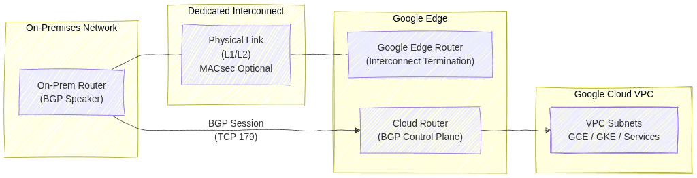

# Cloud Interconnect: ACE Exam Study Guide


_Image source: Google Cloud Documentation_

## 1. Overview

Cloud Interconnect provides a direct physical connection between your on-premises network and Google's network. Unlike Cloud VPN, traffic bypasses the public internet.

**Key Characteristics:**

- **No public internet:** Traffic travels over dedicated physical links
- **Predictable performance:** Consistent latency, no jitter from internet congestion
- **High bandwidth:** 10 Gbps or 100 Gbps (Dedicated) or smaller (Partner)
- **Not encrypted by default:** Must use MACsec (Dedicated) or HA VPN over Interconnect
- **Requires BGP:** Uses Cloud Router for dynamic routing

> **MACsec** (_Media Access Control Security_) is a Layer‑2 encryption standard (IEEE 802.1AE) that protects traffic on physical links.
> In Google Cloud, MACsec is used to encrypt traffic on Dedicated Interconnect connections between your on‑premises router and Google’s edge router.
>
> It provides hop‑by‑hop, hardware‑level encryption directly on the fiber link — unlike IPsec, which is Layer‑3 and tunnel‑based.

## 2. Interconnect Types

### Dedicated Interconnect

| Aspect      | Details                                                  |
| ----------- | -------------------------------------------------------- |
| What        | Physical connection at Google's colocation facility      |
| Requirement | Must be present at an Interconnect location              |
| Bandwidth   | 10 Gbps or 100 Gbps circuits                             |
| Encryption  | MACsec available (encrypts data in transit)              |
| Best for    | High data volume, organizations with colocation presence |

### Partner Interconnect

| Aspect      | Details                                        |
| ----------- | ---------------------------------------------- |
| What        | Connection via third-party service provider    |
| Requirement | Connect to Partner who already has Google link |
| Bandwidth   | 50 Mbps up to 10 Gbps (or 50 Gbps)             |
| Encryption  | Not via MACsec (use VPN if needed)             |
| Best for    | Lower bandwidth needs, no colocation access    |

### Cross-Cloud Interconnect

| Aspect      | Details                                               |
| ----------- | ----------------------------------------------------- |
| What        | Direct link between GCP and other clouds (AWS, Azure) |
| Requirement | No physical hardware setup                            |
| Best for    | Multi-cloud architectures requiring low latency       |

## 3. Deployment Components

1. **Physical Link:** Fiber connecting your equipment to Google (Dedicated) or Partner
2. **Interconnect Resource:** The physical circuit (visible in GCP console)
3. **VLAN Attachment:** Logical connection (VLAN) between Interconnect and VPC
4. **Cloud Router:** Manages BGP sessions for dynamic routing
5. **Border Gateway Protocol (BGP):** Exchanges routes between on-prem and GCP

> 
>
> _Image source: Own work (Mermaid diagram)._
>
> This diagram shows how an on‑premises network connects to a Google Cloud VPC using _Dedicated Interconnect_ and _BGP routing_.
>
> - The _On‑Prem Router_ establishes a _BGP session_ (TCP 179) with _Cloud Router_ in Google Cloud. This BGP session exchanges routes so both environments know how to reach each other.
> - The physical connectivity is provided by _Dedicated Interconnect_, represented by the fiber link between the on‑prem router and Google’s _Edge Router_.
>   This link operates at _Layer 1/2_, and can optionally be protected with MACsec for encryption.
> - Google’s _Edge Router_ terminates the physical Interconnect circuit and hands traffic to _Cloud Router_, which handles the _control plane_ (routing decisions).
> - _Cloud Router_ injects learned routes into the _VPC_, making on‑prem networks reachable to _GCE VMs_, _GKE clusters_, and _other services_ inside the VPC.

## 4. VLAN Attachments

- **What:** Logical connections that carry your VLAN traffic over the Interconnect
- **MTU:** Default 1440 bytes (smaller than standard 1500 due to encapsulation)
- **Limits:**
  - Up to 50 VLAN attachments per Interconnect
  - Each VLAN attachment needs a unique VLAN ID (802.1Q tag)
- **Requirements:**
  - Must be in the same region as your Cloud Router
  - BGP session configured with peer IP addresses

## 5. High Availability & SLA

| SLA        | Requirement                                                             |
| ---------- | ----------------------------------------------------------------------- |
| **99.99%** | 4+ VLAN attachments across 2+ Interconnect locations + 2+ Cloud Routers |
| **99.9%**  | 2+ VLAN attachments + 2 Cloud Routers (single location)                 |

**Important:** Single Interconnect = no SLA (0%)

## 6. Direct Peering vs Carrier Peering

These are **NOT** the same as Cloud Interconnect:

| Type                | Purpose                         | Reaches                                  |
| ------------------- | ------------------------------- | ---------------------------------------- |
| **Direct Peering**  | Reach Google services directly  | Google Workspace, YouTube only (NOT VPC) |
| **Carrier Peering** | Via partner for Google services | Google Workspace via partner             |

**Key point:** Neither reaches VPC resources. Use Interconnect or VPN for VPC.

## 7. Encryption

| Method                   | Availability                | Notes                               |
| ------------------------ | --------------------------- | ----------------------------------- |
| MACsec                   | Dedicated Interconnect only | Encrypts physical link              |
| HA VPN over Interconnect | Both types                  | Add VPN tunnel over VLAN attachment |
| Default (none)           | Both types                  | Traffic is unencrypted              |

**Exam tip:** If encryption is required, use HA VPN over Interconnect (most common answer).

## 8. Common Exam Gotchas

1. **No encryption by default:** Interconnect does not encrypt traffic
2. **Single Interconnect = no SLA:** Must have redundancy for SLA
3. **MTU 1440:** VLAN attachments have lower MTU than standard (1500)
4. **BGP required:** All Interconnect types need Cloud Router and BGP
5. **VLAN limits:** Maximum 50 VLAN attachments per Interconnect
6. **Cross-Cloud is GCP-to-cloud:** Not for connecting to on-premises directly
7. **Peering ≠ Interconnect:** Direct/Carrier Peering only reaches Google services, not VPC
8. **Partner bandwidth flexibility:** Can start small (50 Mbps), unlike Dedicated

## 9. Interconnect vs VPN Comparison

| Factor     | Cloud Interconnect      | Cloud VPN                 |
| ---------- | ----------------------- | ------------------------- |
| Transport  | Dedicated physical link | Public internet           |
| Bandwidth  | Up to 100 Gbps          | Up to 3 Gbps per tunnel   |
| Latency    | Lower, consistent       | Higher, variable          |
| Setup time | Weeks (physical)        | Minutes                   |
| Cost       | Higher                  | Lower                     |
| Encryption | None (use MACsec/VPN)   | Built-in (IPsec)          |
| Use case   | Migration, high-volume  | Quick setup, lower volume |

**Choose Interconnect when:** Migrating large datasets, need consistent performance, acceptable to wait for physical setup.

**Choose VPN when:** Need quick connectivity, lower budget, can tolerate internet variability.

## 10. Essential `gcloud` Commands

**Create Dedicated VLAN Attachment:**

```bash
gcloud compute interconnects attachments dedicated create [NAME] \
  --interconnect=[INTERCONNECT] \
  --router=[ROUTER] \
  --region=[REGION] \
  --vlan=[VLAN_ID]
```

**Create Partner VLAN Attachment:**

```bash
gcloud compute interconnects attachments partner create [NAME] \
  --router=[ROUTER] \
  --region=[REGION] \
  --interconnect-region=[PARTNER_REGION]
```

**List VLAN Attachments:**

```bash
gcloud compute interconnects attachments list
```

## 11. Practice Questions

**Q1:** What provides 99.99% SLA for Cloud Interconnect?

> **Answer:** 4+ VLAN attachments across 2+ Interconnect locations and 2+ Cloud Routers

**Q2:** You need to connect on-premises to VPC with encryption. What do you use?

> **Answer:** HA VPN over Interconnect (or MACsec with Dedicated)

**Q3:** What's the maximum VLAN attachments per Interconnect?

> **Answer:** 50

**Q4:** Direct Peering can reach which GCP resources?

> **Answer:** Google Workspace and YouTube only (NOT VPC resources)

**Q5:** A company needs 500 Mbps bandwidth but has no colocation presence. Which Interconnect type?

> **Answer:** Partner Interconnect

**Q6:** What is the default MTU for a VLAN attachment?

> **Answer:** 1440 bytes

## 12. Quick Reference Summary

| Feature                  | Value                              |
| ------------------------ | ---------------------------------- |
| Dedicated bandwidth      | 10 Gbps or 100 Gbps                |
| Partner bandwidth        | 50 Mbps to 50 Gbps                 |
| VLAN attachments max     | 50 per Interconnect                |
| VLAN MTU                 | 1440 bytes                         |
| 99.99% SLA requires      | 4+ VLANs, 2+ locations, 2+ routers |
| Encryption by default    | No (use MACsec or VPN)             |
| BGP required             | Yes (via Cloud Router)             |
| Reaches VPC              | Yes                                |
| Reaches Google Workspace | Yes                                |

## 13. External Links

- [Network Connectivity Options - The Cloud Girl](https://www.thecloudgirl.dev/networking/network-connectivity-options)
