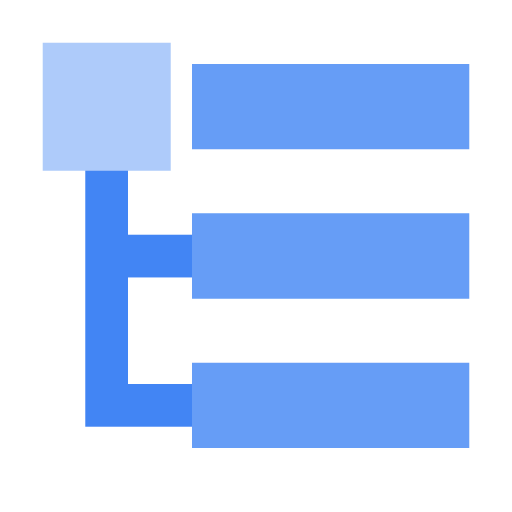
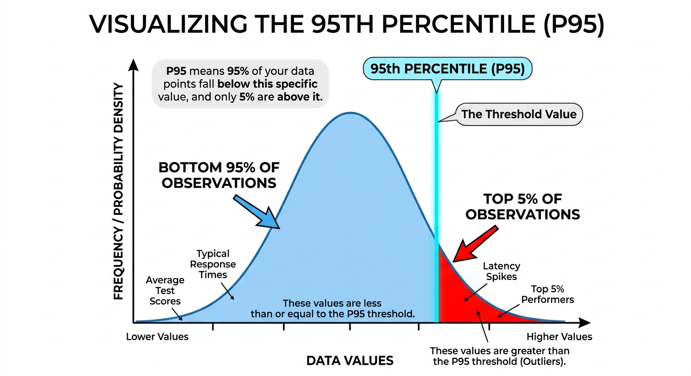

# Cloud Logging: ACE Exam Study Guide (2026)



_Image source: Google Cloud Documentation_

## 1. Cloud Logging Overview

Cloud Logging is a fully managed service that allows you to store, search, analyze, and alert on log data and events from Google Cloud.

### 1.1. Key Characteristics

- **Unified:** Collects logs from all GCP services (Compute Engine, GKE, Cloud Run, etc.) and even multi-cloud/on-premises sources.
- **Integrated:** Works seamlessly with Cloud Monitoring and Cloud Error Reporting.
- **Retention:** Logs are kept for a specific period (standard is 30 days) and then automatically deleted.

### 1.2. Log Entry Structure

Each log entry contains:

| Field                       | Description                                             |
| --------------------------- | ------------------------------------------------------- |
| **Timestamp**               | When the event occurred                                 |
| **Severity**                | Log level (DEBUG, INFO, WARNING, ERROR, CRITICAL, etc.) |
| **Resource**                | The GCP resource that generated the log                 |
| **Log Name**                | Source of the log                                       |
| **Labels**                  | Key-value pairs for metadata                            |
| **TextPayload/JSONPayload** | The actual log message                                  |

### 1.3. Severity Levels

```
DEBUG < INFO < NOTICE < WARNING < ERROR < CRITICAL < ALERT < EMERGENCY
```

### 1.4. Log Router Flow

```
Log Sources (GKE, Cloud Run, VM, etc.)
         ↓
    Log Router
    (applies inclusion/exclusion filters)
         ↓
    ┌────┴────┐
    ↓         ↓
Storage    Sinks
(30 days)  (export)
```

### 1.5. Console Location

View logs in Cloud Console: **Cloud Console → Logging → Logs Explorer**

## 2. Log Buckets and Log Analytics

Logs are stored in **Log Buckets** (not Cloud Storage buckets).

- **Default Buckets:**
  - **\_Default:** For all standard logs (e.g., App Engine, Cloud Functions).
  - **\_Required:** For essential logs like Audit Logs (cannot be disabled or deleted).
- **Log Analytics (2026 Update):** A feature that allows you to perform SQL-based analysis directly on your logs in a log bucket without exporting them to BigQuery.

## 3. Log Sinks (Exporting Logs)

Log Sinks allow you to export specific logs to other destinations for long-term storage or analysis.

### 3.1 Log Router and Flow

Logs first pass through the **Log Router**, which:

- Routes logs to appropriate destinations
- Can apply inclusion and exclusion filters
- Determines which logs go to storage vs. exported

### 3.2. Sink Destinations (Critical for Exam)

| Destination            | Best For                                 | Retention                 |
| ---------------------- | ---------------------------------------- | ------------------------- |
| **Cloud Storage**      | Long-term archival (years)               | As long as you want       |
| **BigQuery**           | SQL-based analytical queries             | Configurable              |
| **Pub/Sub**            | Real-time streaming to third-party tools | Depends on topic settings |
| **Another Log Bucket** | Cross-project log routing                | Per bucket settings       |

- **Filters:** You use the **Logging Query Language (LQL)** to define which logs should be exported.

### 3.3. LQL (Logging Query Language) Examples

```sql
# All error logs from a specific service
resource.type="cloud_run_revision" AND severity>=ERROR

# Logs from Compute Engine with specific resource
resource.type="gce_instance" AND resource.zone="us-east1-b"

# HTTP requests with latency over 1 second
resource.type="cloud_run_revision" AND
"latency" AND latency>1000

# Export filter: Only errors from production
severity>=ERROR AND resource.labels.service_name="production"
```

## 4. Log-based Metrics

Log-based Metrics allow you to create numerical metrics based on the content of your logs.

- **Counter Metrics:** Count the number of log entries that match a specific filter.
- **Distribution Metrics:** Extract numeric values from log entries (e.g., latency percentiles).
- **Alerting:** You can create **Alerting Policies** in Cloud Monitoring based on these metrics.

> A **percentile** is a statistical measure used to indicate the relative standing of a value within a dataset. It represents the value below which a specific percentage of data points in a group fall.
>
> **Key Characteristics**
>
> - **Range:** Percentiles range from 1 to 99.
> - **Interpretation:** If a value is in the **k-th percentile**, it is greater than or equal to **k%** of the other values in the set.
> - **Purpose:** They are used to understand "typical" vs. "outlier" behavior without being as heavily skewed by extreme values as an average (mean).
>
> **Common Benchmarks**
>
> - **25th Percentile (Q1):** The "Lower Quartile"—25% of the data falls below this point.
> - **50th Percentile (Median):** The middle of the dataset—50% of the data falls below this point.
> - **75th Percentile (Q3):** The "Upper Quartile"—75% of the data falls below this point.
> - **90th/95th/99th Percentiles:** Often used in performance monitoring (e.g., latency) to understand the experience of the "worst-case" users.
>
> **Practical Example**
> If your exam score is in the **95th percentile**, you scored better than 95% of the people who took the test. It does not mean you got 95% of the questions correct; it only describes your rank relative to others.
>
> 
> 
> _Image source: Own work._

### 4.1. Creating Log-based Metrics

```sql
# Counter Metric: Count HTTP 500 errors
metric.type="logging.googleapis.com/user/httperror_count"
filter: httpRequest.status >= 500

# Distribution Metric: Extract request latency
metric.type="logging.googleapis.com/user/request_latency"
filter: httpRequest.latency
valueExtractor: regex_extract(httpRequest.latency, "(\d+)s", 1)
```

### 4.2. Use Cases

| Metric Type      | Example                                          |
| ---------------- | ------------------------------------------------ |
| **Counter**      | Count of 500 errors, failed logins, API failures |
| **Distribution** | Request latency, response size, processing time  |

> Log-based metrics appear in Cloud Monitoring alongside system metrics and can trigger alerts.

## 5. Audit Logs

These are critical for security and compliance.

| Type               | Description                                              | Enabled   | Retention | Cost |
| ------------------ | -------------------------------------------------------- | --------- | --------- | ---- |
| **Admin Activity** | Configuration changes (create, update, delete resources) | Always ON | 400 days  | Free |
| **Data Access**    | Reading/writing user data (storage, databases)           | Manual    | 30 days   | Paid |
| **System Event**   | Google-managed actions (maintenance, autoscaling)        | Always ON | 400 days  | Free |
| **Policy Denied**  | Security policy denials                                  | Always ON | 400 days  | Free |

### 5.1. Key Points

- **Admin Activity:** Records are stored for 400 days. This is fixed, automatic, and free — **you cannot shorten or disable it**.
- **Data Access:** Must be manually enabled per GCP service. Creates significant log volume.
- **View Audit Logs:** Cloud Console → IAM & Admin → Audit Logs

### 5.2. Viewing Audit Logs

```bash
# View admin activity logs
gcloud logging read "logName:\"admin.googleapis.com/activity\""

# View policy denied logs
gcloud logging read "logName:\"policy.googleapis.com/policy_activity\""
```

## 6. Access Control (IAM)

- `roles/logging.admin`: Full control over all logging resources.
- `roles/logging.configWriter`: Permission to create sinks and log buckets.
- `roles/logging.viewer`: Permission to view logs in the Logs Explorer.
- `roles/logging.privateLogViewer`: Permission to view logs containing sensitive information.

## 7. Essential `gcloud` Commands

- **Read Logs:** `gcloud logging read "resource.type=gce_instance"`
- **Create a Sink:** `gcloud logging sinks create [SINK_NAME] storage.googleapis.com/[BUCKET_NAME] --log-filter="severity>=ERROR"`
- **List Sinks:** `gcloud logging sinks list`
- **Delete Logs:** `gcloud logging logs delete [LOG_NAME]`
- **Write Log Entry:** `gcloud logging write [LOG_NAME] "Log message" --severity=ERROR`

### 7.1. Retention Details

| Log Type                   | Default Retention | Configurable                 |
| -------------------------- | ----------------- | ---------------------------- |
| **Standard Logs**          | 30 days           | Yes (1-3650 days per bucket) |
| **Admin Activity**         | 400 days          | No (fixed)                   |
| **System Event**           | 400 days          | No (fixed)                   |
| **Cloud Storage Archival** | Unlimited         | As long as you pay           |

### 7.2. Supported Environments

| Environment               | How Logs Are Collected           |
| ------------------------- | -------------------------------- |
| **Compute Engine**        | Cloud Logging agent (Ops Agent)  |
| **GKE**                   | Cloud Logging addon (Fluent Bit) |
| **Cloud Run**             | Automatic via stdout/stderr      |
| **Cloud Functions**       | Automatic via stdout/stderr      |
| **App Engine**            | Automatic for managed runtimes   |
| **On-premises/AWS/Azure** | Cloud Logging agent              |

## 8. Exam Tips

- **Export Choices:**
  - Archiving → Cloud Storage
  - SQL Analysis → BigQuery or Log Analytics
  - Real-time → Pub/Sub
- **Retention vs. Sink:** Remember that logs in the Logs Explorer have a **retention period**.
- **Admin Activity Audit Logs:** Always on, free, 400 days retention - you CANNOT disable these.
- **Data Access Audit Logs:** Must be enabled manually - generates significant volume.
- **Log Buckets ≠ Cloud Storage Buckets:** Log Buckets are for live log storage; Cloud Storage is for archival exports.

## 9. GCP Observability Tools Comparison

| Tool                 | Purpose                         | What it Answers                              |
| -------------------- | ------------------------------- | -------------------------------------------- |
| **Cloud Logging**    | Log aggregation and analysis    | What happened at a specific point in time?   |
| **Cloud Monitoring** | Metrics, dashboards, alerting   | Is my service healthy and performing well?   |
| **Cloud Profiler**   | Code-level performance analysis | Which function is using the most CPU/memory? |
| **Cloud Trace**      | Distributed tracing             | Where is latency in my service calls?        |
| **Error Reporting**  | Aggregated error tracking       | What bugs are in my code?                    |
| **Cloud Debugger**   | Live debugging                  | What is the state of my code at this moment? |

## 10. Practice Questions

**Q1:** You need to keep audit logs for 7 years for compliance. Where should you export them?

> **Answer:** Cloud Storage (export via sink) - Cloud Logging only retains 30 days by default.

**Q2:** You want to query your logs using SQL without exporting to BigQuery. What feature do you use?

> **Answer:** Log Analytics (2026 feature) - allows SQL queries directly on log buckets.

**Q3:** Which audit log type records when someone reads data from Cloud Storage?

> **Answer:** Data Access audit log (must be manually enabled).
