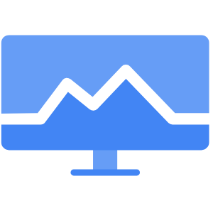

# Cloud Monitoring: ACE Exam Study Guide (2026)



_Image source: [Vecta.io](https://vecta.io/symbols/tag/google-cloud-monitoring)_

## 1. Cloud Monitoring Overview

Cloud Monitoring provides visibility into the performance, uptime, and overall health of your applications and infrastructure.

- **Key Characteristics:**
  - **Full Stack:** Monitors GCP services, AWS, and on-premises resources.
  - **Integrated:** Collects metrics, events, and metadata from Cloud Logging, Trace, and Debugger.
  - **Real-time:** Provides a real-time dashboarding and alerting system.

## 2. Metrics and Time Series

- **System Metrics:** Automatically collected from GCP services (e.g., CPU, Disk I/O).
- **Custom Metrics:** Metrics you define and send to Monitoring via the API.
- **Log-based Metrics:** Metrics derived from the content of your logs in Cloud Logging.
- **Time Series:** The fundamental data structure in Monitoring, representing data points over time.

### Common Metric Types

| Metric              | Description                   | Example               |
| ------------------- | ----------------------------- | --------------------- |
| **CPU Utilization** | Percentage of CPU in use      | 75%                   |
| **Memory Usage**    | RAM utilization               | 4.2 GB / 8 GB         |
| **Request Count**   | Number of requests received   | 1,200 req/min         |
| **Request Latency** | Time to process requests      | p50: 45ms, p99: 200ms |
| **Error Rate**      | Percentage of failed requests | 0.5%                  |
| **Disk Usage**      | Storage utilization           | 150 GB / 500 GB       |

### Metric Types by Resource

| Resource           | Key Metrics                                 |
| ------------------ | ------------------------------------------- |
| **Compute Engine** | CPU, Disk, Network, Instance uptime         |
| **Cloud Run**      | Request count, Latency, Container instances |
| **GKE**            | CPU, Memory, Pod count, Network             |
| **Cloud SQL**      | CPU, Connections, Queries/sec               |
| **Load Balancer**  | Request count, Latency, Backend errors      |

## 3. Dashboards, MQL, and Metrics Explorer

Dashboards provide a visual representation of your metrics.

- **Google Cloud Dashboards:** Pre-defined dashboards created automatically.
- **Custom Dashboards:** Dashboards you create to monitor specific aspects of your application.
- **MQL (Monitoring Query Language):** A powerful language used to create complex charts and data transformations.

### MQL Example

```sql
fetch gce_instance
| metric 'compute.googleapis.com/instance/cpu/utilization'
| filter resource.zone == 'us-east1-b'
| align rate(1m)
| every 1m
| group_by ['instance_name'], mean(val())
```

### Dashboard Types

| Type                      | Use Case                                            |
| ------------------------- | --------------------------------------------------- |
| **Built-in Dashboards**   | Auto-created per GCP service (GKE, Cloud Run, etc.) |
| **Metrics Explorer View** | Ad-hoc metric analysis and exploration              |
| **Custom Dashboards**     | User-defined charts for specific monitoring needs   |
| **Alerting Dashboards**   | Focused view on metrics with alerting policies      |

### Metrics Explorer

A tool for ad-hoc analysis of any metric:

- Select from hundreds of available metrics
- Filter by resource, zone, or labels
- Build custom charts without saving
- Export to dashboards or use in MQL queries

## 4. Alerting Policies

Alerting policies notify you when specific conditions are met.

### Alerting Workflow

```
Define Condition (metric threshold)
         ↓
Set Duration (e.g., "for 5 minutes")
         ↓
Configure Notification Channel (email, SMS, Slack, PagerDuty, Webhook)
         ↓
Add Documentation (runbook links, escalation contacts)
         ↓
Alert Triggered → Incident Created
```

### Alerting Policy Types

| Type                | Description                                      |
| ------------------- | ------------------------------------------------ |
| **Metric-based**    | Triggered when a metric exceeds a threshold      |
| **Log-based**       | Triggered when log entries match a filter        |
| **Availability**    | Triggered by uptime check failures               |
| **Multi-condition** | Requires multiple conditions (AND/OR) to trigger |

- **Uptime Checks vs Alerting Policies:**
  - **Uptime Checks:** Test availability of a service (HTTP/HTTPS/TCP)
  - **Alerting Policies:** React to metric conditions or uptime failures

- **Components of an Alerting Policy:**
  - **Conditions:** What triggers the alert (e.g., "CPU utilization > 80% for 5 minutes").
  - **Notification Channels:** How you are notified (Email, SMS, Slack, PagerDuty, Webhooks).
  - **Documentation:** Instructions or links to playbooks included in the alert.
- **Incident Management:** When an alert is triggered, an **incident** is created for tracking and resolution.

## 5. Synthetic Monitoring (2026 Update)

Synthetic monitoring replaces traditional uptime checks with more complex, programmable checks.

- **Protocols:** Supports HTTP, HTTPS, and TCP.
- **Custom Scripts:** Use Node.js or Python scripts to simulate complex user journeys (e.g., "Login -> Add to Cart -> Checkout").
- **Global Probes:** Checks are performed from multiple regions around the world.
- **Alerting Integration:** Notify you if a synthetic check fails or exceeds latency thresholds.

> In Cloud Monitoring, you create an uptime check specifying the URL, protocol (HTTP/HTTPS/TCP), frequency, and locations to check from. If the service fails to respond from multiple locations, an alert can be triggered.

## 6. Groups and Resources

Groups allow you to organize and monitor sets of resources together.

- **Criteria:** You can define groups based on names, tags, labels, or regions.
- **Use Case:** Monitor all web servers in the `us-east1` region as a single entity.

## 6.1 SLOs and SLIs

Service Level Objectives (SLOs) and Service Level Indicators (SLIs) are key reliability concepts:

| Term    | Definition                               | Example                                   |
| ------- | ---------------------------------------- | ----------------------------------------- |
| **SLI** | Metric that measures service reliability | Request latency, error rate, availability |
| **SLO** | Target value for the SLI                 | "99.9% of requests complete in < 200ms"   |
| **SLA** | Contractual guarantee (legal commitment) | "99.95% uptime"                           |

- **SLO Monitoring:** Cloud Monitoring can create alerting policies based on SLO burn rate to notify you before SLOs are breached.

## 7. Essential `gcloud` Commands

- **List Metrics:** `gcloud monitoring metric-descriptors list`
- **Create a Dashboard:** `gcloud monitoring dashboards create --config-from-file=[DASHBOARD_JSON]`
- **List Alerting Policies:** `gcloud monitoring policies list`

## 8. Exam Tips

- **Log-based Metric vs. System Metric:** Use log-based metrics for counting log events. Use system metrics for performance data.
- **Ops Agent:** For "inside-the-OS" metrics like Memory usage and internal process stats, the **Ops Agent** must be installed on VMs.
- **Synthetic Monitoring:** If a question asks for testing a multi-step user flow from multiple regions, choose **Synthetic Monitoring**.
- **Alerting vs. Uptime Checks:** Uptime checks test availability; alerting policies react to metric conditions.
- **Metrics Explorer:** Use for ad-hoc analysis; dashboards are for persistent monitoring views.

## 9. Security and IAM

- **IAM Roles:**
  - `roles/monitoring.admin`: Full control over all Monitoring resources
  - `roles/monitoring.editor`: Create and modify dashboards, alerts, uptime checks
  - `roles/monitoring.viewer`: View metrics and dashboards (read-only)
  - `roles/monitoring.alertPolicyViewer`: View alerting policies
  - `roles/monitoring.alertPolicyEditor`: Create and modify alerting policies

## 10. GCP Observability Tools Comparison

| Tool                 | Purpose                         | What it Answers                              |
| -------------------- | ------------------------------- | -------------------------------------------- |
| **Cloud Monitoring** | Metrics, dashboards, alerting   | Is my service healthy and performing well?   |
| **Cloud Logging**    | Log aggregation and analysis    | What happened at a specific point in time?   |
| **Cloud Profiler**   | Code-level performance analysis | Which function is using the most CPU/memory? |
| **Cloud Trace**      | Distributed tracing             | Where is latency in my service calls?        |
| **Error Reporting**  | Aggregated error tracking       | What bugs are in my code?                    |
| **Cloud Debugger**   | Live debugging                  | What is the state of my code at this moment? |
