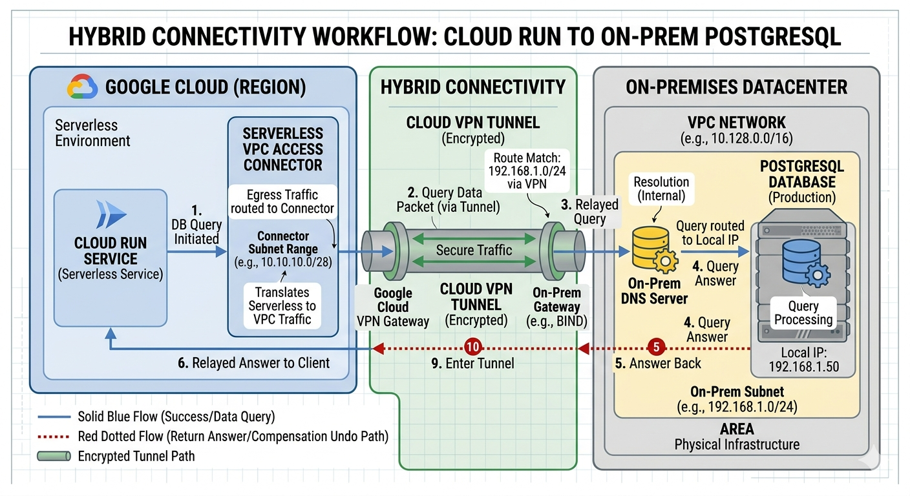

# Cloud Run connecting to DB on-prem

<figure>
  
  <figcaption><center>Cloud Run connecting to on-prem DB via Serverless VPC Access Connector<br><i>Image source: Own work (Gemini Prompting).</i></center></figcaption>
</figure>

This diagram illustrates the secure path data takes when a serverless application in Google Cloud needs to communicate with a database sitting in a physical, on-premises data center.

## Phase 1: Leaving the Serverless Environment

1. **DB Query Initiated**: The Cloud Run service (which lives in a Google-managed tenant project) sends a request to reach the PostgreSQL database.
2. **Serverless VPC Access Connector**: Because Cloud Run isn't "inside" your network by default, the traffic hits the Connector. This bridge translates the serverless request into standard VPC traffic using an IP address from its designated Connector Subnet Range (e.g., `10.10.10.0/28`).

## Phase 2: Hybrid Transit

3. **Route Match**: The VPC checks its routing table for the destination IP (`192.168.1.50`). It sees a match that points toward the Cloud VPN Gateway.
4. **Cloud VPN Tunnel**: The data packet is encrypted and sent through the Secure VPN Tunnel.
5. **On-Prem Gateway**: The on-premises gateway receives the encrypted packet, decrypts it, and identifies that it is destined for the local network.

## Phase 3: On-Premises Processing

6. **Relayed Query**: The query is sent to the On-Prem DNS Server (if a hostname was used) or routed directly via the local switch/router to the database.
7. **PostgreSQL Database**: The query reaches the PostgreSQL Server at its local IP (`192.168.1.50`). The database processes the request and generates a result.

## Phase 4: The Return Path (Red Dotted Line)

8. **Answer Back**: The database sends the result back to the gateway.
9. **Enter Tunnel**: The on-premises gateway encrypts the response and sends it back through the VPN tunnel.
10. **Relayed Answer to Client**: The response travels back through the VPC Access Connector, which hands the data back to the Cloud Run instance to complete the request.

## Key Technical Takeaways

- **The Connector is Essential**: Without the VPC Access Connector, Cloud Run has no "route" to reach private IP addresses like `192.168.x.x`.
- **Firewalls**: You must allow traffic from the Connector Subnet to the On-Prem Subnet in your GCP and On-Prem firewall rules.
- **Static/Dynamic Routing**: The Cloud VPN must be configured (usually via BGP) to tell GCP that the `192.168.1.0/24` range lives behind that tunnel.

## Opentofu Code

Put all following code snippets in a `mail.tf` file.

### 1. NETWORK: The VPC and Subnets

```terraform
resource "google_compute_network" "vpc_network" {
  name                    = "hybrid-vpc"
  auto_create_subnetworks = false
}

# Subnet for the VPC Connector (Must be /28)
resource "google_compute_subnetwork" "connector_subnet" {
  name          = "vpc-connector-subnet"
  ip_cidr_range = "10.10.10.0/28"
  region        = "us-central1"
  network       = google_compute_network.vpc_network.id
}
```

### 2. BRIDGE: Serverless VPC Access Connector

```terraform
resource "google_vpc_access_connector" "connector" {
  name   = "run-to-onprem-connector"
  region = "us-central1"

  subnet {
    name = google_compute_subnetwork.connector_subnet.name
  }
}
```

### 3. COMPUTE: Cloud Run Service with VPC Integration

```terraform
resource "google_cloud_run_v2_service" "cloud_run_app" {
  name     = "onprem-processor"
  location = "us-central1"

  template {
    containers {
      image = "gcr.io/your-project/app-image:latest" # Your app image
      env {
        name  = "DB_HOST"
        value = "192.168.1.50" # The on-prem PostgreSQL IP from diagram
      }
    }

    vpc_access {
      connector = google_vpc_access_connector.connector.id
      egress    = "ALL_TRAFFIC" # Routes all traffic through the connector
    }
  }
}
```

### 4. HYBRID: Cloud VPN Gateway (Simplified HA VPN)

```terraform
resource "google_compute_ha_vpn_gateway" "ha_gateway" {
  name    = "vpn-to-onprem"
  network = google_compute_network.vpc_network.id
  region  = "us-central1"
}
```

### 5. ROUTING: Cloud Router to advertise the Connector range to On-Prem

```terraform
resource "google_compute_router" "router" {
  name    = "vpn-router"
  region  = "us-central1"
  network = google_compute_network.vpc_network.name

  bgp {
    asn = 64514
    # Ensure the on-prem router knows how to find the connector subnet
    advertised_groups = ["ALL_SUBNETS"]
  }
}
```

### 6. FIREWALL: Allow the Connector to talk to the VPN

```terraform
resource "google_compute_firewall" "allow_connector_to_onprem" {
  name    = "allow-connector-to-onprem"
  network = google_compute_network.vpc_network.name

  allow {
    protocol = "tcp"
    ports    = ["5432"] # PostgreSQL port
  }

  source_ranges = ["10.10.10.0/28"] # Match the connector subnet
  destination_ranges = ["192.168.1.0/24"] # On-prem subnet from diagram
}
```

Run `tofu init` and then `tofu apply`.
