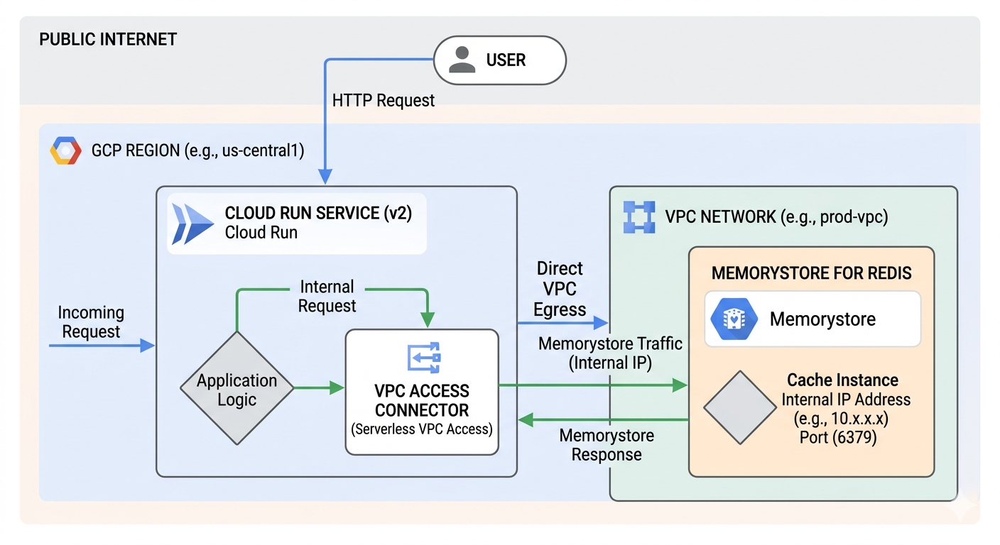

# Cloud Run &amp; Direct VPC Egress for Memorystore



_Image source: Own work (Gemini Prompting)._

## The Request Flow

The diagram depicts a three-step journey for your data:

1. Public to Private Entry - a User sends an HTTP request from the public internet. This hits your Cloud Run Service, which houses your Application Logic.
2. The "Direct" Tunnel - Instead of going back out to the internet to find the database, Cloud Run uses Direct VPC Egress. This assigns the Cloud Run instance a private IP address from your VPC Network (e.g., `10.x.x.x`), allowing it to act like it is physically inside your private network.
3. Private Communication: The request travels over Google's internal network to the Memorystore for Redis instance. Because Memorystore has no public endpoint, it only accepts connections from within the VPC on its internal IP and port (usually `6379`).

## Why this matters (VPC Connector vs. Direct Egress)

The image highlights a shift in Google Cloud architecture:

- The "Old" Way (VPC Access Connector): Used to require a separate set of managed VMs (connectors) to bridge the gap. These cost extra and added a "hop" of latency.
- The "New" Way (Direct VPC Egress): As shown in the image, this removes the need for those connector VMs. It is faster, cheaper (scales to zero cost), and simpler to set up.

## Key Components in the Image

| Component         | Function                                                    |
| ----------------- | ----------------------------------------------------------- |
| Cloud Run (v2)    | The serverless compute platform running your code.          |
| Direct VPC Egress | The networking path that enables private outbound requests. |
| VPC Network       | Your private, isolated section of Google Cloud.             |
| Memorystore       | A fully managed Redis service for low-latency caching.      |

This setup is ideal for applications that need high-performance caching while maintaining strict security by never exposing database data to the public internet.

## Opentofu Code

Put all following code snippets in a `mail.tf` file.

### 1. VPC Network and Subnet

```terraform
resource "google_compute_network" "private_network" {
  name                    = "production-vpc"
  auto_create_subnetworks = false
}

resource "google_compute_subnetwork" "app_subnet" {
  name          = "cloud-run-subnet"
  ip_cidr_range = "10.0.1.0/24" # Must be /26 or larger for Direct VPC Egress
  region        = var.region
  network       = google_compute_network.private_network.id
}
```

### 2. Memorystore (Redis) Instance

```terraform
resource "google_redis_instance" "cache" {
  name           = "app-cache"
  tier           = "BASIC"
  memory_size_gb = 1
  region         = var.region

  authorized_network = google_compute_network.private_network.id
  connect_mode       = "DIRECT_PEERING"

  depends_on = [google_compute_network.private_network]
}
```

### 3. Cloud Run Service with Direct VPC Egress

```terraform
resource "google_cloud_run_v2_service" "main_app" {
  name     = "cache-enabled-app"
  location = var.region

  template {
    containers {
      image = "us-docker.pkg.dev/cloudrun/container/hello" # Replace with your image

      env {
        name  = "REDISHOST"
        value = google_redis_instance.cache.host
      }
      env {
        name  = "REDISPORT"
        value = tostring(google_redis_instance.cache.port)
      }
    }

    # Direct VPC Egress configuration
    vpc_access {
      network_interfaces {
        network    = google_compute_network.private_network.id
        subnetwork = google_compute_subnetwork.app_subnet.id
      }
      egress = "PRIVATE_RANGES_ONLY" # Only route internal traffic to VPC
    }
  }
}
```

Run `tofu init` and then `tofu apply`.

After applying, point your DNS to the outputted IP. It usually takes 15–60 minutes for the Google Managed Certificate to turn green (`ACTIVE`).
