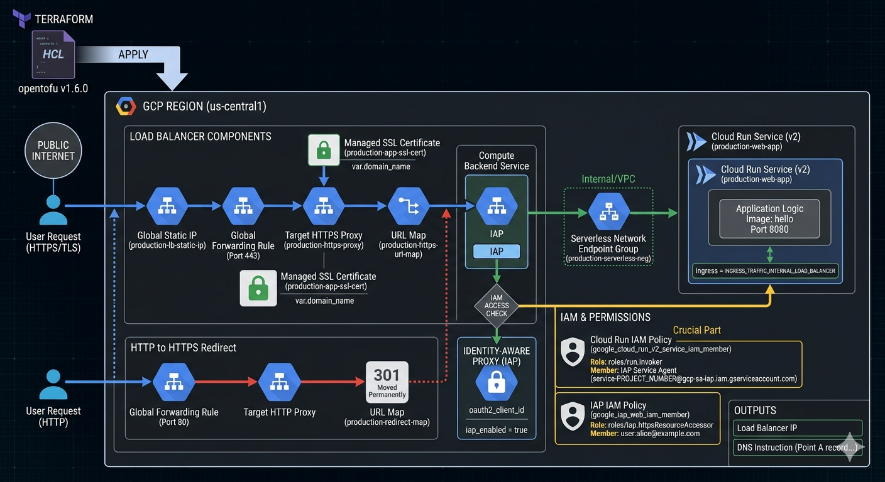

# Cloud Run &amp; IAP



_Image source: Own work (Gemini Prompting)._

## Opentofu Code

Go to _APIs & Services_ > _Credentials_ in the Google Cloud Console. Create an _OAuth 2.0 Client ID_ (Web application type).

Create a `terraform.tfvars` file:

```terraform
project_id        = "your-project-id"
domain_name       = "app.yourdomain.com"
iap_client_id     = "xxxx-yyyy.apps.googleusercontent.com"
iap_client_secret = "your-secret-key"
```

Put all following code snippets in a `mail.tf` file.

1. **Terraform Provider Configuration** - Defines the required provider and version for GCP.

   ```terraform
   terraform {
     required_version = ">= 1.6.0"
     required_providers {
       google = {
         source = "hashicorp/google"
         version = "~> 5.0"
       }
     }
   }

   provider "google" {
     project = var.project_id
     region  = var.region
   }
   ```

2. **Variables** - Declares input variables for project ID, region, IAP OAuth credentials, and domain name.

   ```terraform
   # -------------------------
   # Variables
   # -------------------------
   variable "project_id" {
     type = string
   }

   variable "region" {
     type    = string
     default = "us-central1"
   }

   variable "iap_client_id" {
     type        = string
     description = "OAuth client ID for IAP."
   }

   variable "iap_client_secret" {
     type        = string
     description = "OAuth client secret for IAP."
     sensitive   = true
   }

   variable "domain_name" {
     type        = string
     description = "Domain that will point to the LB IP (e.g. app.example.com)"
   }
   ```

3. **Data & APIs** - Enables required GCP APIs (Cloud Run, Compute, IAP, IAM).

   ```terraform
   # -------------------------
   # Data & APIs
   # -------------------------
   data "google_project" "project" {}

   resource "google_project_service" "enabled_apis" {
     for_each = toset([
       "run.googleapis.com",
       "compute.googleapis.com",
       "iap.googleapis.com",
       "iam.googleapis.com"
     ])
     service            = each.key
     disable_on_destroy = false
   }
   ```

4. **Network & SSL** - Allocates a static IP and creates a managed SSL certificate for the domain.

   ```terraform
   # -------------------------
   # 1. Network & SSL
   # -------------------------
   resource "google_compute_global_address" "app_static_ip" {
     name       = "production-lb-static-ip"
     depends_on = [google_project_service.enabled_apis]
   }

   resource "google_compute_managed_ssl_certificate" "app_cert" {
     name = "production-app-ssl-cert"
     managed {
       domains = [var.domain_name]
     }
   }
   ```

5. **Cloud Run Service** - Creates a Cloud Run v2 service with internal-only ingress (traffic from load balancer only).

   ```terraform
   # -------------------------
   # 2. Cloud Run Service (v2)
   # -------------------------
   resource "google_cloud_run_v2_service" "main_app" {
     name     = "production-web-app"
     location = var.region
     ingress  = "INGRESS_TRAFFIC_INTERNAL_LOAD_BALANCER"

     template {
       containers {
         image = "us-docker.pkg.dev/cloudrun/container/hello"
         ports {
           container_port = 8080
         }
       }
     }
   }
   ```

6. **IAM** - Grants the IAP Service Agent permission to invoke Cloud Run, and allows specific users to access via IAP.

   ```terraform
   # -------------------------
   # 3. IAM (The Crucial Part)
   # -------------------------

   # Permission for the IAP Service Agent to call Cloud Run
   resource "google_cloud_run_v2_service_iam_member" "iap_agent_invoker" {
     location = google_cloud_run_v2_service.main_app.location
     name     = google_cloud_run_v2_service.main_app.name
     role     = "roles/run.invoker"
     member   = "serviceAccount:service-${data.google_project.project.number}@gcp-sa-iap.iam.gserviceaccount.com"
   }

   # Permission for users to pass through IAP
   resource "google_iap_web_iam_member" "iap_user_access" {
     project = var.project_id
     role    = "roles/iap.httpsResourceAccessor"
     member  = "user:alice@example.com" # Change this to your email
   }
   ```

7. **Load Balancer Components** - Creates a Serverless NEG, backend service with IAP enabled, URL map, HTTPS proxy, and forwarding rule.

   ```terraform
   # -------------------------
   # 4. Load Balancer Components
   # -------------------------
   resource "google_compute_region_network_endpoint_group" "app_neg" {
     name                  = "production-serverless-neg"
     network_endpoint_type = "SERVERLESS"
     region                = var.region
     cloud_run {
       service = google_cloud_run_v2_service.main_app.name
     }
   }

   resource "google_compute_backend_service" "app_backend" {
     name                  = "production-backend-service"
     protocol              = "HTTP"
     load_balancing_scheme = "EXTERNAL_MANAGED"

     backend {
       group = google_compute_region_network_endpoint_group.app_neg.id
     }

     iap {
       enabled              = true
       oauth2_client_id     = var.iap_client_id
       oauth2_client_secret = var.iap_client_secret
     }
   }

   resource "google_compute_url_map" "https_map" {
     name            = "production-https-url-map"
     default_service = google_compute_backend_service.app_backend.id
   }

   resource "google_compute_target_https_proxy" "https_proxy" {
     name             = "production-https-proxy"
     url_map          = google_compute_url_map.https_map.id
     ssl_certificates = [google_compute_managed_ssl_certificate.app_cert.id]
   }

   resource "google_compute_global_forwarding_rule" "https_rule" {
     name                  = "production-https-forwarding-rule"
     target                = google_compute_target_https_proxy.https_proxy.id
     port_range            = "443"
     load_balancing_scheme = "EXTERNAL_MANAGED"
     ip_address            = google_compute_global_address.app_static_ip.address
   }
   ```

8. **HTTP to HTTPS Redirect** - Automatically redirects HTTP traffic to HTTPS.

   ```terraform
   # -------------------------
   # 5. HTTP to HTTPS Redirect
   # -------------------------
   resource "google_compute_url_map" "redirect_map" {
     name = "production-redirect-map"
     default_url_redirect {
       https_redirect         = true
       strip_query            = false
       redirect_response_code = "MOVED_PERMANENTLY_DEFAULT"
     }
   }

   resource "google_compute_target_http_proxy" "http_proxy" {
     name    = "production-http-proxy"
     url_map = google_compute_url_map.redirect_map.id
   }

   resource "google_compute_global_forwarding_rule" "http_rule" {
     name                  = "production-http-forwarding-rule"
     target                = google_compute_target_http_proxy.http_proxy.id
     port_range            = "80"
     load_balancing_scheme = "EXTERNAL_MANAGED"
     ip_address            = google_compute_global_address.app_static_ip.address
   }
   ```

9. **Outputs** - Exposes the load balancer IP and DNS instructions.

   ```terraform
   # -------------------------
   # 6. Outputs
   # -------------------------
   output "load_balancer_ip" {
     value = google_compute_global_address.app_static_ip.address
   }

   output "dns_instruction" {
     value = "Point A record for ${var.domain_name} to ${google_compute_global_address.app_static_ip.address}"
   }
   ```

Run `tofu init` and then `tofu apply`.

After applying, point your DNS to the outputted IP. It usually takes 15–60 minutes for the Google Managed Certificate to turn green (`ACTIVE`).
