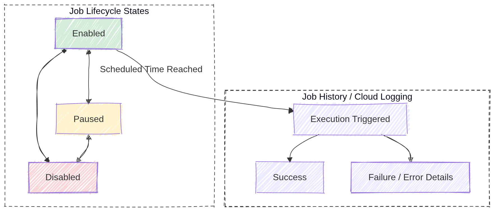

# Cloud Scheduler: ACE Exam Study Guide (2026)

_Image source: Google Cloud Documentation_

## 1. Cloud Scheduler Overview

Cloud Scheduler is a fully managed enterprise-grade cron job service. It allows you to schedule virtually any job, including batch, big data, and cloud infrastructure operations.

- **Key Characteristics:**
  - **Fully Managed:** No infrastructure to manage or scale.
  - **Reliability:** Guaranteed at-least-once delivery to your targets.
  - **Unified:** Provides a single interface to manage all your scheduled jobs.
  - **PaaS Nature:** It is a serverless product; you pay per job per month.

## 2. Target Types (How it triggers work)

Cloud Scheduler can trigger three main types of targets:

- **HTTP/S Targets:**
  - Triggers any publicly accessible URL or an internal URL (if configured correctly).
  - Supports custom HTTP headers and methods (GET, POST, PUT, etc.).
  - Standard for triggering **Cloud Run** or **Cloud Functions**.
- **Pub/Sub Targets:**
  - Publishes a message to a specific Pub/Sub topic.
  - Ideal for decoupled architectures where multiple services subscribe to the same trigger.
- **App Engine HTTP Targets:**
  - Sends an HTTP request to a specific service and handler within an App Engine app.
  - Uses App Engine's internal task queue infrastructure.

## 3. Schedule Syntax (Cron Format)

Cloud Scheduler uses the standard Unix cron format: `* * * * *` (Minute, Hour, Day of Month, Month, Day of Week).

- **Example:** `0 9 * * 1` runs every Monday at 9:00 AM.
- **Timezone:** You can specify a timezone for the job (e.g., `UTC`, `America/New_York`). If not specified, it defaults to `UTC`.

For more details on `cron` see the [Crontab Guru](https://crontab.guru/).

## 4. Reliability and Retries

- **At-least-once delivery:** Google guarantees that the job will be sent at least once. Your code should be **idempotent** to handle potential duplicate triggers.
- **Retry Config:** You can configure:
  - **Max Retries:** Number of times to try again if the target returns an error.
  - **Min/Max Backoff:** The delay between retry attempts.
  - **Max Doublings:** How many times the backoff interval is doubled.

## 5. Security and Authentication

- **Auth for HTTP Targets:**
  - **OIDC Token:** Used for services that require OpenID Connect (e.g., Cloud Run, Cloud Functions).
    > OIDC is an identity layer built on top of OAuth 2.0 that adds user authentication and provides ID tokens containing user identity information.
  - **OAuth Token:** Used for Google APIs.
    > OAuth 2.0 is an authorization framework that lets an application access a user's resources (APIs, data) on another service without needing the user's password.
  - **Service Account:** You must specify a service account that has the permissions to invoke the target service (e.g., `roles/run.invoker`).

  > OAuth handles authorization (permissions), while OIDC adds authentication (identity) on top of OAuth.

- **IAM Roles:**
  - `roles/cloudscheduler.admin`: Full control.
  - `roles/cloudscheduler.jobRunner`: Permission to run jobs manually.
  - `roles/cloudscheduler.viewer`: View-only access.

## 6. Essential `gcloud` Commands

- **Create a Pub/Sub Job:**
  `gcloud scheduler jobs create pubsub [JOB_NAME] --schedule="0 9 * * 1" --topic=[TOPIC_NAME] --message-body="Hello world"`
- **Create an HTTP Job:**
  `gcloud scheduler jobs create http [JOB_NAME] --schedule="0 0 * * *" --uri=[URL] --oidc-service-account-email=[SA_EMAIL]`
- **Run a Job Manually (for testing):**
  `gcloud scheduler jobs run [JOB_NAME]`
- **List Jobs:**
  `gcloud scheduler jobs list`
- **Pause/Resume Job:**
  `gcloud scheduler jobs pause [JOB_NAME]` / `gcloud scheduler jobs resume [JOB_NAME]`

## 7. Exam Tips

- **The "Cron" Keyword:** If a question asks how to run a task on a schedule (e.g., "daily at 2 AM"), look for **Cloud Scheduler**.
- **Idempotency:** Because Cloud Scheduler guarantees "at-least-once" delivery, your backend logic must be able to handle receiving the same request twice without side effects.
- **Triggering Serverless:** For Cloud Run or Cloud Functions, use the **HTTP target** with an **OIDC token** and a service account with the **Invoker** role.
- **App Engine Region:** Cloud Scheduler requires an App Engine application to be initialized in the project (it uses the same underlying location). You cannot change this location later.
- **Cron Format:** Be familiar with the 5-field cron syntax for basic scheduling questions.

## 8. Limitations and Quotas

- **Jobs per project:** Limited to a certain number per project (check current quotas in Cloud Console).
- **Frequency:** Minimum interval is 1 minute between job executions.
- **App Engine Dependency:** Requires App Engine to be enabled in the project for location assignment.
- **Payload size:** Pub/Sub message body has size limits (typically 256KB).

## 9. Cloud Scheduler vs Cloud Tasks

| Feature        | Cloud Scheduler                | Cloud Tasks                      |
| -------------- | ------------------------------ | -------------------------------- |
| Type           | Fully managed cron service     | Task queue service               |
| Use case       | Time-based triggers            | Work queue processing            |
| Target control | Simple HTTP/Pub/Sub            | More control over task execution |
| Retry behavior | Configurable backoff           | Queue-based with automatic retry |
| Best for       | Scheduled jobs, periodic tasks | Decoupled async workloads        |

**When to use Cloud Tasks:** If you need to process large volumes of tasks, want finer control over queue behavior, or need to throttle task execution rate.

## 10. Troubleshooting

- **Job not triggering:** Check job status (`gcloud scheduler jobs describe`), verify the schedule syntax, ensure the target service is accessible.
- **Authentication failures:** Verify the service account has the correct IAM roles (e.g., `roles/run.invoker` for Cloud Run).
- **Location errors:** Confirm App Engine is initialized in the project with the correct region.
- **Use Logs:** Cloud Scheduler logs executions in Cloud Logging - check for error messages under the specific job.

## 11. Job States and Lifecycle

- **Enabled:** Job is active and will execute on schedule.
- **Disabled:** Job exists but won't execute (can be re-enabled).
- **Paused:** Job is temporarily paused (can be resumed).
- **Job History:** Use Cloud Logging to view past executions, success/failure status, and error details.

> While both `disabled` and `paused` states stop a job from running, the difference lies in _intent_ and _behavior_ regarding missed schedules.

_Image source: Own work (Mermaid diagram)._

## 12. Real-World Use Cases

- **Data pipeline automation:** Trigger a Cloud Function or Dataflow job nightly to process daily data.
- **Database maintenance:** Run a scheduled script to clean up old records or optimize tables.
- **Report generation:** Send a daily email report by triggering a Cloud Run service that generates and emails reports.
- **Resource cleanup:** Automatically delete old temporary files from Cloud Storage every week.
- **Instance scheduling:** Start/stop Compute Engine instances during business hours to save costs.

## 13. Additional IAM Roles

- `roles/iam.serviceAccountUser`: Required to impersonate or use a service account for job authentication.
- `roles/pubsub.publisher`: Needed when creating Pub/Sub target jobs to publish messages to topics.
