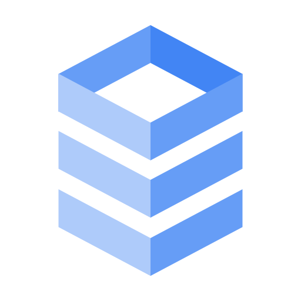

# Cloud SQL: ACE Exam Study Guide (2026)



_Image source: Google Cloud Documentation_

## 1. Core Overview

Cloud SQL is a fully managed relational database service (RDBMS) on Google Cloud.

- **Supported Database Engines:** MySQL, PostgreSQL, and SQL Server.
- **Editions (2026 Standards):**
  - **Cloud SQL Enterprise:** Standard performance and reliability.
  - **Cloud SQL Enterprise Plus:** Enhanced performance, higher availability (99.99% for regional), and near-zero downtime maintenance.
- **Use Cases:** Web frameworks, structured data, existing applications that require standard SQL, OLTP workloads.
- **Gemini Integration:** Gemini in Cloud SQL provides AI-assisted query optimization, performance insights, and simplified database management.

## 2. High Availability (HA) and Replication

Understanding the difference between HA and Read Replicas is heavily tested on the ACE exam.

### High Availability (HA)

- **Purpose:** Protection against zone failures. Provides reliability, not performance scaling.
- **Architecture:** Regional configuration. Provisions a Primary instance in one zone and a Standby instance in another zone within the same region.
- **Failover:** Automatic. If the primary zone goes down, the standby takes over.

### Read Replicas

- **Purpose:** Read performance scaling (offloading read queries from the primary instance).
- **Architecture:** Can be in the same region or a different region (Cross-Region Read Replica).
- **Failover:** Manual. You must manually promote a read replica to become a standalone primary instance if needed for disaster recovery.

## 3. Backups and Recovery

- **Automated Backups:** Taken daily within a configurable backup window. Retained for up to 365 days.
- **On-Demand Backups:** Taken manually at any time.
- **Point-in-Time Recovery (PITR):** Allows you to restore an instance to a specific fraction of a second.
- **Cloning:** You can clone a Cloud SQL instance to create an exact, independent copy.

## 4. Scaling

- **Vertical Scaling:** Increasing the machine type (vCPUs and RAM). **Requires a restart** of the database instance.
- **Horizontal Scaling:** Using Read Replicas to scale read capacity. Cloud SQL does not natively horizontally scale for write operations (use Cloud Spanner or AlloyDB for massive write scale).
- **Storage Auto-Increase:** Cloud SQL can automatically add storage capacity as you approach your limit.
- **Important Fact:** Cloud SQL storage can scale up, but it **cannot scale down**.

## 5. Security and Networking

- **Private IP:** Instances can have a private, internal IP via Private Services Access (VPC Peering).
- **Cloud SQL Auth Proxy:** The **Gold Standard** for secure connections. It uses IAM for authentication and automatically handles SSL/TLS. No need to whitelist IP addresses when using the proxy.
- **IAM Authentication:** Allows users and service accounts to log in using their Google Cloud identity instead of static database passwords.

## 6. Maintenance

- **Maintenance Windows:** You define a specific day and time when Google can perform updates.
- **Impact:** Maintenance usually results in a brief period of downtime (minimized in Enterprise Plus edition).

## 7. Decision Tree for the ACE Exam

- Structured data / Relational? -> **Cloud SQL** or **Spanner**.
- Local/Regional scale? -> **Cloud SQL**.
- High performance PostgreSQL requirements? -> **AlloyDB**.
- Global scale or massive writes? -> **Cloud Spanner**.
- Petabytes of data / Data Warehousing / OLAP? -> **BigQuery**.
- Unstructured data / NoSQL? -> **Cloud Firestore** or **Cloud Bigtable**.

## 8. Migration and Administrative Tasks

- **Database Migration Service (DMS):** The primary tool for migrations from on-premises or other clouds to Cloud SQL.
- **Import/Export:** You MUST store the SQL/CSV file in a **Cloud Storage (GCS)** bucket first before importing it into Cloud SQL.
- **Service Account Permissions:** The Cloud SQL Service Account must have `roles/storage.objectViewer` on the GCS bucket for imports.

## 9. Using Cloud SQL in a Spring Boot App (Example)

Connect to Cloud SQL (PostgreSQL) using its IP, just like a regular PostgreSQL instance.

```yaml
spring:
  datasource:
    url: jdbc:postgresql://10.0.0.10/DB_NAME?currentSchema=SCHEMA_NAME
    username: USER
    password: PASSWORD
    driver-class-name: org.postgresql.Driver

  jpa:
    hibernate:
      ddl-auto: update
    show-sql: true
```

### When to Use Each Cloud SQL Connection Method

- **Private IP**
  - Use it when your service runs inside a VPC (GKE, GCE, Cloud Run with VPC connector). Best security and lowest latency. No public exposure.

- **Cloud SQL Auth Proxy**
  - Use for local development or when you want automatic IAM auth and secure TLS without managing certificates. Works anywhere but adds a sidecar/agent.

  ```bash
  ./cloud-sql-proxy INSTANCE_CONNECTION_NAME \
      --port=5432 \
      --credentials-file=key.json
  ```

- **Socket Factory (JDBC Connector)**
  - Use in Java apps (Spring Boot) when you want secure IAM‑based connections without running the proxy. Common in Cloud Run and GKE.

  ```yaml
  spring:
  datasource:
    url: jdbc:postgresql://google/DB_NAME?socketFactory=com.google.cloud.sql.postgres.SocketFactory&cloudSqlInstance=INSTANCE_CONNECTION_NAME
    username: USER
    password: PASSWORD
    driver-class-name: org.postgresql.Driver
  ```

## Exam Tip

- **Private IP** → Best for production inside a VPC (GKE, GCE, Cloud Run + VPC connector)
- **Auth Proxy** → Easiest secure option for local dev or simple setups
- **Socket Factory** → Ideal for Java apps needing secure IAM auth without running the proxy
