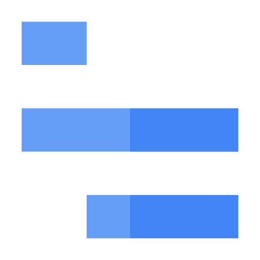

# Cloud Trace: ACE Exam Study Guide



_Image source: Google Cloud Documentation_

## 1. Overview

Cloud Trace is a managed distributed tracing service that collects latency data from your applications and visualizes it in the Google Cloud Console.

**Primary Purpose:** Understand application performance and identify latency bottlenecks in microservices architectures.

**How it Works:** Tracks how a single request travels through various services (frontend, backend, database) and records the time taken at each step.

## 2. Key Concepts

| Concept             | Description                                                                                |
| ------------------- | ------------------------------------------------------------------------------------------ |
| **Trace**           | Complete path (end-2-end) of a single request through your system                          |
| **Span**            | Single operation within a trace (e.g., RPC call, database query) with start/end timestamps |
| **Root Span**       | First span in a trace, representing the initial request                                    |
| **Trace ID**        | Unique identifier propagated between services via HTTP headers                             |
| **Latency Profile** | Waterfall chart showing where time was spent                                               |

## 3. Service Integration

### Auto-Instrumented (No Setup Required)

- **App Engine** (Standard and Flexible)
- **Cloud Run** (basic tracing enabled by default)
- **Cloud Functions** (basic tracing enabled by default)

### Manual Instrumentation Required

- **Compute Engine** VMs
- **GKE** clusters
- **Internal Load Balancers** (configurable)

**Recommended SDK**: **OpenTelemetry** - sends data to Trace API, supports multi-cloud (AWS, Azure).

- [Intro to OpenTelemetry Java](https://opentelemetry.io/docs/languages/java/intro/)

## 4. Trace Context Propagation

When a request crosses service boundaries, the trace context must be propagated:

- **Header:** `X-Cloud-Trace-Context`
- **Format:** `TRACE_ID/SPAN_ID;o=TRACE_TRUE`
- The receiving service continues the trace instead of starting a new one

## 5. Features and Analysis

- **Trace Explorer:** Search and visualize individual traces. Filter by URI, latency, or status code.
- **Analysis Reports:** Periodic reports comparing performance across versions or time periods.
- **Bottleneck Detection:** Identifies which operation causes the most delay.
- **Waterfall Charts:** Displays sequence and duration of spans.
- **Screenshots:** Capture trace views for documentation.

## 6. Retention and Limits

| Setting        | Value                                  |
| -------------- | -------------------------------------- |
| Data retention | 30 days (default) / 90 days (extended) |
| Free tier      | 10 traces/second                       |
| Sampling rate  | Configurable to control costs          |

## 7. Cloud Trace vs Other Cloud Operations Tools

| Service              | Question Answered               | Data Type                   |
| -------------------- | ------------------------------- | --------------------------- |
| **Cloud Logging**    | "What happened?"                | Text events, logs           |
| **Cloud Monitoring** | "How is the system performing?" | Numerical metrics           |
| **Cloud Trace**      | "Where is the delay?"           | Latency across services     |
| **Cloud Profiler**   | "Which code causes latency?"    | CPU/memory within a service |

**Key Distinction:**

- **Trace** = Latency **between** services (request flow)
- **Profiler** = Latency **within** a service (code-level)

## 8. When to Use Cloud Trace

**Use Cloud Trace when:**

- Troubleshooting latency across microservices
- Identifying which service in a chain is slowing down requests
- Comparing performance between deployments
- Monitoring distributed tracing in production

**Do NOT use Cloud Trace when:**

- Single monolithic application (use Cloud Profiler instead)
- Real-time alerting needed (use Cloud Monitoring)
- Log analysis required (use Cloud Logging)

## 9. Security and IAM

| Role                      | Permission                                    |
| ------------------------- | --------------------------------------------- |
| `roles/cloudtrace.admin`  | Full control over Cloud Trace resources       |
| `roles/cloudtrace.user`   | Send trace data to the API (for applications) |
| `roles/cloudtrace.viewer` | View trace data and reports in console        |

## 10. Essential gcloud Commands

- Check API Status

  ```bash
  gcloud services list --enabled | grep cloudtrace
  ```

- List recent traces (alpha)
  ```bash
  gcloud alpha trace slices list --project=[PROJECT_ID]
  ```

## 11. Quick Reference Summary

| Feature              | Value                                  |
| -------------------- | -------------------------------------- |
| Trace                | Complete request path through services |
| Span                 | Single operation with timestamps       |
| Propagation header   | `X-Cloud-Trace-Context`                |
| Auto-instrumented    | App Engine, Cloud Run, Cloud Functions |
| Manual setup needed  | Compute Engine, GKE                    |
| Recommended SDK      | OpenTelemetry                          |
| Data retention       | 30 days (default)                      |
| Answers the question | "Where is the delay?"                  |

## 12. Comparison Diagram

### _Cloud Trace vs_ _Cloud Logging_ vs _Cloud Monitoring_

```
                          ┌──────────────────────────────────┐
                          │        Cloud Operations Suite    │
                          │   (Observability Stack in GCP)   │
                          └──────────────────────────────────┘
                                           │
       ┌───────────────────────────────────┼───────────────────────────────────┐
       │                                   │                                   │
       ▼                                   ▼                                   ▼
┌──────────────────────────┐  ┌──────────────────────────┐  ┌──────────────────────────┐
│      Cloud Logging       │  │     Cloud Monitoring     │  │        Cloud Trace       │
└──────────────────────────┘  └──────────────────────────┘  └──────────────────────────┘
│ What it captures:        │  │ What it captures:        │  │ What it captures:        │
│ • Text logs              │  │ • Metrics (CPU, RAM,     │  │ • Latency of requests    │
│ • Structured logs        │  │   QPS, errors, custom)   │  │ • Request flow across    │
│ • Application events     │  │ • SLOs, SLIs, alerts     │  │   microservices          │
│ • Error messages         │  │ • Dashboards             │  │ • Spans & trace IDs      │
└──────────────────────────┘  └──────────────────────────┘  └──────────────────────────┘
│ Answers the question:    │  │ Answers the question:    │  │ Answers the question:    │
│ “What happened?”         │  │ “How is the system       │  │ “Where is the delay?”    │
│                          │  │ performing?”             │  │                          │
└──────────────────────────┘  └──────────────────────────┘  └──────────────────────────┘
│ Typical use cases:       │  │ Typical use cases:       │  │ Typical use cases:       │
│ • Debugging errors       │  │ • Alerting on high CPU   │  │ • Troubleshooting slow   │
│ • Viewing logs per       │  │ • Monitoring uptime      │  │   requests               │
│   service or request     │  │ • SLO compliance         │  │ • Identifying bottleneck │
│ • Log-based metrics      │  │ • Trend analysis         │  │   microservices          │
└──────────────────────────┘  └──────────────────────────┘  └──────────────────────────┘
                                             |
                         ┌───────────────────┼───────────────────┐
                         │                   │                   │
                         ▼                   ▼                   ▼
                   ┌──────────────────────────────────────────────────┐
                   │   Combined View: Observability Workflow in GCP   │
                   └──────────────────────────────────────────────────┘
                   │ Logs show **what happened**                      │
                   │ Metrics show **system health**                   │
                   │ Traces show **where latency occurs**             │
                   └──────────────────────────────────────────────────┘
```