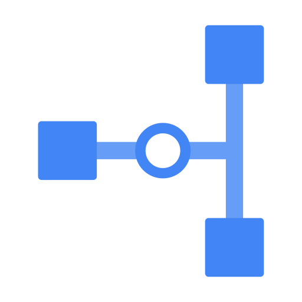

# Cloud VPN: ACE Exam Study Guide (2026)

_Image source: Google Cloud Documentation_

## 1. Cloud VPN Overview

Cloud VPN securely connects your peer network (on-premises or another VPC) to your Google Cloud VPC network through an IPsec VPN connection.

### Key Characteristics

- **Encrypted Traffic:** Data travels over the public internet but remains private due to IPsec encryption.
- **SLA:** Up to 99.99% availability for HA VPN.

## 2. VPN Types (The Most Important Exam Distinction)

Google Cloud offers two types of VPN gateways: **HA VPN** and **Classic VPN**.

| Feature             | HA VPN                                                                                          | Classic VPN                                                                    |
| ------------------- | ----------------------------------------------------------------------------------------------- | ------------------------------------------------------------------------------ |
| **SLA**             | **99.99%**                                                                                      | **99.9%**                                                                      |
| **Architecture**    | Two interfaces (0 & 1), each with its own external IP; two tunnels per interface for redundancy | Single interface, single external IP; single tunnel unless manually duplicated |
| **Routing**         | **Dynamic routing only (BGP)** via Cloud Router                                                 | Static or Dynamic (BGP optional)                                               |
| **Redundancy**      | Built‑in high availability across two availability zones                                        | No built‑in HA; must create multiple tunnels manually                          |
| **Traffic Support** | IPv4 and IPv6 (2026 standard)                                                                   | IPv4 only                                                                      |
| **Throughput**      | Higher throughput due to dual‑tunnel architecture                                               | Lower throughput                                                               |
| **Use Case**        | Production‑grade, highly available VPN connections                                              | Legacy systems or peers that **do not support BGP**                            |
| **Status**          | Recommended default                                                                             | Deprecated for most new deployments                                            |

## 3. Dynamic vs. Static Routing

- **Dynamic Routing (BGP):**
  - Uses **Cloud Router** to automatically exchange routes between Google Cloud and on-premises.
  - Automatically updates routes if the network topology changes.
- **Static Routing:**
  - Routes are manually defined.
  - Only supported on Classic VPN.

## 4. Connectivity Components

To establish a VPN, you need:

1. **VPC Network:** The Google Cloud network you are connecting.
2. **Cloud VPN Gateway:** The Google-side gateway.
3. **Peer VPN Gateway:** The on-premises or non-GCP side gateway.
4. **VPN Tunnels:** Encrypted links connecting the two gateways.
5. **Cloud Router:** Required for Dynamic Routing (BGP).

## 5. Bandwidth and MTU

- **Bandwidth:** Each tunnel supports up to **3 Gbps** (egress/ingress combined). You can add multiple tunnels to increase aggregate bandwidth.
- **MTU (Maximum Transmission Unit):** Cloud VPN uses an MTU of **1460 bytes**.
- **Exam Tip:** If SSH works but large file transfers hang, it is likely an **MTU mismatch**. Adjust the MTU on the peer gateway or guest OS.

## 6. Security and Firewall Rules

- **IPsec Protocols:** Uses IKE (Internet Key Exchange) to establish the secure tunnel.

  > _Internet Key Exchange_ is the protocol that negotiates keys and security parameters for IPsec VPN tunnels. It authenticates endpoints and establishes encrypted sessions. Used by GCP **Cloud VPN (Classic + HA VPN)** because both rely on IPsec.

- **Firewall Rules:** You must create ingress firewall rules in your VPC to allow traffic from the on-premises IP ranges.
- **IKE Ports:** Traffic on UDP 500 and UDP 4500 must be allowed by the on-premises firewall.

## 7. Essential gcloud Commands

- **Create HA VPN Gateway:**
  `gcloud compute vpn-gateways create [NAME] --network=[VPC] --region=[REGION]`
- **Create Cloud Router (for BGP):**
  `gcloud compute routers create [ROUTER_NAME] --network=[VPC] --region=[REGION] --asn=[GOOGLE_ASN]`
- **Create VPN Tunnel:**
  `gcloud compute vpn-tunnels create [TUNNEL_NAME] --peer-address=[PEER_IP] --ike-version=2 --router=[ROUTER_NAME] --vpn-gateway=[GW_NAME] --interface=[0_OR_1]`

## 8. Exam Tips

- **VPN vs. Interconnect:**
  - Use **VPN** for lower bandwidth, lower cost, and fast setup over the public internet.
  - Use **Interconnect** for high bandwidth (10 or 100 Gbps), predictable latency, and high security via a direct physical link.
- **High Availability:** To achieve 99.99% SLA, you must have two tunnels from the HA VPN gateway and use Cloud Router with BGP (Border Gateway Protocol).
- **Transitive Routing:** Cloud VPN can act as a bridge for transitive routing if Cloud Router is configured correctly to advertise routes from other peered VPCs.
