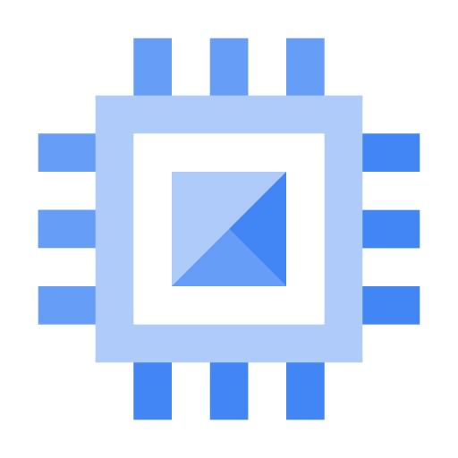

# Compute Engine: ACE Exam Study Guide (2026)

_Image source: Google Cloud Documentation_

## 1. Compute Engine Overview

Compute Engine is Google Cloud's _Infrastructure as a Service (IaaS)_ offering, providing customizable Virtual Machines (VMs).

- Machine Families (2026 Standards)
  - **General-purpose:** Best price-performance. Includes **E2**, **N2**, and the new **N4** (optimized for modern workloads with flexible sizing).
  - **Compute-optimized:** High performance per core. Includes **C2**, **C3**, and **C4** (the latest generation for high-performance computing).
  - **Memory-optimized:** High memory/vCPU ratio. Includes **M1**, **M2**, and **M3**.
  - **Accelerator-optimized:** GPUs attached (e.g., **A2**, **A3**).

## 2. Pricing and Discounts

- **Cost of Stopped VMs:** If you stop a VM, you stop paying for CPU and RAM, but you still pay for attached _Persistent Disks_ and any reserved _Static External IPs_.
- **Sustained Use Discounts (SUD):** Automatic discounts for running instances for a significant portion of the month (N1, N2).
- **Committed Use Discounts (CUD):** 1 or 3-year commitment for a predictable workload.
- **Spot VMs:** Up to 91% discount. These can be terminated by Google at any time with a 30-second notice. Best for fault-tolerant, stateless batch jobs.

## 3. Instance Templates and Managed Instance Groups (MIGs)

- **Instance Templates:** Immutable resources that define VM properties (machine type, image, labels). Used to create MIGs.
- **Managed Instance Groups (MIGs):** A collection of identical VMs that offer high availability and scalability.
  - **Auto-healing:** Automatically recreates VMs that fail health checks.
  - **Auto-scaling:** Dynamically adds or removes VMs based on CPU utilization, load balancing capacity, or custom metrics.
  - **Regional MIGs:** Highly recommended for production as they distribute VMs across multiple zones in a region.

> - [Zonal MIG - Google Cloud Documentation](https://docs.cloud.google.com/compute/docs/instance-groups/create-zonal-mig)
> - [Regional MIG - Google Cloud Documentation](https://docs.cloud.google.com/compute/docs/instance-groups/distributing-instances-with-regional-instance-groups)

> Live migration is the process of moving a running VM from one physical host to another without downtime. Google uses this for infrastructure maintenance, allowing your VMs to keep running during host updates. It requires no action from you.

## 4. Persistent Disks, Snapshots and Images

- **Persistent Disks (PD):** Durable network storage. You can resize a disk up but never down.
- **Snapshots:** Incremental backups of disks, stored globally. Best for disaster recovery.
- **Custom Images:** A _Gold Master_ boot disk with your OS and software pre-installed. Best for consistent deployments in MIGs.
- **Local SSD:** Physical drives attached directly to the host. Data is ephemeral and lost if the VM is stopped or deleted.
  > You can attach up to 24 local SSDs to a single VM, depending on the machine type. Each local SSD is 375 GB, providing up to 9 TB of local SSD storage per VM. Local SSDs provide high-performance ephemeral storage.

## 5. Sole-Tenant Nodes

Dedicated, single‑tenant physical servers in Google Cloud that run only your project’s Compute Engine VMs. They provide hardware‑level isolation by ensuring no other customer’s workloads share the same underlying host.

> [Sole-tenancy overview - Google Cloud Documentation](https://docs.cloud.google.com/compute/docs/nodes/sole-tenant-nodes)

#### Primary Use Cases

Regulatory or compliance requirements that mandate physical isolation (e.g., healthcare, finance, government).
Security boundaries where you must avoid multi‑tenant hardware for risk or policy reasons.
_Bring‑Your‑Own‑License (BYOL)_ scenarios for software that is licensed per physical core, socket, or host.
Workload placement control, such as pinning specific VMs to specific hardware types.

#### Node Groups & Placement

Nodes are organized into node groups, which act as pools of dedicated hosts.
VMs use **node affinity/anti‑affinity** rules to control placement, ensuring they land on the correct physical nodes.
You can enforce strict placement (must run on a specific node type) or preferred placement (try this node type first).
Useful for keeping related workloads together or separating sensitive workloads across different hosts.

## 6. Connecting to Instances

- **SSH Access**: `gcloud compute ssh [VM_NAME]`
  - Uses a **direct SSH connection** to the VM’s **public IP**
  - Requires the VM to **have an external IP**
  - Firewall must allow TCP on port `22` from your client
  - Your machine connects **over the public internet**
- **Identity-Aware Proxy (IAP)**: `gcloud compute ssh VM_NAME --zone=ZONE --tunnel-through-iap`
  - Uses **IAP TCP Tunneling** (Zero‑Trust access)
  - Works even when the VM has **no external IP**
  - Requires IAM role: `roles/iap.tunnelResourceAccessor`
  - Firewall must allow TCP on port `22` from **IAP’s IP range `35.235.240.0/20`**
  - SSH traffic goes through Google’s secure IAP tunnel to the VM’s **internal IP**

## 7. Service Accounts and Metadata

- **Service Accounts:** VMs use these to authenticate to other Google Cloud services (GCS, BigQuery). Always use custom service accounts with _Least Privilege_ for production.
  > The default Compute Engine service account `PROJECT_NUMBER-compute@developer.gserviceaccount.com` is automatically created and has the Editor role on the project. It is automatically attached to new VMs unless you specify a different service account or disable it.
- **Metadata:** Used to pass configuration data. Startup scripts are automated scripts that run every time the VM boots.
- **Metadata Server:** Accessible at `http://metadata.google.internal/computeMetadata/v1/`.

## 8. Essential `gcloud` Commands

- **Create a VM:** `gcloud compute instances create [NAME] --zone=[ZONE] --machine-type=[TYPE]`
- **Resize a MIG:** `gcloud compute instance-groups managed resize [NAME] --size=[NEW_SIZE]`
- **List Instances:** `gcloud compute instances list`

## 9. Exam Tips

- **Preemption:** If a Spot VM is terminated, it is a preemption, not a system crash.
- **Zonal vs. Regional MIG:** Choose Regional MIG for the highest availability.
- **Metadata Header:** Requests to the metadata server require the header `Metadata-Flavor: Google`.
- **Machine Type Selection:** If a question asks for the best cost-performance for a general workload, consider **E2** or **N4**. For high-performance databases, consider **C4** or **M3**.

## 8. External Links

- [Compute Engine - The Cloud Girl](https://www.thecloudgirl.dev/compute/compute-engine)
