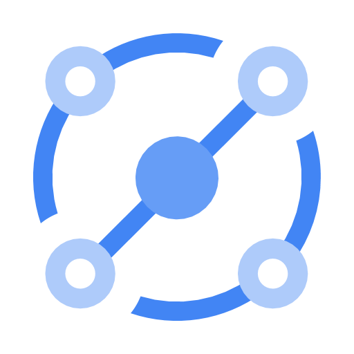

# Eventarc: ACE Exam Study Guide (2026)



_Image source: Google Cloud Documentation_

## 1. Eventarc Overview

Eventarc is a fully managed eventing service that routes events from various sources to specific destinations using the CloudEvents specification.

- Fully Managed: No infrastructure to manage; scales automatically.
- Decoupling: Enables asynchronous communication between producers and consumers.
- Standardization: Uses CloudEvents 1.0 for consistent event format.
- Regional: Triggers must be in the same region as the destination service.

## 2. Core Components

- **Event:** A record of something that happened (e.g., a file uploaded to Cloud Storage).
- **Trigger:** A filter that defines which events to route to which destination.
- **Destination:** The service that receives and processes the event (Cloud Run, Cloud Functions, GKE, Workflows).
- **Event Channel:** A pathway to receive events from non-Google sources (SaaS, custom apps).

## 3. Event Sources

- **Direct Sources:** Cloud Storage, Pub/Sub, Firestore, BigQuery (have built-in event types).
- **Cloud Audit Logs:** Any GCP service that writes to Audit Logs can trigger events. Use when a service lacks direct Eventarc support.
- **Pub/Sub:** Route existing Pub/Sub messages through Eventarc.
- **Third-party (SaaS):** Datadog, PagerDuty, etc. via Event Channels.
- **Custom Applications:** Your own apps can publish events via Event Channels.
- **Discovery:** `gcloud eventarc events list --location=[REGION]` shows available event types.

## 4. Event Destinations

- Cloud Run (Services)
- Cloud Functions (2nd Gen - Eventarc is the underlying engine)
- GKE (via k8s triggers)
- Workflows (orchestrate multi-step processes)
- Internal Load Balancers

## 5. Event Filters

Triggers use **AND logic** - all specified filters must match:

- Single: `--event-filters="type=google.cloud.storage.object.v1.finalized"`
- Multiple: `--event-filters="type=google.cloud.storage.object.v1.finalized" --event-filters="bucket=my-bucket"`
- Common filters: `type`, `bucket`, `serviceName`, `methodName`

## 6. CloudEvents Format

```json
{
  "id": "test-event-id",
  "source": "//storage.googleapis.com/buckets/my-bucket",
  "type": "google.cloud.storage.object.v1.finalized",
  "datacontenttype": "application/json",
  "data": { "bucket": "my-bucket", "name": "my-file.txt" }
}
```

## 7. Security and IAM

- **Service Account:** Needs `roles/eventarc.eventReceiver` to receive events and `roles/run.invoker` to invoke destinations.
- **Roles:**
  - `roles/eventarc.admin`: Full control
  - `roles/eventarc.viewer`: Read-only

## 8. Essential `gcloud` Commands

- Create Trigger: `gcloud eventarc triggers create [NAME] --destination-run-service=[SVC] --destination-run-region=[REGION] --event-filters="type=google.cloud.storage.object.v1.finalized" --event-filters="bucket=[BUCKET]" --service-account=[SA_EMAIL]`
- List Triggers: `gcloud eventarc triggers list --location=[REGION]`
- Create Channel: `gcloud eventarc channels create [NAME] --location=[REGION]`

## 9. Failure Handling

- **At-least-once delivery:** Retries with exponential backoff on failure.
- **No dead letter queue:** Handle failures in the destination service.
- **Idempotency required:** Destinations must handle duplicate deliveries.

## 10. Eventarc vs Pub/Sub

| | Eventarc | Pub/Sub |
|---------|---------|---------|
| Format | CloudEvents | Any |
| Use case | React to state changes | Service-to-service messaging |
| Filtering | Trigger-level (simple) | Subscription-level (complex) |
| Throughput | Moderate | High |

**Use Pub/Sub:** High-throughput, complex filtering, any message format.
**Use Eventarc:** GCP-managed routing, CloudEvents format, serverless triggers.

## 11. Exam Tips

- 2nd Gen Cloud Functions use Eventarc internally.
- Cloud Audit Logs enables triggering on ANY GCP operation.
- Triggers are regional; match destination region.
- Event Channels bridge non-Google sources into Eventarc.
