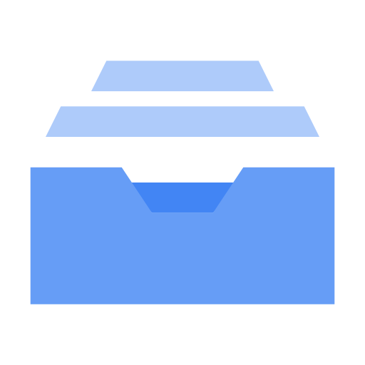

# Filestore: ACE Exam Study Guide (2026)



_Image source: Google Cloud Documentation_

Google Cloud Filestore is a **managed NFS file storage service** (POSIX‑compliant) designed for applications that require a shared filesystem. It is a regional resource that offers both zonal and multi-zonal availability tiers.

> **POSIX** is a standard that ensures portability by unifying system calls, file and process handling, and permissions. Linux and macOS follow POSIX, so software written for one typically works on Filestore without modification.

## 1. Filestore Use Cases

- Shared storage for **GKE** and **Compute Engine** workloads.
- Content management systems (CMS) and media processing.
- Machine learning workloads needing shared datasets.
- Home directories for Linux users.
- **Serverless:** Cloud Run (Gen 2) can mount Filestore via **Direct VPC Egress**.

## 2. Filestore Tiers (Updated for 2026)

Tiers determine performance, availability, and capacity.

> **Note:** You cannot change tiers in-place. You must migrate data to a new instance.

| Tier           | Availability        | Capacity           | Use Case                                             |
| :------------- | :------------------ | :----------------- | :--------------------------------------------------- |
| **Basic HDD**  | Single Zone         | 1 TiB – 63.9 TiB   | Low-cost, sequential workloads, dev/test.            |
| **Basic SSD**  | Single Zone         | 2.5 TiB – 63.9 TiB | General purpose, legacy apps, read-heavy.            |
| **Zonal**      | Single Zone (99.9%) | 1 TiB – 100 TiB    | HPC, AI/ML, High throughput (formerly High Scale).   |
| **Regional**   | Multi-Zone (99.99%) | 100 GiB – 100 TiB  | Mission-critical apps, DR-ready.                     |
| **Enterprise** | Multi-Zone (99.99%) | 1 TiB – 10 TiB     | **GKE Multishares**, high availability, **NFSv4.1**. |

## 3. Networking & Connectivity

- Deployed into a **VPC network** via a private IP.
- Must be in the **same VPC and region** as clients (or connected via VPC Peering/VPN).
- **Mounting:**
  - **GKE:** Use the Filestore CSI driver for automatic provisioning.
  - **Cloud Run (Gen 2):** Use `--add-volume=type=nfs` and `--vpc-egress=all-traffic`.

## 4. Capacity & Scaling

- **Increase Only:** You can increase capacity, but you **cannot decrease** it.
- **Downtime:** Scaling may cause brief downtime on Basic/Zonal tiers.
- **Online Scaling:** The **Enterprise** tier supports **online scaling** with zero downtime, making it the preferred choice for mission-critical GKE applications.
- **Independent Scaling:** The **Zonal** tier allows scaling performance and capacity independently.

## 5. Data Protection: Backups & Snapshots

Understanding the difference is critical for disaster recovery (DR).

### Filestore Backups

- **What:** A point-in-time copy of the entire share, stored separately from the instance.
- **Scope:** Can be stored in the same region or **different regions** (Multi-regional).
- **Restore:** You MUST restore a backup to a **new Filestore instance**. You cannot restore in-place.
- **Use Case:** Disaster recovery or moving data to a new region/tier.

### Filestore Snapshots

- **What:** Fast, local point-in-time copies of the filesystem.
- **Availability:** Supported on **Enterprise**, **Zonal**, and **Regional** tiers.
- **Restore:** Allows for quick recovery of individual files or the entire share.
- **Use Case:** Protecting against accidental deletions or rolling back local changes.

| Feature                | Backup                      | Snapshot                   |
| :--------------------- | :-------------------------- | :------------------------- |
| **Location**           | Separate from instance      | Local to instance          |
| **Storage Cost**       | Per GB (Regional/Multi-reg) | Uses instance capacity     |
| **Restore Path**       | New instance only           | In-place recovery possible |
| **Performance Impact** | Brief degradation possible  | Near-zero impact           |

## 6. Security

- **IAM:** Controls **instance management** (create, delete, backup).
- **POSIX/NFS:** Controls **file-level access** (UID/GID, read/write permissions).
- **Network:** Isolated within your VPC; supports CMEK on Enterprise tiers.

> **Important:** IAM does NOT control who can read or write individual files inside the share; that is handled by NFS permissions.

## 7. Using in a Spring Boot App (Example)

Filestore is mounted as a local directory. Use the `java.nio.file` API.

```java
@Service
public class FileService {

    private final Path mountPoint = Paths.get("/mnt/filestore/data");

    public void save(String fileName, byte[] content) throws IOException {
        Files.write(mountPoint.resolve(fileName), content);
    }
}
```

## 8. Common ACE Exam Scenarios

- **Scenario**: Shared POSIX for GKE? → **Filestore**.
- **Scenario**: Many small (10GB) shares for GKE pods? → Filestore **Enterprise (Multishares)**.
- **Scenario**: Mount shared storage to Cloud Run? → Filestore + **Direct VPC Egress**.
- **Scenario**: Scale performance and capacity independently? → **Zonal** tier.
- **Scenario**: In-place tier upgrade? → **Not possible** (must create new and migrate).
- **Scenario**: Regional High Availability (99.99% SLA)? → **Regional** or **Enterprise** tier.
- **Scenario**: Global object storage? → **Cloud Storage** (not Filestore).

## 9. Quick Summary Table

| Feature           | Filestore           | Cloud Storage         | Persistent Disk       |
| :---------------- | :------------------ | :-------------------- | :-------------------- |
| **Protocol**      | NFSv3 / NFSv4.1     | HTTP(S) / API         | Block (SCSI/NVMe)     |
| **Shared Access** | ReadWriteMany (RWX) | ReadWriteMany (RWX)   | ReadWriteOnce (RWO)\* |
| **POSIX**         | Full                | Partial (via GCSFuse) | Full                  |
| **Cloud Run**     | ✔️ (via Gen2)       | ✔️                    | ❌                    |
| **HA**            | Regional Tier       | Regional/Multi-Reg    | Regional PD           |

> Note: Multi-writer PD exists but is highly specialized (Block storage).

## 10. External Links

- [Youtube - Andrew Brown - GCP ACE](https://www.youtube.com/watch?v=OlAmyf8_4O4&t=17043s)
