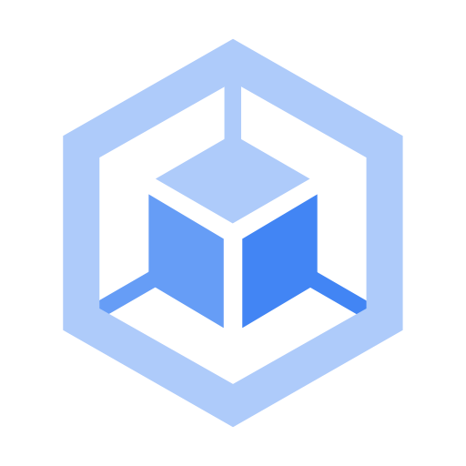

# GKE: ACE Exam Study Guide (2026)



_Image source: Google Cloud Documentation_

## 1. GKE Fundamentals

Google Kubernetes Engine (GKE) is a managed environment for deploying, managing, and scaling containerized applications using Google infrastructure.

- Managed Kubernetes: Google manages the Kubernetes Control Plane, while you manage worker nodes in Standard mode.
- Cluster Types:
  - Autopilot: The default and recommended mode for 2026. Fully managed; Google manages nodes, scaling, and security. You pay only for running pods.
  - Standard: You manage the node infrastructure. Full control over nodes, SSH access, and custom machine types.

## 2. Cluster Configurations

- Regional Clusters: Control Plane and nodes replicated across multiple zones. Higher availability (99.95% SLA).
- Zonal Clusters: Control Plane and nodes in a single zone. Less expensive (99.5% SLA).
- Private Clusters: Nodes have internal IP addresses only. Communication with Control Plane via VPC peering. Requires Cloud NAT for outbound internet access.

## 3. Node Management and Scaling

- Node Pools: A group of nodes with the same configuration. Support for N4 (general purpose) and C4 (compute optimized) machine types in 2026 for optimized performance.
- Cluster Autoscaler: Automatically adds or removes nodes based on resource demands.
- Horizontal Pod Autoscaler (HPA): Scales pod replicas based on CPU or custom metrics.
- Vertical Pod Autoscaler (VPA): Adjusts CPU and memory reservations for pods.

> **Deployment** → Manages app lifecycle: rolling updates, rollbacks, scaling. Creates and controls ReplicaSets.
> This is a recommented way to run stateless apps in GKE.
>
> ```yaml
> apiVersion: apps/v1
> kind: Deployment
> metadata:
>   name: my-app
> spec:
>   replicas: 3
>   strategy:
>     type: RollingUpdate
>     rollingUpdate:
>       maxSurge: 1
>       maxUnavailable: 1
>   selector:
>     matchLabels:
>       app: my-app
>   template:
>     metadata:
>       labels:
>         app: my-app
>     spec:
>       containers:
>         - name: app
>           image: nginx:1.25
>           ports:
>             - containerPort: 80
> ```

> **ReplicaSet** → Ensures a fixed number of Pods are running. Usually not used directly. Managed (created automatically) by Deployments.
>
> ```yaml
> apiVersion: apps/v1
> kind: ReplicaSet
> metadata:
>   name: my-app-rs
> spec:
>   replicas: 3
>   selector:
>     matchLabels:
>       app: my-app
>   template:
>     metadata:
>       labels:
>         app: my-app
>     spec:
>       containers:
>         - name: app
>           image: nginx:1.25
> ```

> **GKE** → Use Deployments for stateless workloads. ReplicaSets are created automatically.


## 4. GKE Networking

- Services:
  - **ClusterIP** (default)
    - Internal-only virtual IP.
    - Accessible only inside the cluster.
    - Used for pod‑to‑pod communication.

  _ClusterIP Service Definition for Internal Traffic_

  ```yaml
  apiVersion: v1
  kind: Service
  metadata:
    name: my-clusterip-service
  spec:
    type: ClusterIP
    selector:
      app: my-app
    ports:
      - port: 80 # service port
        targetPort: 8080 # container port
  ```

  - **NodePort**
    - Opens port `30080` on every node.
    - Accessible via `http://<node-ip>:30080`.
    - Still load‑balances across pods.

  _NodePort Service Exposing Port 80 → 30080_

  ```yaml
  apiVersion: v1
  kind: Service
  metadata:
    name: my-nodeport-service
  spec:
    type: NodePort
    selector:
      app: my-app
    ports:
      - port: 80
        targetPort: 8080
        nodePort: 30080 # must be in range 30000–32767
  ```

  - **LoadBalancer**:
    - GKE automatically creates a Google Cloud external Load Balancer
    - Assigns a public IP
    - Traffic → LB → NodePort → Pod
    - This is the standard way to expose a service publicly

  _LoadBalancer Service Exposing Port 80_

  ```yaml
  apiVersion: v1
  kind: Service
  metadata:
    name: my-loadbalancer-service
  spec:
    type: LoadBalancer
    selector:
      app: my-app
    ports:
      - port: 80
        targetPort: 8080
  ```

- Ingress: Manages external access (layer-7 HTTP/HTTPS) routing mechanism and creates a _Google Cloud_ **_External Application Load Balancer_**.
- Container-Native Load Balancing: Uses _Network Endpoint Groups (NEGs)_ to route traffic directly to pods.

## 5. Storage in GKE

In Kubernetes, Pods are _ephemeral_ — they can be rescheduled, recreated, or moved to another node at any time.
Stateful apps (databases, queues, caches, file‑based apps) need persistent storage that survives pod restarts.

That’s where _Persistent Volumes_ (PV) and _Persistent Volume Claims_ (PVC) come in.

- _Persistent Volumes_ and _Persistent Volume Claims_: Managed storage for stateful applications.
- Storage Classes: Defines storage types (e.g., standard HDD, SSD, or Balanced PD).
- Hyperdisk: Support for Google Cloud Hyperdisk in 2026 for high-performance GKE workloads.

## 6. GKE Security

- Workload Identity: The recommended way for GKE workloads to access Google Cloud services.
  > _Workload Identity_ lets GKE pods access Google Cloud APIs without service account keys. It maps a _Kubernetes Service Account_ to a _Google Cloud Service Account_, giving pods secure, short‑lived credentials managed automatically by GKE and IAM.
- Binary Authorization: Ensures only trusted container images are deployed.
  > _Binary Authorization_ ensures only trusted, verified container images can run in GKE. It enforces deploy‑time security by requiring signed attestations from approved build or security systems, blocking unapproved or unscanned images before they reach the cluster.
- RBAC: Manages permissions inside the cluster.
  > _Role‑Based Access Control_ in Kubernetes controls who can do what in the cluster. It uses _Roles/ClusterRoles_ to define permissions and _RoleBindings/ClusterRoleBindings_ to assign them to users, groups, or service accounts. It provides fine‑grained, namespace‑scoped or cluster‑wide access control without exposing unnecessary privileges.
- IAM: Manages permissions outside the cluster (e.g., cluster creation).
- Shielded GKE Nodes: Provides node identity and integrity.

## 8. Essential `gcloud` and `kubectl` Commands

- Create a Cluster: `gcloud container clusters create [CLUSTER_NAME] --zone [ZONE] --num-nodes [NUMBER]`
- Get Credentials: `gcloud container clusters get-credentials [CLUSTER_NAME] --zone [ZONE]`
- Resize a Cluster: `gcloud container clusters resize [CLUSTER_NAME] --node-pool [POOL_NAME] --num-nodes [NEW_SIZE]`
- Deploy an Application: `kubectl apply -f [FILENAME.YAML]`
- Check Pod Status: `kubectl get pods`

## 9. Exam Tips and Gotchas

- Control Plane Upgrade: Google automatically upgrades the Control Plane. Define Maintenance Windows and Exclusions.
- Preemptible/Spot VMs: Use for cost savings in fault-tolerant workloads.
- Autopilot vs Standard: Choose Autopilot for reduced operational overhead unless specific node customization is required.
