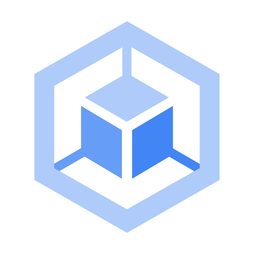
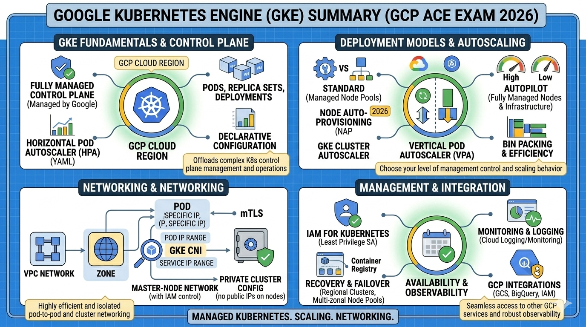
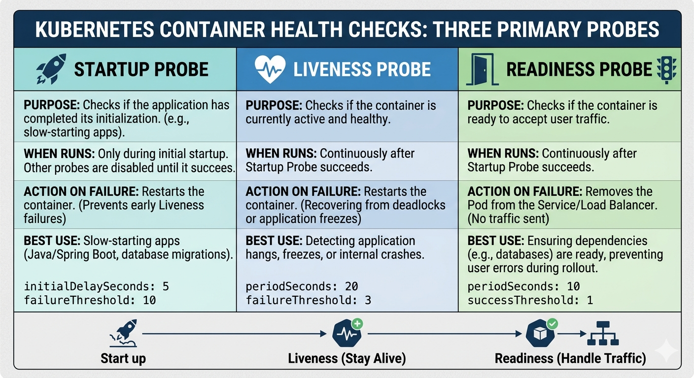
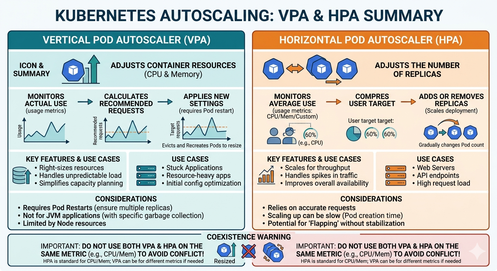
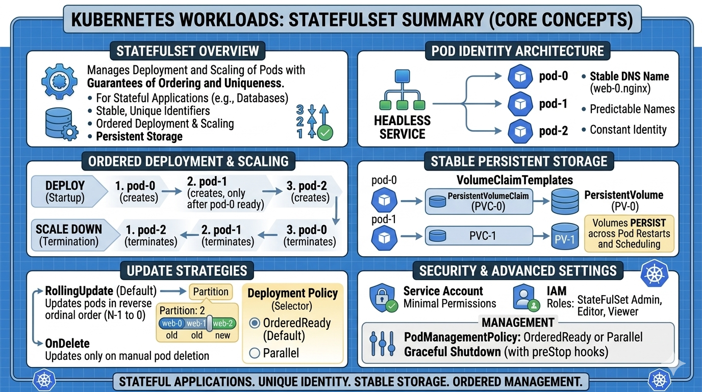
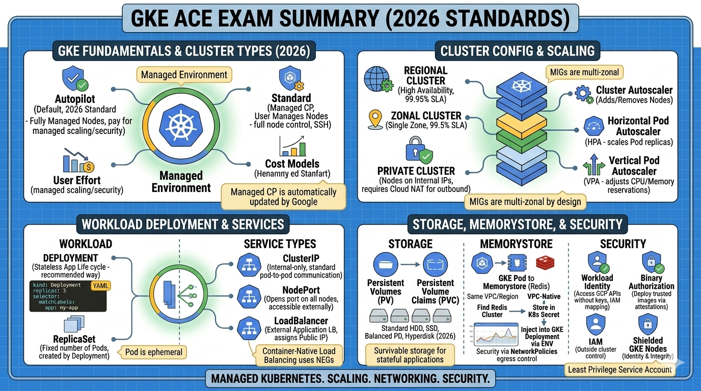

# GKE: ACE Exam Study Guide (2026)

<figure>
  
  <figcaption><center>Google Kubernetes Engine<br><i>Image source: Google Cloud Documentation</i></center></figcaption>
</figure>

## 1. GKE Fundamentals

Google Kubernetes Engine (GKE) is a managed environment for deploying, managing, and scaling containerized applications using Google infrastructure.

- Managed Kubernetes: Google manages the Kubernetes Control Plane, while you manage worker nodes in Standard mode.
- Cluster Types:
  - Autopilot: The default and recommended mode for 2026. Fully managed; Google manages nodes, scaling, and security. You pay only for running pods.
  - Standard: You manage the node infrastructure. Full control over nodes, SSH access, and custom machine types.

<figure>
  
  <figcaption><center>Google Kubernetes Engine Summary<br><i>Image source: Own work (Gemini Prompting)</i></center></figcaption>
</figure>

## 2. Cluster Configurations

- Regional Clusters: Control Plane and nodes replicated across multiple zones. Higher availability (99.95% SLA).
- Zonal Clusters: Control Plane and nodes in a single zone. Less expensive (99.5% SLA).
- Private Clusters: Nodes have internal IP addresses only. Communication with Control Plane via VPC peering. Requires Cloud NAT for outbound internet access.

## 3. Node Management and Scaling

- Node Pools: A group of nodes with the same configuration. Support for N4 (general purpose) and C4 (compute optimized) machine types in 2026 for optimized performance.
- Cluster Autoscaler: Automatically adds or removes nodes based on resource demands.
- Horizontal Pod Autoscaler (HPA): Scales pod replicas based on CPU or custom metrics.
- Vertical Pod Autoscaler (VPA): Adjusts CPU and memory reservations for pods.

### 3.1. `Deployment`

[Deployment](https://kubernetes.io/docs/concepts/workloads/controllers/deployment/) manages app lifecycle: rolling updates, rollbacks, scaling. Creates and controls `ReplicaSets`.  
This is a recommented way to run stateless apps in GKE.

> **Resource Limits** → Set CPU/memory requests and limits per pod to control resource allocation and prevent starvation.

```yaml
apiVersion: apps/v1
kind: Deployment
metadata:
  name: my-app
spec:
  replicas: 3
  strategy:
    type: RollingUpdate
    rollingUpdate:
      maxSurge: 1
      maxUnavailable: 1
  selector:
    matchLabels:
      app: my-app
  template:
    metadata:
      labels:
        app: my-app
    spec:
      containers:
        - name: app
          image: nginx:1.25
          ports:
            - containerPort: 80
          startupProbe:
            httpGet:
              path: /
              port: 80
            failureThreshold: 30
            periodSeconds: 10
          livenessProbe:
            httpGet:
              path: /
              port: 80
            initialDelaySeconds: 0
            periodSeconds: 20
            failureThreshold: 3
          readinessProbe:
            httpGet:
              path: /
              port: 80
            initialDelaySeconds: 5
            periodSeconds: 10
            timeoutSeconds: 1
            successThreshold: 1
            failureThreshold: 3
          resources:
            requests:
              cpu: "250m"
              memory: "128Mi"
            limits:
              cpu: "500m"
              memory: "256Mi"
```

Updating a container image and doing a _rolling update_ is as easy as changing `image` in a deployment `yaml` file
and then executing `kubectl` command:

```bash
kubectl apply -f deployment.yaml
```

_Undo/Rollback_ if the new image is buggy, revert to the previous version instantly:

```bash
kubectl rollout undo deployment/my-app
```

> **Note**: For the rollout to work effectively, ensure your Pod has Readiness Probes configured. This tells Kubernetes to stop sending traffic to an old Pod only after the new Pod is actually ready to handle requests.

#### 3.1.1. Probes

Kubernetes probes manage the container lifecycle:

- **Startup Probe** - verified if the application has finished its boot cycle. It disables other probes until success, preventing slow-starting apps from being killed prematurely by the liveness check.
- **Liveness Probe** - determines if the container is still running and healthy. If it fails, Kubernetes kills and restarts the container to recover from deadlocks or internal application crashes.
- **Readiness Probe** - checks if the container is ready to handle incoming user requests. If it fails, the Pod is temporarily removed from service load balancers to prevent users from seeing error pages.

<figure>
  
  <figcaption><center>Pod Probes<br><i>Image source: Own work (Gemini Prompting)</i></center></figcaption>
</figure>

#### 3.1.2. Vertical Pod Autoscaling (VPA)

Before applying YAML, ensure the VPA feature is enabled on your cluster (it is disabled by default in many standard clusters).

```bash
gcloud container clusters update CLUSTER_NAME \
  --enable-vertical-pod-autoscaling
```

VPA works by targeting your Deployment via a `targetRef`. You do not need to modify the Deployment's `resources` section manually. The VPA will handle the overrides.
The VPA _will restart_ your Pods to apply updated CPU or Memory requests.

```yaml
apiVersion: autoscaling.k8s.io/v1
kind: VerticalPodAutoscaler
metadata:
  name: my-app-vpa
spec:
  targetRef:
    apiVersion: "apps/v1"
    kind: Deployment
    name: my-app
  updatePolicy:
    updateMode: "Auto"
  resourcePolicy:
    containerPolicies:
      - containerName: "app"
        minAllowed:
          cpu: "100m"
          memory: "64Mi"
        maxAllowed:
          cpu: "1"
          memory: "1Gi"
        controlledResources: ["cpu", "memory"]
```

#### 3.1.3. Horizontal Pod Autoscaling (HPA)

To configure _Horizontal Pod Autoscaling_ (HPA) in GKE, you define a resource that automatically scales the number of Pod replicas based on CPU/memory usage or custom metrics.

Prerequisites:

- _Metrics Server_ - This must be running in your cluster (enabled by default in GKE) to provide resource usage data.
- _Resource Requests_ - You must define `resources.requests` (specifically CPU) in your Deployment YAML. Without these, the HPA cannot calculate the percentage of utilization and will not scale.

> _VPA Conflict_ - **never** use HPA and VPA on the same metric (like CPU or Memory). They will fight each other.
> VPA will try to make the Pod bigger while HPA will try to add more Pods.

```yaml
apiVersion: autoscaling/v2
kind: HorizontalPodAutoscaler
metadata:
  name: my-app-hpa
spec:
  scaleTargetRef:
    apiVersion: apps/v1
    kind: Deployment
    name: my-app
  minReplicas: 2
  maxReplicas: 10
  metrics:
    - type: Resource
      resource:
        name: cpu
        target:
          type: Utilization
          averageUtilization: 60
    - type: Resource
      resource:
        name: memory
        target:
          type: AverageValue
          averageValue: 512Mi
```

<figure>
  
  <figcaption><center>Horizontal vs Vertical Pod Autoscaping<br><i>Image source: Own work (Gemini Prompting)</i></center></figcaption>
</figure>

>

### 3.2. `ReplicaSet`

[ReplicaSet](https://kubernetes.io/docs/concepts/workloads/controllers/replicaset/) ensures a fixed number of Pods are running. Usually not used directly. Managed (created automatically) by `Deployments`.

```yaml
apiVersion: apps/v1
kind: ReplicaSet
metadata:
  name: my-app-rs
spec:
  replicas: 3
  selector:
    matchLabels:
      app: my-app
  template:
    metadata:
      labels:
        app: my-app
    spec:
      containers:
        - name: app
          image: nginx:1.25
```

### 3.3. `DaemonSet`

A [DaemonSet](https://kubernetes.io/docs/concepts/workloads/controllers/daemonset/) is a specific type of Kubernetes controller that ensures a copy of a particular Pod is running on _every node_ (or a specific subset of nodes) within your cluster.

DaemonSets are typically used for _infrastructure-level services_ or "daemons" that need to run in the background on every machine to support the cluster's health and visibility.

> Use cases:
>
> - _Log Collection_ → Running an agent like Fluentd or Logstash on each node to collect and ship logs.
> - _Cluster Monitoring_ → Deploying monitoring agents like Prometheus Node Exporter or Datadog to gather hardware metrics from every node.

```yaml
apiVersion: apps/v1
kind: DaemonSet
metadata:
  name: fluentd-logging
  namespace: kube-system
  labels:
    k8s-app: fluentd-logging
spec:
  selector:
    matchLabels:
      name: fluentd-logging
  template:
    metadata:
      labels:
        name: fluentd-logging
    spec:
      # DaemonSets often need to tolerate taints to run on all nodes
      tolerations:
        - key: node-role.kubernetes.io/master
          effect: NoSchedule
        - key: node-role.kubernetes.io/control-plane
          effect: NoSchedule
      containers:
        - name: fluentd
          image: quay.io/fluentd_elasticsearch/fluentd:v2.5.2
          resources:
            limits:
              memory: 200Mi
            requests:
              cpu: 100m
              memory: 200Mi
          volumeMounts:
            - name: varlog
              mountPath: /var/log
      # DaemonSets usually interact with the host system
      volumes:
        - name: varlog
          hostPath:
            path: /var/log
```

**Key Components Explained**:

- `kind` → DaemonSet: Tells Kubernetes to run exactly one instance of this pod per node.
- `selector` → Must match the labels defined in the template so the controller knows which pods it owns.
- `tolerations` → Crucial for DaemonSets. By default, master/control-plane nodes have a "taint" that prevents regular pods from running. Adding these allows the DaemonSet to monitor those nodes as well.
- `volumes`/`hostPath` → Since DaemonSets are usually for system-level tasks (like logging or monitoring), they often need to mount a path directly from the physical Node's file system.

### 3.4. `StatefulSet`

A [StatefulSet](https://kubernetes.io/docs/concepts/workloads/controllers/statefulset/) is a Kubernetes workload controller designed to manage applications that require a persistent state, stable identities, and unique storage.

Unlike standard `Deployments` — where Pods are completely anonymous, interchangeable, and easily replaced — a `StatefulSet` provides explicit guarantees for each of its Pod replicas.

- _Stable Network Identity_ - Pods are assigned fixed, predictable hostnames based on sequential integers (e.g., `app-0`, `app-1`, `app-2`). If a Pod restarts or moves to a different cluster node, it retains its exact name and DNS record.
- _Dedicated Persistent Storage_ - Through a `volumeClaimTemplates` configuration, every Pod automatically spins up its own dedicated `PersistentVolumeClaim` (PVC). If a Pod is rescheduled, it automatically reattaches to its original cloud storage disk, ensuring no data loss.
- _Ordered Deployment and Scaling_ - Pods are created, updated, and terminated sequentially (e.g., `app-1` won't deploy until `app-0` is completely healthy), which is essential for safely initializing clustered systems.

**Common Use Cases**  
It is predominantly used for stateful, distributed software architectures that coordinate data replication amongst themselves, such as databases (PostgreSQL, MongoDB, MySQL), message queues (Apache Kafka, RabbitMQ), and key-value stores (Redis).

<figure>
  
  <figcaption><center>GKE StatefulSet Summary<br><i>Image source: Own work (Gemini Prompting)</i></center></figcaption>
</figure>

### 3.5. GKE Cluster Autoscaling

**GKE Cluster Autoscaler (CA)** automatically adjusts the size of your Kubernetes cluster by adding or removing underlying Compute Engine Virtual Machine (VM) instances (nodes) based on workload demands.
How It Works:

- **Scaling Up** - When developers deploy applications and Pods cannot be scheduled because the existing nodes lack sufficient CPU or memory resources (leaving the Pods in a `Pending` state), the Cluster Autoscaler requests Google Cloud to provision new VMs into the node pool.
- **Scaling Down** - It continuously monitors the utilization of nodes. If a node is underutilized for a period of time and all of its running Pods can be easily rescheduled onto other existing nodes, the Cluster Autoscaler safely deletes that VM to optimize infrastructure costs.

**Key Distinction**  
Unlike the HPA which creates more copies of your application containers (Pods), the Cluster Autoscaler operates at the infrastructure layer, making sure there is enough physical hardware available to run those containers.

---

> **GKE** → Use `Deployments` for stateless workloads. `ReplicaSets` are created automatically.

## 4. GKE Networking

For more details see [Services, Load Balancing, and Networking](https://kubernetes.io/docs/concepts/services-networking/).

- [Services](https://kubernetes.io/docs/concepts/services-networking/service/) - Expose an application running in your cluster behind a single outward-facing endpoint, even when the workload is split across multiple backends:
  - **ClusterIP** (default)
    - Internal-only virtual IP.
    - Accessible only inside the cluster.
    - Used for pod‑to‑pod communication.

  _ClusterIP Service Definition for Internal Traffic_

  ```yaml
  apiVersion: v1
  kind: Service
  metadata:
    name: my-clusterip-service
  spec:
    type: ClusterIP
    selector:
      app: my-app
    ports:
      - port: 80 # service port
        targetPort: 8080 # container port
  ```

  - **NodePort**
    - Opens port `30080` on every node.
    - Accessible via `http://<node-ip>:30080`.
    - Still load‑balances across pods.

  _NodePort Service Exposing Port 80 → 30080_

  ```yaml
  apiVersion: v1
  kind: Service
  metadata:
    name: my-nodeport-service
  spec:
    type: NodePort
    selector:
      app: my-app
    ports:
      - port: 80
        targetPort: 8080
        nodePort: 30080 # must be in range 30000–32767
  ```

  - **LoadBalancer**:
    - GKE automatically creates a Google Cloud external Load Balancer
    - Assigns a public IP
    - Traffic → LB → NodePort → Pod
    - This is the standard way to expose a service publicly

  _LoadBalancer Service Exposing Port 80_

  ```yaml
  apiVersion: v1
  kind: Service
  metadata:
    name: my-loadbalancer-service
  spec:
    type: LoadBalancer
    selector:
      app: my-app
    ports:
      - port: 80
        targetPort: 8080
  ```

- Ingress: Manages external access (layer-7 HTTP/HTTPS) routing mechanism and creates a _Google Cloud_ **_External Application Load Balancer_**.
- Container-Native Load Balancing: Uses _Network Endpoint Groups (NEGs)_ to route traffic directly to pods.

## 5. Storage in GKE

In Kubernetes, Pods are _ephemeral_ — they can be rescheduled, recreated, or moved to another node at any time.
Stateful apps (databases, queues, caches, file‑based apps) need persistent storage that survives pod restarts.

That’s where _Persistent Volumes_ (PV) and _Persistent Volume Claims_ (PVC) come in.

- _Persistent Volumes_ and _Persistent Volume Claims_: Managed storage for stateful applications.
- Storage Classes: Defines storage types (e.g., standard HDD, SSD, or Balanced PD).
- Hyperdisk: Support for Google Cloud Hyperdisk in 2026 for high-performance GKE workloads.

For more details see [Persistant Disk](./persistent_disk.md)

## 6. Connecting GKE Pod to Memorystore (standard)

To connect a GKE Pod to a Google Cloud Memorystore (Redis) instance, you need to ensure they share a network and then inject the connection details into your Kubernetes deployment.

### 6.1. Network Prerequisites

- **Same VPC**: The Redis instance and GKE cluster must be in the same VPC network and same region.
- **VPC-Native GKE**: Your GKE cluster must be VPC-native (IP Aliasing enabled). Standard route-based clusters cannot natively route traffic to the Google-managed VPC where Redis lives.

### 6.2. Find Connection Details

Once the Redis instance is created, retrieve its internal IP address and port from the Google Cloud Console or CLI:

- Host IP: `10.x.x.x`
- Port: `6379` (Default)
- Auth String: If _Auth_ is enabled, you will also need the password string.

### 6.3. Store Credentials in Kubernetes

The best practice is to store these details in a Kubernetes Secret so they aren't hardcoded in your application code.

```bash
kubectl create secret generic redis-creds \
  --from-literal=REDIS_HOST=10.x.x.x \
  --from-literal=REDIS_PORT=6379 \
  --from-literal=REDIS_PASSWORD=your-auth-string
```

### 6.4. Update the GKE Deployment

Inject these values into your Pod as environment variables in your `deployment.yaml`.

```yaml
spec:
  containers:
    - name: my-app
      image: gcr.io/my-project/my-app:v1
      env:
        - name: REDIS_HOST
          valueFrom:
            secretKeyRef:
              name: redis-creds
              key: REDIS_HOST
        - name: REDIS_PORT
          valueFrom:
            secretKeyRef:
              name: redis-creds
              key: REDIS_PORT
```

### 6.5. Verify Connectivity

You can test the connection by running a temporary "debug" pod with `redis-cli` installed:

```bash
kubectl run redis-test --rm -it --image=redis:7 -- \
  redis-cli -h [YOUR_REDIS_IP] -p 6379 ping
# Expected Output: PONG
```

> Note on Security: By default, Memorystore does not have a firewall. Use Kubernetes `NetworkPolicies` to restrict which Pods in your cluster are allowed to send egress traffic to the Redis IP address.

### 6.6. View Detailed Lifecycle Information and Events for a Specific Pod Named `web-server`

```bash
kubectl describe pod web-server
```

## 7. GKE Security

- Workload Identity: The recommended way for GKE workloads to access Google Cloud services.
  > _Workload Identity_ lets GKE pods access Google Cloud APIs without service account keys. It maps a _Kubernetes Service Account_ to a _Google Cloud Service Account_, giving pods secure, short‑lived credentials managed automatically by GKE and IAM.
- Binary Authorization: Ensures only trusted container images are deployed.
  > _Binary Authorization_ ensures only trusted, verified container images can run in GKE. It enforces deploy‑time security by requiring signed attestations from approved build or security systems, blocking unapproved or unscanned images before they reach the cluster.
- RBAC: Manages permissions inside the cluster.
  > _Role‑Based Access Control_ in Kubernetes controls who can do what in the cluster. It uses _Roles/ClusterRoles_ to define permissions and _RoleBindings/ClusterRoleBindings_ to assign them to users, groups, or service accounts. It provides fine‑grained, namespace‑scoped or cluster‑wide access control without exposing unnecessary privileges.
- IAM: Manages permissions outside the cluster (e.g., cluster creation).
- Shielded GKE Nodes: Provides node identity and integrity.

<figure>
  
  <figcaption><center>Google Kubernetes Engine Summary<br><i>Image source: Own work (Gemini Prompting)</i></center></figcaption>
</figure>

### 7.1. GKE Sandbox & gVisor

Provides a high-security defense layer for GKE clusters running untrusted or arbitrary code from multiple customers (multi-tenancy).

- _gVisor_ - An open-source, user-space kernel that intercepts and handles system calls. It acts as a "buffer" between the container and the host OS kernel.
- _Isolation_ - Standard containers share the host's kernel. GKE Sandbox provides each Pod with its own dedicated guest kernel (gVisor), preventing "container escape" attacks from compromising the host or other Pods.
- _Usage Case_ - Essential for SaaS platforms where users can upload and execute their own scripts or binaries.

**Implementation**

1. **Node Pool** - Enable the "GKE Sandbox" feature on a specific Node Pool.
2. **Pod Spec** - Direct the Pod to use the sandbox by adding the `runtimeClassName`:
   ```yaml
   spec:
     runtimeClassName: gvisor
     containers:
       - name: untrusted-customer-code
         image: node:18
   ```

> While _gVisor_ adds security, it can introduce a small performance overhead for system-call-heavy applications. Always test latency-sensitive apps before full deployment.

## 8. Troubleshooting

### 8.1. Pod stays in a `Pending` state

A Pod is `Pending` when it has been accepted by Kubernetes but hasn't been assigned to a Node yet. It’s essentially stuck in the "waiting room" of the scheduler.

**Top 3 Reasons**:

- _Insufficient Resources_ → No node has enough free CPU or Memory to satisfy the Pod's `requests`.
- _Scheduling Constraints_ → `nodeSelector`, `affinity`, or `taints` are preventing the Pod from fitting onto the available nodes.
- _Storage Issues_ → The Pod is waiting for a Persistent Volume (Disk) to be created or attached.

**How to Fix**  
Run this command and look at the Events section at the bottom:

```bash
kubectl describe pod [POD_NAME]
```

It will tell you exactly why the scheduler rejected the available nodes (e.g., _"0/3 nodes are available: 3 Insufficient cpu"_).

## 9. Essential `gcloud` and `kubectl` Commands

- Create a Cluster: `gcloud container clusters create [CLUSTER_NAME] --zone [ZONE] --num-nodes [NUMBER]`
- Get Credentials: `gcloud container clusters get-credentials [CLUSTER_NAME] --zone [ZONE]`
- Resize a Cluster: `gcloud container clusters resize [CLUSTER_NAME] --node-pool [POOL_NAME] --num-nodes [NEW_SIZE]`
- Enable Cluster Nodes autoscaling: `gcloud container clusters update [CLUSTER_NAME] --enable-autoscaling --min-nodes=1 --max-nodes=10`
  > This is used e.g. in case when a pod cannot find available CPU/memory (e.g. when `Insufficient cpu` error happens during pod scheduling).
- Deploy an Application: `kubectl apply -f [FILENAME.YAML]`
- Check Pod Status: `kubectl get pods`

> Important: "Per Zone" vs "Total"
>
> | Flag                                    | Meaning        | Scope                                                                                                   |
> | --------------------------------------- | -------------- | ------------------------------------------------------------------------------------------------------- |
> | `--min-nodes`/`--max-nodes`             | Per Zone       | If you have a regional cluster with 3 zones, a max of 10 means your cluster can grow to 30 nodes total. |
> | `--total-min-nodes`/`--total-max-nodes` | Entire Cluster | Limits the sum of all nodes across all zones to the specified number.                                   |

## 10. Exam Tips and Gotchas

- Control Plane Upgrade: Google automatically upgrades the Control Plane. Define Maintenance Windows and Exclusions.
- Preemptible/Spot VMs: Use for cost savings in fault-tolerant workloads.
- Autopilot vs Standard: Choose Autopilot for reduced operational overhead unless specific node customization is required.

## 11. External Links

- [Google Kubernetes Engine - The Cloud Girl](https://www.thecloudgirl.dev/compute/google-kubernetes-engine)
- [Where should I run my staff - The Cloud Girl](https://www.thecloudgirl.dev/compute/where-should-i-run-my-stuff)
