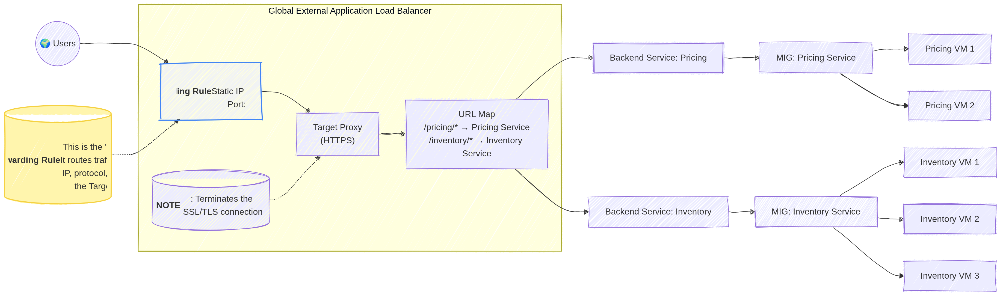
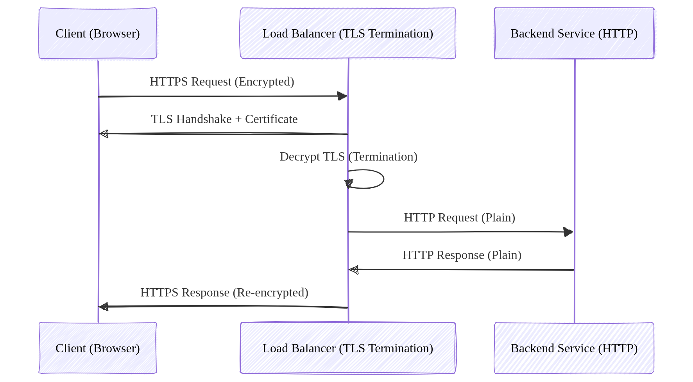

# Load Balancing: ACE Exam Study Guide (2026)

_Image source: [Cloud Icons](https://cloud-icons.onemodel.app/gcp/networking/cloud_load_balancing)_

## 1. Load Balancing Overview

Google Cloud Load Balancing is a fully managed, software-defined service. It is not instance-based, so you don't need to manage infrastructure or scale it manually.

### Key Characteristics

- External vs. Internal: Internet-facing or private within your VPC.
- Global vs. Regional: Traffic distribution across multiple regions or a single region.
- Traffic Type: Layer 7 (HTTP/S) vs. Layer 4 (TCP/UDP).

## 2. External Load Balancers

### Global External Application Load Balancer (HTTP/S)

- Layer: Layer 7 (HTTP, HTTPS, HTTP/2).
- Scope: Global. Distributes traffic to the closest available backend.
- Features: URL maps (path-based routing), SSL termination, Cloud Armor integration, and Cloud CDN support.
- Backends: MIGs/ZIGs, NEGs for GKE/Serverless.

> _SSL Termination_ is the process where a load balancer decrypts incoming HTTPS traffic before passing it to backend services over HTTP. This offloads CPU‑heavy encryption work from the servers, simplifies certificate management, and allows the load balancer to inspect and route requests (e.g., via URL maps).

_Image source: Own work (Mermaid diagram)._

There is no functional difference today — TLS is simply the modern, secure successor to SSL. But people still say SSL termination even though they actually mean TLS termination.

_Image source: Own work (Mermaid diagram)._

### External Proxy Network Load Balancer (TCP/SSL)

- Layer: Layer 4 (TCP with SSL termination).
- Scope: Global (Regional version available).
- Use Case: Non-HTTP traffic that requires SSL termination or proxying.

### External Passthrough Network Load Balancer (TCP/UDP)

- Layer: Layer 4 (TCP, UDP, ICMP).
- Scope: Regional.
- Nature: Passthrough. Preserves the source IP address of the client.
- Use Case: Simple TCP/UDP traffic where low latency is critical.

## 2.1. Load Balancing Methods

When distributing traffic across multiple backend services or instances, load balancers can use different algorithms to determine which backend receives each request.

### Round Robin

The simplest method — requests are distributed sequentially to each backend in order. Each backend gets an equal number of requests in rotation. This works well when all backends have similar capacity.

### Least Connections

The load balancer sends new requests to the backend with the fewest active connections. This accounts for varying request processing times — backends handling longer requests will receive fewer new requests.

### Least Request

Similar to Least Connections but uses a more general approach based on outstanding request count rather than established connections. The External Application Load Balancer uses this method.

### Weighted Round Robin

Each backend is assigned a weight indicating its capacity. Backends with higher weights receive proportionally more requests. For example, a backend with weight 3 receives 3 requests for every 1 sent to a weighted backend.

### IP Hash

The client's IP address is hashed to determine which backend receives the request. This ensures the same client always reaches the same backend — useful when session data is stored locally on the backend.

### Session Affinity (Sticky Sessions)

Session affinity ensures requests from the same client go to the same backend. This is critical when applications store session data in memory on specific instances. The load balancer uses cookies or source IP to track and route requests to the same backend.

- **L7 Load Balancers**: Use LB-generated cookies (e.g., `GOOGLB` cookie).
- **L4 Proxy Load Balancers**: Use source IP/port hashing.
- **Passthrough Load Balancers**: Do not support session affinity.

## 3. Internal Load Balancers

### Internal Application Load Balancer (HTTP/S)

- Layer: Layer 7.
- Scope: Regional.
- Use Case: Microservices communication within a VPC requiring path-based routing.

### Internal Proxy Network Load Balancer (TCP)

- Layer: Layer 4.
- Scope: Regional.
- Use Case: Internal TCP traffic requiring proxying services.

### Internal Passthrough Network Load Balancer (TCP/UDP)

- Layer: Layer 4.
- Scope: Regional.
- Nature: Passthrough. Very low latency.
- Use Case: Database clusters, legacy applications inside the VPC.

## 4. Summary Table for the Exam (with SSL Termination)

| Load Balancer Type              | Layer | Scope      | Traffic Type        | Proxy? | SSL Termination?    |
| ------------------------------- | ----- | ---------- | ------------------- | ------ | ------------------- |
| **Global External App LB**      | L7    | Global     | HTTP, HTTPS, HTTP/2 | Yes    | **Yes**             |
| **Regional External App LB**    | L7    | Regional   | HTTP, HTTPS         | Yes    | **Yes**             |
| **External Proxy Net LB**       | L4    | Global/Reg | TCP, SSL            | Yes    | **Yes** (SSL proxy) |
| **External Passthrough Net LB** | L4    | Regional   | TCP, UDP            | No     | **No**              |
| **Internal App LB**             | L7    | Regional   | HTTP, HTTPS         | Yes    | **Yes**             |
| **Internal Passthrough Net LB** | L4    | Regional   | TCP, UDP            | No     | **No**              |

## 5. Components of a Load Balancer

- Forwarding Rule: Directs traffic based on IP, protocol, and port.
- Target Proxy: Terminates the connection and forwards it to the URL map.
- URL Map: Defines path-based routing rules (e.g., `/images` vs `/api`).
- Backend Service: Manages health checks, session affinity, and backend pools.
- Health Check: Regularly polls backends to ensure they are healthy.

### Backend Service

A backend service defines how a load balancer sends traffic to backends like MIGs or NEGs. It applies health checks, balancing policies, timeouts, and routing rules. The load balancer never talks directly to VMs - traffic always flows through a backend service, which decides which instances are healthy and ready to receive requests.

## 6. Essential `gcloud` Commands

- Create a health check: `gcloud compute health-checks create http [NAME] --port 80`
- Create a backend service: `gcloud compute backend-services create [NAME] --protocol=HTTP --health-checks=[HC_NAME] --global`
- Add backends to service: `gcloud compute backend-services add-backend [NAME] --instance-group=[GROUP_NAME] --global`
- Create a URL map: `gcloud compute url-maps create [MAP_NAME] --default-service=[BACKEND_NAME]`

## 7. Exam Tips

- Preserving Client IP: For L4 traffic, use the External Passthrough Network Load Balancer.
- Path-based Routing: Only Application Load Balancers (L7) support URL maps.
- SSL Termination: Proxy-based load balancers (App LB, Proxy Net LB) handle SSL at the load balancer level.
- Cloud Armor/CDN: These integrate only with the Global External Application Load Balancer.
- Session Affinity: Use if a client needs to stick to the same backend instance.

## 8. External Links

- [Cloud Load Balancing - The Cloud Girl](https://www.thecloudgirl.dev/networking/cloud-load-balancing)
