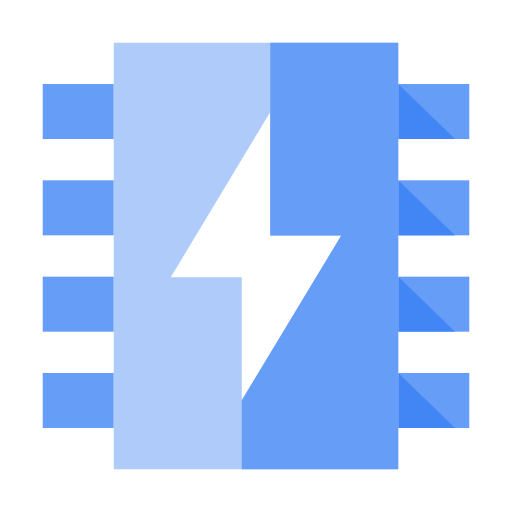

# Memorystore: ACE Exam Study Guide (2026)



_Image source: Google Cloud Documentation_

## 1. Memorystore Overview

Memorystore is Google Cloud’s fully managed in-memory data store service. It is used for low-latency caching, session storage, and real-time data access.

## 2. Quick Summary: Redis/Valkey vs. Memcached

| Feature          | Redis/Valkey                               | Memcached              |
| :--------------- | :----------------------------------------- | :--------------------- |
| **Use Case**     | Advanced (Sessions, Pub/Sub, HA)           | Simple Key/Value Cache |
| **Persistence**  | Optional (RDB/AOF)                         | **No** (Ephemeral)     |
| **Scaling**      | Vertical (Standard) / Horizontal (Cluster) | Horizontal (Node pool) |
| **Networking**   | PSA (Standard) / PSC (Cluster)             | PSA (VPC Peering)      |
| **Auth/TLS**     | Yes (Redis AUTH)                           | **No**                 |
| **Availability** | HA with Failover (Standard Tier)           | No HA/Replication      |

## 3. Supported Engines

### Redis & Valkey

- **Latency:** Sub-millisecond.
- **Persistence:** Supports RDB snapshots and point-in-time recovery.
- **Valkey:** The 2026 standard for open-source high-performance caching.
- **Tiers:**
  - **Basic:** Single node (dev/test).
  - **Standard:** Primary + Replica with automatic failover (Production).

### Memcached

- **Architecture:** Horizontally scalable node pools.
- **Behavior:** Data is lost on restart or node failure. Best for large, simple web caches.

## 4. Networking and Connectivity

Memorystore instances are **VPC-only** (no public IPs).

### Connecting Serverless (Cloud Run / Functions)

- **Direct VPC Egress (Recommended):** Lowest latency and cost.
- **Serverless VPC Access Connector:** Legacy method.

### Networking Models

- **Standard/Basic Tiers:** Use Private Service Access (PSA).
- **Cluster/Valkey Tiers:** Use **Private Service Connect (PSC)**. Clients connect to a single IP (discovery endpoint) in their own VPC.

| Service          | Can connect? | Requirements                 |
| ---------------- | ------------ | ---------------------------- |
| Compute Engine   | Yes          | Same VPC                     |
| GKE              | Yes          | Same VPC                     |
| Cloud Run        | Yes          | Direct VPC Egress            |
| External clients | Yes          | Only via VPN or Interconnect |

## 5. Scaling and TTL

- **Scaling:**
  - **Vertical:** Increasing memory on Basic/Standard tiers causes brief downtime.
  - **Horizontal:** Adding shards (Cluster/Valkey) or nodes (Memcached) has zero downtime.
- **TTL (Time-to-Live):** Essential for cache management.
  - `SET key value EX 60` (Set on write)
  - `EXPIRE key 60` (Set after write)

## 6. Authentication and Monitoring

- **Security:**
  - **IAM:** Controls management plane (creating/deleting instances).
  - **Redis AUTH:** Application-level password (not IAM-based). Must be enabled at creation.
- **Gemini for Memorystore:** Provides AI-driven recommendations for sharding and memory usage patterns.

## 7. Common ACE Exam Scenarios

- **Scenario**: Connect Cloud Run to Redis with lowest cost? → Use **Direct VPC Egress**.
- **Scenario**: Scale Redis to 10TB+ with zero downtime? → Use **Redis Cluster** or **Valkey**.
- **Scenario**: Need High Availability (HA)? → Use **Standard Tier** (Primary + Replica).
- **Scenario**: Ephemeral cache for simple KV pairs? → Use **Memcached**.
- **Scenario**: Avoid VPC Peering limits? → Use **Private Service Connect (PSC)**.

## 8. Using Memorystore in Spring Boot (Examples)

### Redis / Valkey

```yaml
spring:
  data:
    redis:
      host: 10.0.0.5
      port: 6379
      password: ${sm://projects/PROJECT_ID/secrets/REDIS_AUTH_TOKEN/versions/latest}
```

```java
@Service
@RequiredArgsConstructor
public class CacheService {

    private final StringRedisTemplate redis;

    public void save(String key, String value) {
        redis.opsForValue().set(key, value, Duration.ofMinutes(60));
    }
}
```

> **Note:** Memorystore Redis AUTH tokens are generated by GCP and only displayed once at creation. Secure them in **Secret Manager**.

### Memcached

```java
@Configuration
public class MemcachedConfig {

    @Bean
    public MemcachedClient memcachedClient() throws Exception {
        return new MemcachedClient(new InetSocketAddress("10.0.0.6", 11211));
    }
}
```
