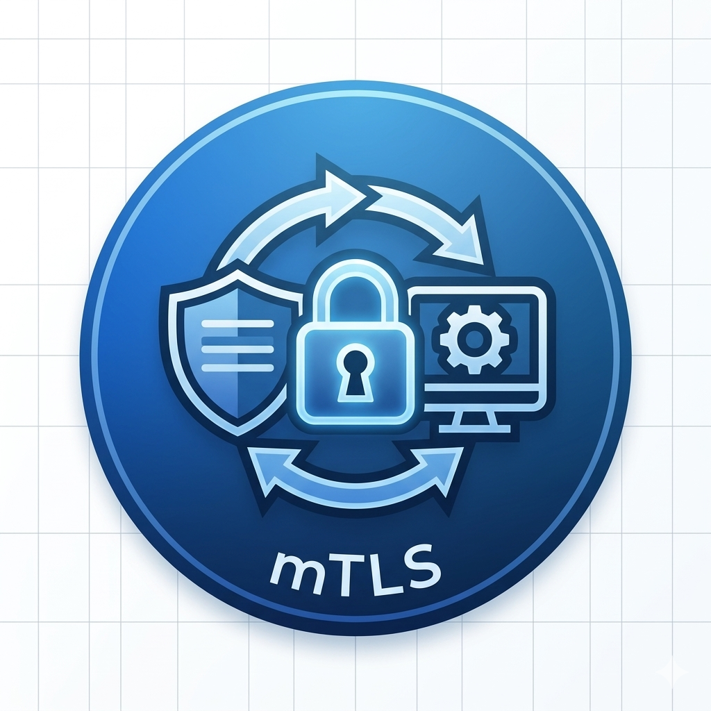

# mTLS

<figure>
  
  <figcaption>
mTLS <i>Image source: Own work (Gemini Prompting)</i>
</figcaption>
</figure>

mTLS (Mutual Transport Layer Security) is an extension of standard TLS where both the client and the server verify each other’s identity before a connection is established.

In standard TLS (like when you visit a website), only the server is required to prove its identity to the client via a certificate. In mTLS, the client must also provide a valid certificate to the server.

## 1. How mTLS Works (The Handshake)

The process involves a "dual-handshake" logic:

1. _Server Authentication_ - The server sends its certificate to the client. The client checks if it's signed by a trusted Certificate Authority (CA).
2. _Client Authentication_ - The client sends its own certificate to the server.
3. _Validation_ - The server checks the client’s certificate against its own list of trusted CAs.
4. _Key Exchange_ - Once both parties trust each other, they negotiate encrypted session keys and begin a secure session.

## 2. Why use mTLS?

- _Zero Trust Security_ - It ensures that even if someone is on your internal network, they cannot talk to a service unless they have a valid, cryptographically signed certificate.
- _Preventing Spoofing_ - It stops "man-in-the-middle" attacks where an attacker pretends to be a legitimate client to steal data.
- _Automatic Identity_ - Since the certificate is tied to a specific machine or service, the server knows exactly who is calling without needing a password or API key.

## 3. Common Use Cases

1. Microservices (Service Mesh)  
   In modern cloud architectures (like Kubernetes using Istio or Anthos), mTLS is used to secure communication between internal services. If "Service A" wants to talk to "Service B," they use mTLS to prove their identities to each other.

2. B2B Integrations  
   When two companies share sensitive data via an API, they often use mTLS. Each company issues a certificate to the other, ensuring that only their specific servers can communicate.

3. IoT Devices  
   Smart devices (like cameras or industrial sensors) often use mTLS to connect to their cloud backend. This ensures that a rogue device cannot spoof a legitimate one and send fake data.

4. Database Proxies  
   As we discussed with AlloyDB and Cloud SQL Auth Proxies, mTLS is the "secret sauce" that encrypts the tunnel between your local machine and the Google Cloud database without you having to manually manage the keys.

## 4. The Challenges

While mTLS is incredibly secure, it is harder to manage than standard TLS because:

- You must distribute and rotate certificates for every client.
- If a client certificate expires, the service breaks immediately.
- It requires a robust PKI (Public Key Infrastructure) to manage the lifecycle of thousands of certificates.
