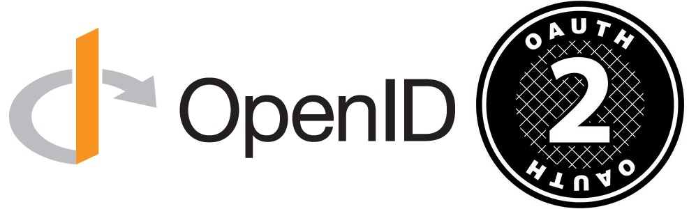

# OIDC, OAuth2 &amp; JWT

_Image source: [Word Line Blog](https://blog.worldline.tech/2019/02/06/oidc-oauth-intro.html/)_

## OAuth 2.0 (Authorization)

- Delegation framework allowing a client to access resources on behalf of a user
- Issues access tokens for APIs (token format not defined by spec)
- Defines flows like Auth Code, PKCE, Client Credentials
- Does not provide identity or user profile information

## OpenID Connect (Authentication)

- Identity layer built on top of OAuth2
- Issues ID Tokens (always JWT) containing user identity claims
- Provides standardized user info via the UserInfo endpoint
- Used for login, SSO, and user identity verification

## JWT (Token Format)

- Compact, signed token format: header.payload.signature
- Used for ID tokens, access tokens, and stateless session tokens
- Contains claims (issuer, subject, expiration, custom data)
- Enables validation without server‑side session storage

## External Links

- [An Illustrated Guide to OAuth and OpenID Connect](https://developer.okta.com/blog/2019/10/21/illustrated-guide-to-oauth-and-oidc)
- [OAuth 2.0 Playground](https://www.oauth.com/playground/)
