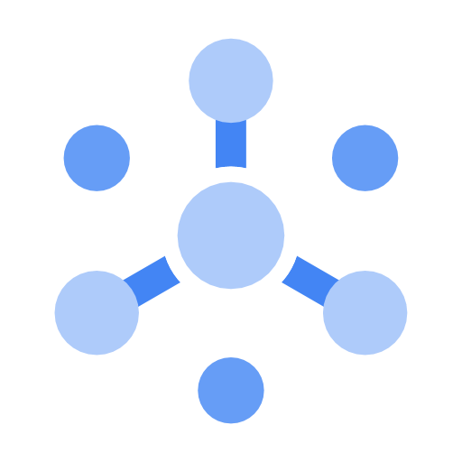
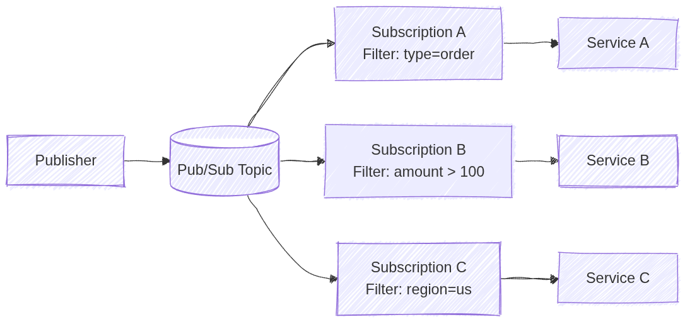

# Cloud Pub/Sub (GCP)



_Image source: Google Cloud Documentation_

## 1. Overview

**Cloud Pub/Sub** is a fully managed, global, serverless messaging service that enables asynchronous, event-driven communication between services. It decouples **publishers** (services that send messages) from **subscribers** (services that receive and process messages).

> **Key Concept**: Pub/Sub provides **at-least-once delivery**. Applications must be **idempotent** to handle potential duplicate messages.

## 2. Core Concepts

| Concept          | Description                                                       |
| ---------------- | ----------------------------------------------------------------- |
| **Topic**        | A named channel where publishers send messages                    |
| **Subscription** | A named resource representing the stream of messages from a topic |
| **Message**      | The data payload (+ optional attributes) sent by publishers       |
| **Publisher**    | An application that creates and sends messages to a topic         |
| **Subscriber**   | An application that receives messages from a subscription         |

## 3. Subscription Types

### 3.1. Pull Subscription

- The subscriber **initiates requests** to fetch messages from Pub/Sub
- Best for: High-throughput batch jobs, worker fleets, or when subscriber is behind a firewall
- Subscriber controls the rate of message consumption

### 3.2. Push Subscription

- Pub/Sub **sends HTTP POST requests** to a predefined endpoint (webhook)
- Best for: Serverless environments (**Cloud Run**, **Cloud Functions**)
- Endpoint must be publicly accessible or use `roles/run.invoker` with authenticated requests

### 3.3. BigQuery Subscription

- Messages are written **directly** to a BigQuery table
- No subscriber code required
- Ideal for analytics pipelines

### 3.4. Cloud Storage Subscription

- Messages are written **directly** to Cloud Storage as objects
- Useful for archiving message streams

## 4. Message Lifecycle

### 4.1. Delivery Guarantees

| Feature           | Behavior                                                            |
| ----------------- | ------------------------------------------------------------------- |
| **At-least-once** | Messages may be delivered more than once (duplicates possible)      |
| **Exactly-once**  | Available when enabled (requires publisher + subscription settings) |

> **Exam Tip**: If a question mentions duplicate message handling, the answer is to make your application **idempotent**.

### 4.2. Acknowledgement

| Action           | Description                                                    |
| ---------------- | -------------------------------------------------------------- |
| **ACK**          | Subscriber signals successful processing; message is removed   |
| **NACK**         | Subscriber signals failure; message is redelivered immediately |
| **Ack Deadline** | Time to process before redelivery (default: **10 seconds**)    |

- **Message Retention**: Unacknowledged messages stored for **up to 7 days**
- **Retry Policy**: Configurable number of delivery attempts before sending to Dead Letter Topic

## 5. Advanced Features

### 5.1. Dead Letter Topics

- Messages that fail delivery after **maximum retry attempts** are sent here
- Allows for investigation and manual reprocessing
- Requires a separate topic and subscription

### 5.2. Message Ordering

- Enable **Ordering Key** on subscription to deliver messages in publish order
- All messages with the same ordering key are delivered in FIFO order
- Requires single-region topic

### 5.3. Message Filtering

- Subscriptions can filter messages by **attributes**
- Reduces cost by avoiding unnecessary message delivery
- Filter is applied at Pub/Sub level before delivery

```bash
gcloud pubsub subscriptions create high-value-orders \
    --topic=orders \
    --message-filter='attributes.type="order" AND attributes.amount > 100'
```

### 5.4. Replay (Seek)

- Rewind subscription to a specific timestamp or snapshot
- Useful for disaster recovery or reprocessing historical events

### 5.5. Fan-out

Fan‑out in Pub/Sub means a single published message is delivered to multiple independent subscribers. Each subscription receives its own copy of the message, allowing multiple services to react to the same event without coupling. Adding more subscribers does not affect the publisher.

- One topic can have **multiple subscriptions**
- Each subscription receives a **copy** of every message
- Enables parallel processing by different consumers

In Pub/Sub, each subscription can define its own filter. A message is delivered to a subscription only if it matches that filter. This allows selective fan‑out without creating multiple topics.



_Image source: Own work (Mermaid diagram)._

### 5.6. Schema Registry

- Define message structure using **Avro** or **Protocol Buffers**
- Ensures data quality and validation

## 6. IAM Roles

| Role                      | Permission                      |
| ------------------------- | ------------------------------- |
| `roles/pubsub.publisher`  | Send messages to a topic        |
| `roles/pubsub.subscriber` | Pull messages and ACK           |
| `roles/pubsub.viewer`     | View topics and subscriptions   |
| `roles/pubsub.admin`      | Full control over all resources |

> **Exam Tip**: Use the **principle of least privilege** - grant only publisher or subscriber roles, not admin.

## 7. Configuration Commands

### Create Topic

```bash
gcloud pubsub topics create TOPIC_NAME
```

### Create Pull Subscription

```bash
gcloud pubsub subscriptions create SUB_NAME \
    --topic=TOPIC_NAME
```

### Create Push Subscription

```bash
gcloud pubsub subscriptions create SUB_NAME \
    --topic=TOPIC_NAME \
    --push-endpoint=https://example.com/webhook
```

### Publish Message

```bash
gcloud pubsub topics publish TOPIC_NAME --message="Hello World"
```

### Pull Messages

```bash
gcloud pubsub subscriptions pull SUB_NAME --auto-ack
```

### Configure Dead Letter Topic

```bash
gcloud pubsub subscriptions update SUB_NAME \
    --dead-letter-topic=DEAD_LETTER_TOPIC \
    --max-delivery-attempts=5
```

### Enable Message Ordering

```bash
gcloud pubsub topics update TOPIC_NAME --enable-message-ordering
```

## 8. Comparison with Alternatives

| Feature         | Pub/Sub                  | Kafka (Confluent)               | RabbitMQ              |
| --------------- | ------------------------ | ------------------------------- | --------------------- |
| **Management**  | Fully managed            | Self-managed or Confluent Cloud | Self-managed          |
| **Global**      | Yes                      | No                              | No                    |
| **Scalability** | Auto                     | Manual                          | Manual                |
| **Use Case**    | Event-driven, serverless | High-throughput streaming       | Traditional messaging |

## 9. Exam Prep Summary

### Key Points to Remember

1. **Global Service**: Topics and subscriptions are global resources (not regional)
2. **At-least-once Delivery**: Applications must be idempotent
3. **Serverless**: Automatically scales, no capacity planning needed
4. **Fan-out**: Multiple subscriptions = multiple copies of each message
5. **Ordering**: Use ordering keys for FIFO delivery
6. **Ack Deadline**: Default is 10 seconds, configurable up to 600 seconds
7. **Retention**: Messages stored for up to **7 days**
8. **Dead Letter Topics**: For failed messages after max retries

### When to Choose Pub/Sub

- Decoupling microservices for independent scaling
- Buffering traffic spikes (IoT, analytics)
- Event-driven architectures
- Asynchronous communication between services

### Common Exam Traps

| Trap                      | Explanation                                                |
| ------------------------- | ---------------------------------------------------------- |
| Exactly-once guaranteed   | Only available when **explicitly enabled**                 |
| Regional topic            | Topics are **global**, not regional                        |
| Message deleted after ACK | Message is removed immediately after acknowledgement       |
| Same subscription         | Each subscriber needs its **own subscription** for fan-out |
