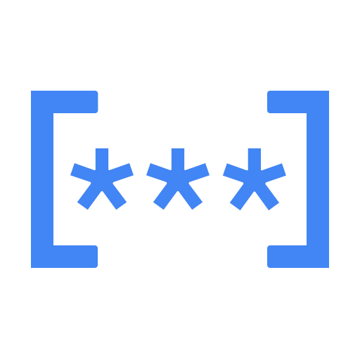

# Secret Manager: ACE Exam Study Guide (2026)

_Image source: Google Cloud Documentation_

## 1. Secret Manager Overview

Secret Manager is a secure and convenient storage system for API keys, passwords, certificates, and other sensitive data. It provides a central source of truth for secrets across Google Cloud.

- Secret vs. Version:
  - Secret: A logical container for a sensitive object (e.g., db-password). It holds metadata and replication policies.
  - Secret Version: The actual sensitive payload (e.g., P@ssword123). Secrets can have multiple versions (v1, v2, etc.).
- Replication:
  - Automatic: Google chooses the regions to replicate the secret for high availability.
  - User-managed: You explicitly choose which regions the secret is stored in (useful for compliance).

## 2. Secret Lifecycle Operations

The ACE exam tests your ability to manage secrets using the console and CLI.

- Creating a Secret: Defines the name and replication policy.
- Adding a Secret Version: Uploads the actual sensitive data. Versions are immutable; you cannot change the data in a version, you must create a new one.
- Accessing a Secret: Retrieving the payload of a specific version or the latest version.
- Disabling/Deleting:
  - Disabling: Prevents a version from being accessed but keeps the data.
  - Deleting: Permanently removes the version or the entire secret.

## 3. IAM Roles and Security

Understanding Secret Manager IAM roles is critical for the exam, especially regarding the Principle of Least Privilege.

- Secret Manager Admin (roles/secretmanager.admin): Full control over all Secret Manager resources.
- Secret Manager Secret Accessor (roles/secretmanager.secretAccessor): Allows accessing the secret payload (the sensitive data). This is the role granted to applications/service accounts.
- Secret Manager Viewer (roles/secretmanager.viewer): Allows seeing secret metadata (names, replication) but cannot see the secret payload.
- Best Practice: Grant secretAccessor only to the specific Service Account that needs it, and scope it to a specific secret rather than the entire project.

## 4. Service Integrations

How compute services consume secrets is a frequent exam topic.

- Cloud Run and Cloud Functions:
  - Environment Variables: Map a secret version to an environment variable.
  - Mounted Volumes: Mount secrets as files in the container's file system (more secure than env vars).
- Compute Engine:
  - Use a Service Account with secretAccessor role. The VM can use the gcloud CLI or client libraries to fetch the secret at runtime.
- GKE:
  - Secret Store CSI Driver: Recommended way to mount Secret Manager secrets as volumes in Kubernetes Pods.

## 5. Secret Manager vs. Cloud KMS

The exam often tries to confuse these two services.

- Secret Manager: Use for sensitive strings (API keys, passwords, database credentials, SSL certificates). You store the actual secret data here.
- Cloud KMS: Use for cryptographic keys (keys used to encrypt/decrypt large files, disks, or database tables). You do not store your database password in KMS; you use KMS to encrypt the password or the disk it sits on.

## 6. Security Best Practices

- **Encryption:** Secrets are encrypted at rest by default. You can use CMEK (Cloud KMS) to encrypt with your own key.
  - Use `--kms-key-name` when creating a secret for CMEK.
- **Audit Logging:** All secret access is recorded in Cloud Audit Logs (Admin Activity, Data Access).
- **Avoid "Latest":** Pin applications to specific versions (e.g., `v5`) to prevent breaking changes.
- **Expiration:** Set TTL on secret versions to auto-expire sensitive data.
- **Secret Rotation:** Use Cloud Scheduler + Cloud Function to rotate secrets periodically.

## 6a. Automated Secret Rotation

- **Pattern:** Cloud Scheduler triggers a Cloud Function.
- **Function:** Fetches new secret from source, creates new version.
- **Application:** Reads new version automatically.
- **Benefit:** Automatic credential rotation without downtime.

## 6b. Binary Secrets

- Secret Manager can store binary data (certificates, keys).
- Encode binary as base64 when using CLI: `--data-file=-` (read from stdin).
- Decode base64 on retrieval if needed.

## 7. Essential `gcloud` Commands

- **Create a Secret:** `gcloud secrets create [SECRET_ID] --replication-policy="automatic"`
- **Create with CMEK:** `gcloud secrets create [SECRET_ID] --replication-policy="automatic" --kms-key-name=[KMS_KEY]`
- **Add a Secret Version:** `gcloud secrets versions add [SECRET_ID] --data-file="[FILE_PATH]"`
- **Access Latest Version:** `gcloud secrets versions access latest --secret="[SECRET_ID]"`
- **Access Specific Version:** `gcloud secrets versions access [VERSION] --secret="[SECRET_ID]"`
- **Grant Access to SA:** `gcloud secrets add-iam-policy-binding [SECRET_ID] --member="serviceAccount:[SA_EMAIL]" --role="roles/secretmanager.secretAccessor"`
- **List Secrets:** `gcloud secrets list`
- **Disable a Version:** `gcloud secrets versions disable [VERSION] --secret="[SECRET_ID]"`
- **Enable a Version:** `gcloud secrets versions enable [VERSION] --secret="[SECRET_ID]"`
- **Destroy a Version:** `gcloud secrets versions destroy [VERSION] --secret="[SECRET_ID]"`
- **Describe Secret:** `gcloud secrets describe [SECRET_ID]`

## 8. Service Integrations

- **Cloud Build:** Reference secrets in Cloud Build triggers.
- **Dataproc:** Mount secrets as configurations for Spark jobs.
- **Composer (Airflow):** Pass secrets to DAGs using Secret Manager.
- **GKE (CSI Driver):** Mount secrets as Kubernetes volumes (best practice).
- **Terraform:** Use Secret Manager as a backend for provider credentials.
