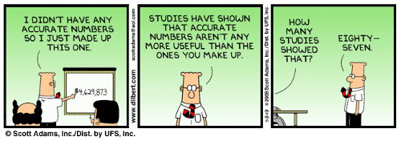
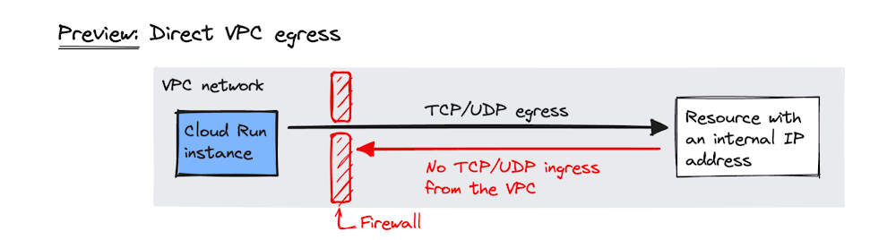
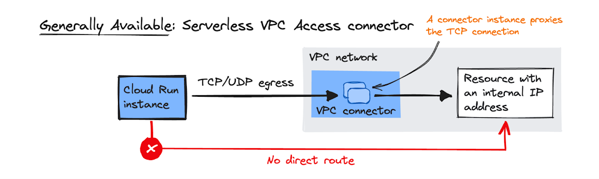

# Serverless VPC Access: ACE Exam Study Guide



_Image source: Dilbert.com_

## 1. Overview

Serverless VPC Access allows your Google Cloud serverless services to communicate with resources in your VPC network using internal (private) IP addresses.

**Supported Services (The "Serverless" side):**

- Cloud Run (Services and Jobs)
- Cloud Functions (1st and 2nd Gen)
- App Engine (Standard Environment)

**Target Resources (The "VPC" side):**

- Compute Engine VMs
- Cloud SQL (with private IP)
- Memorystore (Redis/Memcached)
- Internal Load Balancers
- On-premises resources (via Cloud VPN or Cloud Interconnect)

## 2. Direct VPC Egress vs Serverless VPC Access Connector

| Feature            | Direct VPC Egress | Serverless VPC Access Connector |
| ------------------ | ----------------- | ------------------------------- |
| Subnet required    | No                | Yes (`/28` dedicated subnet)    |
| Performance        | Lower latency     | Higher latency                  |
| Cost               | Pay per use       | Always-on minimum instances     |
| All traffic egress | Native support    | Requires "All traffic" mode     |
| Simplicity         | Simpler           | More complex                    |

**Use Direct VPC Egress when:**

- Building new deployments
- Only need outbound (egress) connectivity to VPC
- Want to avoid managing connector infrastructure



_Image source: [Google Cloud Blog](https://cloud.google.com/blog/products/serverless/announcing-direct-vpc-egress-for-cloud-run)_

**Use Serverless VPC Access Connector when:**

- Need inbound connectivity **from** VPC to serverless service
- Must use Shared VPC (connector in host project)
- Exam question specifically mentions a connector



_Image source: [Google Cloud Blog](https://cloud.google.com/blog/products/serverless/announcing-direct-vpc-egress-for-cloud-run)_

### 2.1. Key Characteristics

- **Managed Connector:** Acts as a bridge between serverless environment and VPC.
- **Regional Resource:** Created in a specific region; only works with services in that same region.
- **Dedicated Subnet:** Requires a `/28` subnet that must not overlap with existing VPC ranges.
- **Always-on Cost:** Minimum 2 instances run even if set to 0 (billed regardless).
- **Throughput Scaling:** Specify min/max instances to control throughput.

## 4. Configuration

### 4.1. Egress Settings

| Mode                              | Behavior                                                                                                                                      |
| --------------------------------- | --------------------------------------------------------------------------------------------------------------------------------------------- |
| **Private ranges only** (default) | Only [RFC 1918](https://datatracker.ietf.org/doc/html/rfc1918) traffic goes through connector. Internet traffic uses standard public gateway. |
| **All traffic**                   | All outbound traffic routes through connector. Required for static outbound IP.                                                               |

### 4.2. Static Outbound IP for Cloud Run

To give Cloud Run a static IP (e.g., for third-party firewall whitelisting):

1. Create Serverless VPC Access Connector with **"All traffic"** egress
2. Configure **Cloud NAT** on the VPC
3. All outbound traffic from Cloud Run exits via Cloud NAT's static IP

## 5. Shared VPC

- Connector must be created in the **Host Project** (where VPC lives)
- Serverless service in **Service Project** references the connector
- Service Project Admin needs `roles/vpcaccess.user` on the connector

## 6. IAM Roles

| Role                     | Permissions                               |
| ------------------------ | ----------------------------------------- |
| `roles/vpcaccess.admin`  | Full control over connectors              |
| `roles/vpcaccess.user`   | Use a connector (required for deployment) |
| `roles/vpcaccess.viewer` | View-only access                          |

## 7. Firewall Rules

The connector's `/28` subnet must be allowed to reach target resources:

- Example: Allow port 3306 from connector subnet to Cloud SQL instance
- Without proper firewall rules, connectivity will fail silently

## 8. Common Exam Gotchas

1. **Wrong region:** Connector and serverless service must be in the same region
2. **Subnet overlap:** `/28` must not conflict with any existing VPC subnet
3. **Minimum instances:** Even setting min to 0 still runs 2 instances (cost!)
4. **[RFC 1918](https://datatracker.ietf.org/doc/html/rfc1918) only:** By default, only private IP ranges route through connector
5. **Inbound vs Outbound:** Connector handles outbound from serverless; for inbound **to** serverless from VPC, consider Direct VPC Egress or Serverless VPC Access (ingress mode)

## 9. Essential `gcloud` Commands

**Create a Connector:**

```
gcloud compute vpc-access connectors create [NAME] \
  --network=[VPC] \
  --region=[REGION] \
  --range=[CIDR_28]
```

**List Connectors:**

```
gcloud compute vpc-access connectors list --region=[REGION]
```

**Deploy Cloud Run with Connector:**

```
gcloud run deploy [SERVICE_NAME] --image [IMAGE] --vpc-connector [CONNECTOR_NAME]
```

**Deploy Cloud Run with Direct VPC Egress:**

```
gcloud run services update [SERVICE_NAME] --vpc-egress=all
```

## 10. Practice Questions

**Q1:** A Cloud Run service needs to connect to a Cloud SQL instance using Private IP only. What GCP feature is required?

> **Answer:** Serverless VPC Access Connector

**Q2:** You want Cloud Run to use a static outbound IP for firewall whitelisting. What configuration is needed?

> **Answer:** Serverless VPC Access Connector with "All traffic" egress + Cloud NAT gateway

## 11. When NOT to Use

- Public serverless services with no VPC dependencies (unnecessary cost and complexity)
- Egress-only scenarios where Direct VPC Egress is available (simpler, no connector needed)
- When service and target are in different regions (not supported)

## 12. Quick Reference Summary

| Item                          | Value                                                          |
| ----------------------------- | -------------------------------------------------------------- |
| Subnet size                   | `/28` exactly                                                  |
| Connector region              | Must match service region                                      |
| Always-on instances           | 2 (even at min=0)                                              |
| Default egress                | [RFC 1918](https://datatracker.ietf.org/doc/html/rfc1918) only |
| Static IP                     | Requires "All traffic" + Cloud NAT                             |
| Shared VPC connector location | Host Project                                                   |
