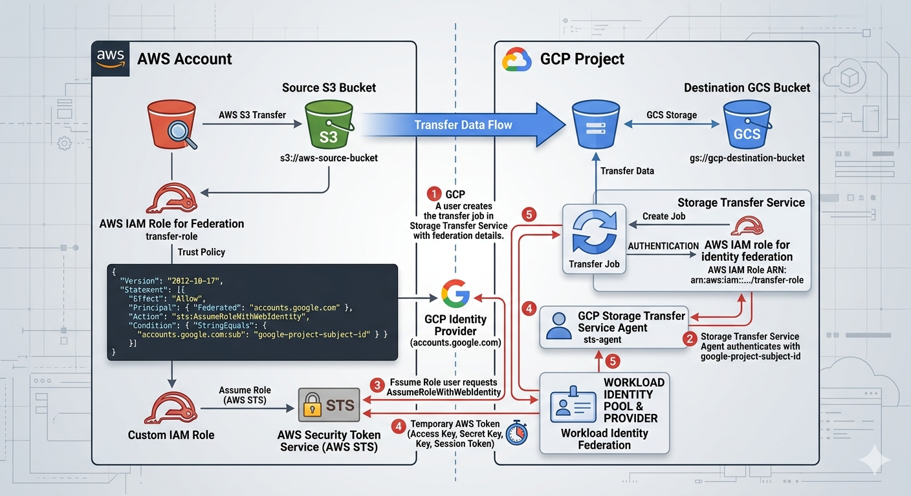

# Storage Transfer Service: ACE Exam Study Guide (2026)

_Image source: Google Cloud Documentation_

## 1. Overview and Use Cases

Storage Transfer Service (STS) is a fully managed service for moving large volumes of data into Cloud Storage (GCS) from other cloud providers, on-premises locations, or within GCS itself.

- Source Support: AWS S3, Azure Blob Storage, HTTP/HTTPS locations, On-premises (using agents), and Google Cloud Storage (GCS).
- Destination Support: Always Google Cloud Storage (GCS) buckets.
- Key Benefit: Managed scaling, scheduling, and error handling without requiring you to manage VMs or scripts.

## 2. Core Architecture Components

- Transfer Job: A configuration that defines the source, destination, filters, and schedule.
- Transfer Agents (On-premises only): Lightweight software installed on your local hardware to facilitate data transfer to GCP.
- STS Service Account: A Google-managed service account that performs the transfer. It requires permissions (like `storage.admin`) on both source and destination buckets.
- Manifest Files: A CSV file that lists specific objects to be transferred, allowing for granular control.

## 3. The Migration Lifecycle

1. Source Setup: Grant the STS Service Account permission to read from the source (e.g., AWS S3 bucket) and write to the destination (GCS bucket).
2. Create Transfer Job: Define the source (AWS, Azure, GCS, etc.) and the destination bucket.
3. Configure Options:
   - Scheduling: One-time vs. Recurring (daily/weekly).
   - Filtering: Include or exclude objects based on prefix or suffix.
   - Overwrite/Delete: Choose whether to overwrite existing files or delete source files after transfer (use with caution).
4. Monitoring: Use the Cloud Console or Cloud Monitoring to track the progress and status of the transfer job.

## 4. STS in Action

<figure>
  
  <figcaption>
STS - Transfer from AWS S3 into the GCP Cloud Storage <i>Image source: Own work (Gemini Prompting).</i>
</figcaption>
</figure>

The image illustrates the secure, federated handshake between Google Cloud Storage Transfer Service and Amazon S3. Instead of using vulnerable, long-term passwords (Access Keys), it uses a digital trust relationship to exchange temporary "guest passes."

Here are the specific steps happening in that workflow:

1. Setup & Identity (The Foundation)
   - GCP Side: You create a Transfer Job and provide it with your GCP Project Subject ID. This ID is the unique "social security number" for your transfer service.
   - AWS Side: You create an IAM Role with a Trust Policy. This policy explicitly states: "I trust anyone coming from accounts.google.com, but only if their ID matches this specific Subject ID."
2. The Authentication Handshake
   - Step 1: Requesting Access: The GCP Storage Transfer Service agent contacts the Google Identity Provider to prove who it is.
   - Step 2: Federated Request: GCP then sends a request to AWS STS (Security Token Service). It says, "I am the verified GCP agent you trust; please let me assume the 'transfer-role'."
   - Step 3: Verification: AWS STS checks the incoming Google token against the Trust Policy you wrote.
3. The Token Exchange
   - Step 4: Issuing the "Guest Pass": Once AWS STS is satisfied, it generates a Temporary Security Token (consisting of a temporary Access Key, Secret Key, and Session Token).
   - Step 5: Delivery: This temporary token is sent back to the GCP Storage Transfer Service. These credentials usually expire in as little as one hour, making them useless to hackers if intercepted later.
4. The Data Transfer
   - Step 6: S3 Access: Equipped with the temporary AWS token, the GCP Transfer Job connects to the Source S3 Bucket. AWS sees the token and allows GCP to "GetObject" (read the files).
   - Step 7: GCS Delivery: The files are streamed directly across the high-speed Google/AWS backbone and written into your Destination GCS Bucket.

> By using this specific workflow shown in the image, you eliminate Secret Management. There are no AWS Access Keys saved in GCP variables or code. If someone were to compromise your GCP environment, they wouldn't find any permanent keys to your AWS kingdom—only a trust relationship that can be severed instantly by updating the AWS IAM Role.

## 5. STS vs. Other Transfer Tools (High Frequency Exam Topic)

- Storage Transfer Service (STS): Best for cloud-to-cloud (S3 to GCS), scheduled/recurring transfers, or massive on-premises data (1TB+ with good bandwidth).
- Transfer Appliance: Best for massive on-premises data (60TB+) where bandwidth is too slow for online transfer (offline "truck-based" transfer).
- `gcloud storage` (formerly `gsutil`): Best for small, ad-hoc transfers (< 1TB) or developer-driven scripts.
- Database Migration Service (DMS): Use for databases, NOT for unstructured file data.

## 6. Security and Compliance

- Identity Federation: In 2026, the exam emphasizes using OIDC (OpenID Connect) for AWS/Azure transfers instead of long-term Access/Secret keys.
- Data Integrity: STS automatically performs checksum validation (CRC32C) to ensure data is not corrupted during transit.
- Encryption: Data is encrypted in transit using HTTPS/TLS and at rest in GCS using default or Customer-Managed Encryption Keys (CMEK).

## 7. Key Exam Tips and Gotchas

- Incremental Transfers: STS only copies new or changed objects (based on checksums and file size) to save time and cost.
- Event-Driven Transfers: STS can be triggered by events (e.g., a new file appearing in an S3 bucket), reducing latency for real-time workflows.
- Permissions: If a transfer fails, the first check is ALWAYS the STS Service Account's permissions on the source and destination.
- Deletion Policy: You can configure STS to delete the source files after a successful transfer (useful for moving logs to long-term storage).
- Bandwidth Throttling: For on-premises transfers, you can set limits to avoid saturating your local internet connection.

## 8. 2026 Updates

- Event-Driven Transfers: Now a standard feature for real-time synchronization between cloud providers.
- OIDC Adoption: Moving away from static credentials for cross-cloud transfers.
