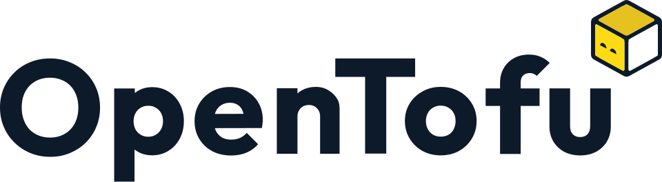

# Usecases - Opentofu code

<figure>
  
  <figcaption>
OpenTofu Logo <i>Image source: <a href="https://commons.wikimedia.org/wiki/File:Logo_of_OpenTofu.svg">Wikimedia</a></i>
</figcaption>
</figure>

### [**Cloud Run secured with IAP**](./cloud_run_iap.md)

Protects Cloud Run with Identity-Aware Proxy using an external HTTP(S) load balancer, requiring Google authentication before reaching the service.

### [**Cloud Run using Direct VPC Egress**](./cloud_run_direct_vpc_egress.md)

Connects Cloud Run directly to a VPC network without a Serverless VPC Access Connector for lower latency and cost.

### [**Cloud Run to on-prem PostgreSQL hybrid connectivity**](./cloud_run_db_on_prem.md)

A usecase illustrating the secure path data takes when a serverless application in Google Cloud needs to communicate with a database sitting in a physical, on-premises data center.

### [**Configure CDC** sync from Cloud SQL (PostgreSQL) into Memorystore (Redis)](./cdc_postgresql_redis.md)

CDC (Change Data Chapture) streams updates from Cloud SQL to Memorystore by enabling logical replication in PostgreSQL, capturing changes via Datastream to Pub/Sub, and using Dataflow to sync key-value pairs into Redis.
