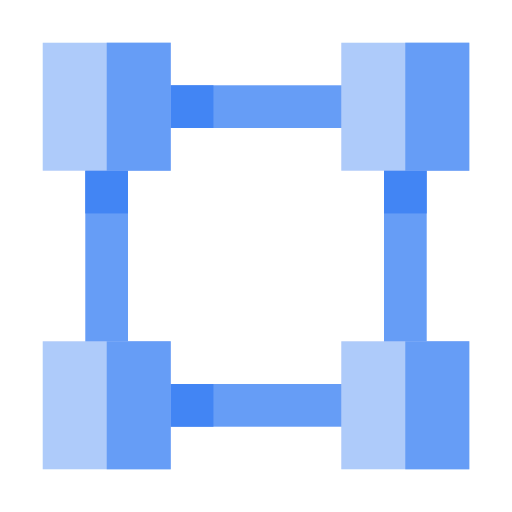

# GCP VPC Networks: ACE Exam Study Guide (2026)

_Image source: Google Cloud Documentation_

## 1. VPC Fundamentals

A _Virtual Private Cloud_ (VPC) is a global resource that provides networking functionality to Compute Engine, GKE, and App Engine.

- **Global Scope:** A single VPC can span multiple regions across the globe without needing to traverse the public internet.
- **VPC Types:**
  - **Auto Mode:** Automatically creates one subnet in each Google Cloud region. Uses a predefined IP range (`10.128.0.0/9`). (Not recommended for production).
  - **Custom Mode:** You manually create and define subnets and their IP ranges. This is the best practice for production environments.
- **Project Relationship:** By default, a project starts with a VPC named `default` (Auto mode).
  > **Note**: Default VPC auto-creation is **disabled by default** for projects created after 2020.
- **RFC 1918 Private Ranges:** VPC subnets should use private IP ranges:
  - `10.0.0.0/8`
  - `172.16.0.0/12`
  - `192.168.0.0/16`

## 2. Subnets (Regional)

While a VPC is global, subnets are **regional** resources.

- **Regional Isolation:** A subnet exists only within one region (e.g., `us-central1`).
- **IP Ranges:** Subnet ranges must not overlap within the same VPC.
- **Expansion:** You can expand the CIDR range of a subnet without downtime, but you **cannot shrink** it.
  - **Example**: Changing a `/24` (256 IPs) to a `/22` (1024 IPs) is an **expansion** (Valid).
  - **Example**: Changing a `/24` (256 IPs) to a `/25` (128 IPs) is a **shrink** (Invalid/Error).
    > The new range must not overlap with any other subnets in the same VPC.
- **Secondary Ranges:** Used for GKE (alias IPs) to provide IP addresses for pods and services.
- **Dual-stack Support:** Modern VPCs support **Dual-stack subnets**, allowing instances to have both IPv4 and IPv6 addresses.
- **Private Google Access:** Allows VMs with only internal IP addresses to reach Google API services (GCS, BigQuery) without needing an external IP.
- **Direct VPC Egress:** The preferred method for connecting Cloud Run and Cloud Functions to a VPC with lower latency and higher performance than _Serverless VPC Access connectors_.
- **Proxy-only Subnets:** Required for Envoy-based load balancers (e.g., Regional External HTTP(S) LB). Requires a `/26` or larger range with the `--purpose=REGIONAL_MANAGED_PROXY` flag.

## 3. Routes

Routes define the paths that network traffic takes from a VM instance to other destinations.

- **System-Generated Routes:**
  - **Default Route:** Routes all traffic (`0.0.0.0/0`) to the Internet Gateway.
  - **Subnet Routes:** Automatically created for each subnet to allow communication between instances within the same VPC.
- **Static Routes:** Manually created to route traffic to specific destinations (e.g., a VPN gateway or a specific VM acting as a NAT).
- **Priority:** Routes are evaluated based on the **Longest Prefix Match** (most specific CIDR). If prefixes are identical, the route with the **Lowest Priority** number wins.

## 4. Network Security & Firewall Policies

In 2026, **Network Firewall Policies** (Global and Regional) are the modern standard for controlling VPC traffic.

- **Implicit Rules (Cannot be deleted):**
  - **Allow Egress:** All outbound traffic is allowed by default.
  - **Deny Ingress:** All inbound traffic is blocked by default.
- **Hierarchical Firewall Policies:** Evaluated at the Organization or Folder level before any VPC-level rules.
- **Rule Components:**
  - **Direction:** Ingress (Inbound) or Egress (Outbound).
  - **Action:** Allow or Deny.
  - **Priority:** 0 (Highest) to 65535 (Lowest).
  - **Targets:** Defines which VMs the rule applies to (using **Network Tags**, Service Accounts, or "All instances").
- **Stateful Nature:** Firewall rules are **stateful**. If a connection is allowed, return traffic is automatically permitted.
- **VPC Flow Logs:** Records network traffic flow data for debugging and security. Enabled at the subnet level.

## 5. VPC Network Peering & Shared VPC

- **VPC Network Peering:** Connects two VPC networks to allow internal IP communication. Traffic stays on Google's private backbone.
  - Peering is **not** transitive: If A is peered with B, and B is peered with C, A cannot communicate with C through B.
- **Shared VPC:** Allows an organization to connect resources from multiple projects to a common VPC network.
  - **Host Project:** Contains the Shared VPC network.
  - **Service Projects:** Attach their resources (VMs, GKE) to the Host Project's subnets.
  - **IAM Roles:** Requires **Compute Network User** role for service projects to use host project subnets.

## 6. Connectivity Services

- **Cloud VPN:** Connects your on-premises network to your VPC via IPsec. **HA VPN** provides a 99.99% SLA using two or more tunnels.
- **Cloud Interconnect:** Provides a direct, physical connection (Dedicated or Partner).
- **Cloud NAT:** Allows VMs without external IPs to access the internet for updates without exposing them to inbound connections.
- **Cloud Router:** Uses BGP to dynamically exchange routes between your VPC and on-premises networks.
- **Private Service Connect (PSC):** Allows you to access Google APIs and services (like Cloud SQL) via private IP addresses using an internal load balancer, avoiding the need for VPC Peering or PGA.

## 7. Common ACE Exam Scenarios

- **Scenario**: You need to connect a Cloud Run service to a Cloud SQL instance using a private IP with the lowest possible latency and no management overhead.

  > Use **Direct VPC Egress** to route traffic directly into the VPC without requiring a Serverless VPC Access connector.

- **Scenario**: You are deploying a Regional External HTTP(S) Load Balancer and receiving an error that no subnets are available for the proxies.

  > You must create a **Proxy-only subnet** in that region with the `--purpose=REGIONAL_MANAGED_PROXY` flag and a range of at least `/26`.

- **Scenario**: You need to ensure that only traffic from your corporate headquarters' public IP range can SSH into your VM instances.

  > Create a firewall rule with **Direction: Ingress**, **Source IP range: [HQ_IP_RANGE]**, and **Target Tags: [SSH_TAG]**, then apply that tag to the VMs.

- **Scenario**: You want to allow internal communication between two VPCs in different organizations without using public IPs.
  > Configure **VPC Network Peering** between the two networks. Remember that this connection is not transitive.

## 8. Essential `gcloud` Commands

- **Create VPC:** `gcloud compute networks create [NAME] --subnet-mode=custom`
- **Create Subnet:** `gcloud compute networks subnets create [NAME] --network=[VPC] --region=[REGION] --range=[CIDR]`
- **Create Proxy-only Subnet:** `gcloud compute networks subnets create [NAME] --purpose=REGIONAL_MANAGED_PROXY --role=ACTIVE --region=[REGION] --network=[VPC] --range=[CIDR]`
- **Enable IPv6 on Subnet:** `gcloud compute networks subnets update [NAME] --stack-type=IPV4_IPV6 --ipv6-access-type=INTERNAL --region=[REGION]`
- **Create Firewall Rule:** `gcloud compute firewall-rules create [NAME] --network=[VPC] --allow tcp:80 --target-tags=http-server`
- **Enable Private Google Access:** `gcloud compute networks subnets update [SUBNET] --region=[REGION] --enable-private-ip-google-access`

## 9. Exam Tips

- **Global vs. Regional:** VPC is Global, Subnets are Regional, Firewall Rules/Policies are Global (legacy rules) or Regional/Global (policies).
- **Conflict Resolution:** Longest Prefix Match always wins in routing.
- **IAP for SSH/RDP:** Remember the range `35.235.240.0/20` must be allowed for IAP TCP forwarding (TCP:22 for SSH, TCP:3389 for RDP).
- **Networking Costs:** Egress traffic usually incurs costs; Ingress is usually free. Traffic within the same Zone is free; traffic between Zones in the same Region has a cost.

## 10. External Links

- [CIRD Calculator](https://cidr.xyz/)
- [Virtual Private Cloud - The Cloud Girl](https://www.thecloudgirl.dev/networking/virtual-private-cloud)
