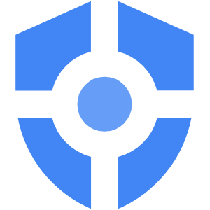

# GCP VPC Service Controls: ACE Exam Study Guide

_Image source: [Vecta.io](https://vecta.io/symbols/4/google-cloud-platform/65/google-security-command-center)_

## 1. VPC Service Controls Overview

VPC Service Controls (VPC SC) is a security feature that allows you to define a security perimeter around Google-managed resources (like Cloud Storage, BigQuery, and Cloud SQL) to mitigate data exfiltration risks.

- **Primary Goal:** Prevent data exfiltration from Google Cloud services.
- **Key Functionality:** It limits access to protected services to only those requests originating from within a defined **Service Perimeter**.
- **VPC SC vs. IAM:**
  - **IAM:** Determines **who** can access a resource.
  - **VPC SC:** Determines **where** the request can come from.
  - **Exam Tip:** Even if a user has the "Owner" IAM role, they will be blocked if their request originates from outside the allowed perimeter.

## 2. Core Components

- **Service Perimeter:** A logical boundary that isolates Google Cloud resources. Projects within a perimeter can communicate freely, but communication across the boundary is restricted.
- **Access Levels:** Defined using **Access Context Manager**. They allow access to a perimeter based on attributes like:
  - Source IP address (e.g., corporate office range).
  - User identity (optional).
  - Device type (e.g., encrypted, company-managed).
  - Device OS version, screen lock status.
- **Service Perimeter Bridge:** Allows projects in different perimeters to communicate. Use when you need data sharing between perimeters.
  > Bridge access is **non-transitive**. If Perimeter A is bridged to Perimeter B, and Perimeter B is bridged to Perimeter C, resources in Perimeter A cannot access resources in Perimeter C through the bridge chain.
- **Ingress Rules:** Allow specific inbound traffic _into_ the perimeter.
- **Egress Rules:** Allow specific outbound traffic _out of_ the perimeter.
  - Use ingress/egress rules instead of a bridge for more granular control.
  - Can specify: ` principals[]`, `resourceSelectors[]`, `methodSelectors[]`

## 3. Key Concepts & Scenarios

- **Data Exfiltration Mitigation:** VPC SC prevents scenarios where a malicious insider copies data from a production BigQuery dataset to a personal dataset outside the organization.
- **Private Google Access:** Often used in conjunction with VPC SC. It allows VMs with only internal IP addresses to reach Google APIs.
- **Dry-Run Mode:** Allows you to test a perimeter configuration without enforcing it. It generates audit logs showing what _would_ have been blocked. Always use this before moving to enforcement in production.
- **VPC Service Controls Troubleshooter:** A tool in the Cloud Console used to diagnose why a request was blocked (e.g., finding the missing access level or perimeter project).

## 4. Protected Services

Not all services are supported, but the most common exam-relevant services include:

- **Cloud Storage (GCS)** - Buckets and objects
- **BigQuery** - Datasets and tables
- **Cloud SQL** - MySQL, PostgreSQL, SQL Server
- **Pub/Sub** - Topics and subscriptions
- **Cloud Spanner** - Databases
- **Cloud Functions** - Functions (1st gen)
- **Cloud Run** - Services and jobs
- **GKE** - Private clusters (requires additional config)
- **Artifact Registry** - Registries and artifacts
- **Dataproc** - Clusters
- **AI Platform** - Notebooks and endpoints
- **API Gateway** - APIs

> **Exam Tip:** Not all services support VPC SC. Always check the VPC SC documentation for the latest list.

### 4.1. GKE Integration with VPC SC

- **Private GKE Clusters:** Work well with VPC SC perimeters.
- **Configuration:**
  1. Create a private cluster (no public endpoints).
  2. Add the cluster's project to the perimeter.
  3. Use Private Google Access or Private Service Connect.
- **DNS:** Configure Private Google DNS zones to resolve internal service names.

### 4.2. Cloud Armor vs VPC SC

|          | VPC SC                        | Cloud Armor           |
| -------- | ----------------------------- | --------------------- |
| Scope    | Data exfiltration perimeter   | DDoS + WAF protection |
| Layer    | Application/API layer         | Network layer         |
| Protects | Cloud Storage, BigQuery, etc. | Load balancers, CDN   |
| Use Case | Prevent data leaks            | Block attacks         |

## 5. Implementation Steps

1. **Create an Access Policy:** The container for all access levels and perimeters (usually at the Organization level).
2. **Define Access Levels:** Specify the conditions (IPs, devices) for allowed access.
3. **Create a Service Perimeter:**
   - Add projects to the perimeter.
   - Select the services to protect (e.g., Storage, BigQuery).
   - Attach Access Levels (optional).
4. **Test in Dry-Run Mode:** Monitor audit logs for potential breakages.
5. **Enforce the Perimeter.**

## 6. Essential `gcloud` Commands

- **List Perimeters:** `gcloud access-context-manager perimeters list --policy=[POLICY_ID]`
- **Describe a Perimeter:** `gcloud access-context-manager perimeters describe [PERIMETER_NAME] --policy=[POLICY_ID]`
- **List Access Levels:** `gcloud access-context-manager levels list --policy=[POLICY_ID]`
- **Describe Access Level:** `gcloud access-context-manager levels describe [LEVEL_NAME] --policy=[POLICY_ID]`
- **Create Perimeter:** `gcloud access-context-manager perimeters create [PERIMETER_NAME] --policy=[POLICY_ID] --title=[TITLE]`
- **Update Perimeter:** `gcloud access-context-manager perimeters update [PERIMETER_NAME] --policy=[POLICY_ID] --add-resources=projects/[PROJECT_ID]`

## 7. Common Exam Scenarios

- **Scenario 1:** Allow on-prem office users to access BigQuery in perimeter.
  - Solution: Create an Access Level with the corporate office IP range.
- **Scenario 2:** Allow a 3rd party vendor temporary access.
  - Solution: Create a time-limited Ingress rule with specific principals.
- **Scenario 3:** GKE pod needs to access Cloud Storage in perimeter.
  - Solution: Add GKE project to perimeter; ensure pod uses Workload Identity.
- **Scenario 4:** Prevent public access to Cloud Storage bucket.
  - Solution: Use Public Access Prevention (org policy) + VPC SC perimeter.

### 7.1. TLS Inspection Warning

- **Layer 7 Inspection:** If you use Cloud Armor or a proxy with TLS inspection, it can break VPC SC.
- **Why:** VPC SC validates requests at the API layer, but TLS inspection terminates and re-encrypts traffic.
- **Solution:** Configure inspection to trust VPC SC headers, or bypass inspection for VPC SC-protected services.

### 7.2. Dry-Run to Enforcement Checklist

1. Create Access Policy.
2. Define Access Levels (IPs, devices).
3. Create Perimeter in dry-run mode.
4. Wait 4-6 hours for propagation.
5. Check Audit Logs for blocked requests.
6. Create Ingress/Egress rules for legitimate traffic.
7. Switch to enforced mode.

## 8. Troubleshooting Tip

If you see a `403 Forbidden` error with a reason like `RESOURCES_NOT_IN_PERIMETER` or `ACCESS_DENIED_BY_VPC_SERVICE_CONTROLS`, it means VPC SC is blocking the request. Check if:

- The project is included in the perimeter.
- The service is being protected by the perimeter.
- The user's request meets the criteria of the attached Access Level (e.g., correct IP address).
